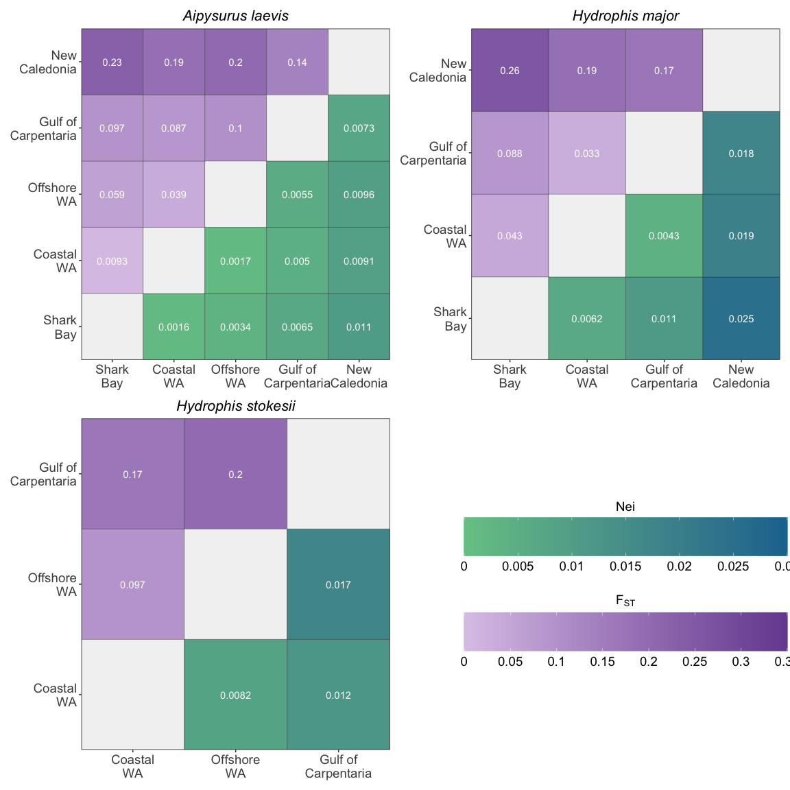

Diversity statistics
================
2025-02-26

- [Load metadata and VCF files](#load-metadata-and-vcf-files)
  - [Adapting metadata](#adapting-metadata)
  - [Load VCF files](#load-vcf-files)
- [Calculate statistics](#calculate-statistics)
  - [Calculate](#calculate)
- [Within population statistics](#within-population-statistics)
- [Between population statistics](#between-population-statistics)
  - [Clean F<sub>ST</sub> matrix](#clean-fst-matrix)
  - [Combine F<sub>ST</sub> and Nei’s genetic distance data into single
    matrix](#combine-fst-and-neis-genetic-distance-data-into-single-matrix)
  - [Write pairwise distance results](#write-pairwise-distance-results)
  - [Pairwise genetic distance
    heatmaps](#pairwise-genetic-distance-heatmaps)

This directory contains results relating to diversity statistics, both
within and between populations. The statistics are generated from the
unfiltered `Ipyrad` VCFs, with all filtering being applied by the
package `snpR`.

## Load metadata and VCF files

Here we’re simply loading the population-map files and storing them into
the object `meta`. This object is a named `list`, where each list
element is a dataframe.

Note that we’re going to remove the North and South QLD samples, as
there aren’t many individuals in these groups and we’re not certain of
the structure in these Eastern populations. As such, we’re just keeping
the well sampled Gulf of Carpentaria population where available.

``` r
# Load data
meta <- fs::dir_ls(
    here("data", "popmaps"),
    glob = "*.txt"
) |>
    (\(x) set_names(x, str_remove(basename(x), "-.*")))() |>
    map(\(x) {
        x |>
            read_delim(
                delim = " ", 
                col_names = c("sampID", "population"), 
                col_types = cols()
            ) |>
            filter(
                ! str_detect(population, "QLD"), 
                ! sampID %in% samples_remove
            )
    })
```

### Adapting metadata

Based off the PCA analyses, we’re going to regroup some samples.
Specifically, all WA coastline samples *except* Shark Bay are going to
be clustered into “Coastal WA”. Additionally, offshore reef samples are
grouped as “Offshore WA”.

``` r
meta <- meta |>
    imap(\(x, i) {
        if(i == "ALA") {
            x <- x |>
                mutate(
                    pop = case_when(
                        population %in% c("Broome", "Pilbara", "Exmouth_Gulf") ~ "Coastal_WA",
                        population %in% c("Ashmore", "Heywood_Shoal", "Scott_Reef") ~ "Offshore_WA",
                        .default = population
                    )
                )
        }
        
        if(i == "HMA") {
            x <- x |>
                mutate(
                    pop = case_when(
                        population %in% c("Broome", "Pilbara", "Exmouth_Gulf") ~ "Coastal_WA",
                        .default = population
                    )
                )
        }
        
        if(i == "HST") {
            x <- x |>
                mutate(
                    pop = case_when(
                        population %in% c("Broome", "Pilbara", "Exmouth_Gulf", "North_Kimberley") ~ "Coastal_WA",
                        population %in% c("Ashmore", "Heywood_Shoal") ~ "Offshore_WA",
                        .default = population
                    )
                )
        }
        
        return(x)
    })
```

### Load VCF files

Next we load the VCF files into `R` as `snpRdata` objects. Similarly, we
load each species’ file separately and store it in a list. Filtering is
applied here so we don’t have to pre-filter our data ahead of time.

We also apply some sample filtering (i.e. removing QLD samples from
snpRobject) and add in the metadata after loading the data. This is to
ensure the correct metadata is assigned to the right sample.

``` r
# Get each species' VCF file
vcfs <- fs::dir_ls(
    here("results", "ipyrad"),
    glob = "*stringent.vcf.gz",
    recurse = TRUE
) |>
    (\(x) set_names(x, str_remove(basename(x), "-stringent.*")))() |>
    imap(\(v,i) {
        tmp_vcf <- read_vcf(file = v)
        
        filt_vcf <- filter_snps(
            tmp_vcf,
            min_ind = 0.75,
            min_loci = 0.5,
            re_run = TRUE
        )
        
        # Subset for samples to keep + add in metadata
        filt_vcf <- subset_snpR_data(
            x = filt_vcf, 
            .facets = "sampID",
            .subfacets = meta[[i]]$sampID
        )
        
        sample.meta(filt_vcf) <- left_join(sample.meta(filt_vcf), meta[[i]]) |>
            mutate(pop = factor(pop, levels = pop_levels))
        filt_vcf
    })
```

## Calculate statistics

Next we’ll calculate a range of diversity statistics. The program `snpR`
has a really convenient function `calc_basic_snp_stats()` which
practically estimates all the statistics we want.

Below we estimate π, H<sub>o</sub>, H<sub>e</sub>, F<sub>IS</sub>, HWE
and pairwise F<sub>ST</sub>. We estimate all statistics by population.

``` r
## WA all
# Calculate within population statistics
stats_within <- vcfs |>
    map(\(v) {
        tmp <- calc_basic_snp_stats(v, facets = "pop", fst.method = "WC")
        get.snpR.stats(tmp, facets = "pop", stats = c("pi", "hwe", "ho", "he", "fis", "fst"))
    })

# Divergence statistics
stats_between <- vcfs |>
    map(\(v) {
        tmp <- custom_calc_genetic_distances(v, facets = "pop", method = "Nei")
        get.snpR.stats(tmp, facets = "pop", stats = "genetic_distance")
    })
```

### Calculate

We used a separate program to calculate nucleotide diversity (π) in each
population. This program is `pixy`, which uses invariant data in its
calculation in addition to variant sites. The authors of `Ipyrad` wrote
a script that can return an **all-sites** VCF file from the `.loci`
files. I’ve passed this VCF to `pixy` to get a more accurate estimation
of π in each population.

``` r
pixy_pi <- fs::dir_ls(
    here("results"),
    glob = "*pi.txt",
    recurse = TRUE
) |>
    read_tsv(col_types = cols(), id = "species") |>
    rename(population = pop) |>
    filter(!str_detect(population, "QLD")) |>
    mutate(
        species = str_remove(basename(species), "_.*"),
        pop = NA_character_,
        pop = case_when(
            species == "ALA" & population %in% c("Broome", "Pilbara", "Exmouth_Gulf") ~ "Coastal_WA",
            species == "ALA" & population == "Shark_Bay" ~ "Shark_Bay",
            species == "ALA" & population %in% c("Ashmore", "Heywood_Shoal", "Scott_Reef") ~ "Offshore_WA",
            species == "ALA" & population == "Gulf_of_Carpentaria" ~ "Gulf_of_Carpentaria",
            species == "ALA" & population == "New_Caledonia" ~ "New_Caledonia",
            .default = pop
        ),
        pop = case_when(
            species == "HMA" & population %in% c("Broome", "Pilbara", "Exmouth_Gulf") ~ "Coastal_WA",
            species == "HMA" & population == "Shark_Bay" ~ "Shark_Bay",
            species == "HMA" & population =="Gulf_of_Carpentaria" ~ "Gulf_of_Carpentaria",
            species == "HMA" & population == "New_Caledonia" ~ "New_Caledonia",
            .default = pop
        ),
        pop = case_when(
            species == "HST" & population %in% c("Broome", "Pilbara", "Exmouth_Gulf", "North_Kimberley") ~ "Coastal_WA",
            species == "HST" & population %in% c("Ashmore", "Heywood_Shoal") ~ "Offshore_WA",
            species == "HST" & population == "Gulf_of_Carpentaria" ~ "Gulf_of_Carpentaria",
            species == "HST" & population == "New_Caledonia" ~ "New_Caledonia",
            .default = pop
        )
    ) |>
    # Generating genome-wide averages
    summarise(
        pixy_pi = sum(count_diffs) / sum(count_comparisons),
        .by = c(species, pop)
    )
```

The π estimates are included in the next table.

## Within population statistics

Below we simply extract the weighted averages for each population. The
table contains four relevant columns - weighted means for nucleotide
diversity, observed heterozygosity, expected heterozygosity and
F<sub>IS</sub>. I’ve appended the `pixy` π estimates to compare the
impact of calculating nucleotide diversity with and without invariant
data.

``` r
# Number of samples in each subfacet
within <- stats_within |>
    imap(
        \(x, i) {
            x |>
                pluck("weighted.means") |>
                as_tibble() |>
                filter(is.na(weighted_mean_fst)) |>
                select(-c(snp.facet, snp.subfacet, weighted_mean_fst, mean_fst)) |>
                left_join(
                    meta[[i]] |> summarise(n_samples = n(), .by = pop),
                    by = join_by(subfacet == pop)
                )
        }
    ) |>
    list_rbind(names_to = "species") |>
    left_join(pixy_pi, by = join_by(species, subfacet == pop)) |>
    mutate(subfacet = factor(subfacet, levels = pop_levels)) |>
    select(
        Species = species,
        Population = subfacet,
        n_samples,
        `Nuc. diversity (pixy)` = pixy_pi,
        `Nuc. diversity (snpR)` = weighted_mean_pi,
        Ho = weighted_mean_ho, He  = weighted_mean_he,
        Fis = weighted_mean_fis,
        -facet
    ) |>
    arrange(Species, Population)

# Write to file
within |>
    (\(x) split(x, x$Species))() |>
    iwalk(\(x, i) {
        x |>
            write_csv(
                file = here("results", "diversity-statistics", glue::glue("{i}-within-stats.csv"))
            )
    })

# Example of output
within |>
    gt(groupname_col = "Species") |>
    fmt_number(
        columns = 4:8,
        n_sigfig = 2
    ) |>
    as_raw_html()
```

<div id="umtiymdilx" style="padding-left:0px;padding-right:0px;padding-top:10px;padding-bottom:10px;overflow-x:auto;overflow-y:auto;width:auto;height:auto;">
  &#10;  <table class="gt_table" data-quarto-disable-processing="false" data-quarto-bootstrap="false" style="-webkit-font-smoothing: antialiased; -moz-osx-font-smoothing: grayscale; font-family: system-ui, 'Segoe UI', Roboto, Helvetica, Arial, sans-serif, 'Apple Color Emoji', 'Segoe UI Emoji', 'Segoe UI Symbol', 'Noto Color Emoji'; display: table; border-collapse: collapse; line-height: normal; margin-left: auto; margin-right: auto; color: #333333; font-size: 16px; font-weight: normal; font-style: normal; background-color: #FFFFFF; width: auto; border-top-style: solid; border-top-width: 2px; border-top-color: #A8A8A8; border-right-style: none; border-right-width: 2px; border-right-color: #D3D3D3; border-bottom-style: solid; border-bottom-width: 2px; border-bottom-color: #A8A8A8; border-left-style: none; border-left-width: 2px; border-left-color: #D3D3D3;" bgcolor="#FFFFFF">
  <thead style="border-style: none;">
    <tr class="gt_col_headings" style="border-style: none; border-top-style: solid; border-top-width: 2px; border-top-color: #D3D3D3; border-bottom-style: solid; border-bottom-width: 2px; border-bottom-color: #D3D3D3; border-left-style: none; border-left-width: 1px; border-left-color: #D3D3D3; border-right-style: none; border-right-width: 1px; border-right-color: #D3D3D3;">
      <th class="gt_col_heading gt_columns_bottom_border gt_center" rowspan="1" colspan="1" scope="col" id="Population" style="border-style: none; color: #333333; background-color: #FFFFFF; font-size: 100%; font-weight: normal; text-transform: inherit; border-left-style: none; border-left-width: 1px; border-left-color: #D3D3D3; border-right-style: none; border-right-width: 1px; border-right-color: #D3D3D3; vertical-align: bottom; padding-top: 5px; padding-bottom: 6px; padding-left: 5px; padding-right: 5px; overflow-x: hidden; text-align: center;" bgcolor="#FFFFFF" valign="bottom" align="center">Population</th>
      <th class="gt_col_heading gt_columns_bottom_border gt_right" rowspan="1" colspan="1" scope="col" id="n_samples" style="border-style: none; color: #333333; background-color: #FFFFFF; font-size: 100%; font-weight: normal; text-transform: inherit; border-left-style: none; border-left-width: 1px; border-left-color: #D3D3D3; border-right-style: none; border-right-width: 1px; border-right-color: #D3D3D3; vertical-align: bottom; padding-top: 5px; padding-bottom: 6px; padding-left: 5px; padding-right: 5px; overflow-x: hidden; text-align: right; font-variant-numeric: tabular-nums;" bgcolor="#FFFFFF" valign="bottom" align="right">n_samples</th>
      <th class="gt_col_heading gt_columns_bottom_border gt_right" rowspan="1" colspan="1" scope="col" id="Nuc.-diversity-(pixy)" style="border-style: none; color: #333333; background-color: #FFFFFF; font-size: 100%; font-weight: normal; text-transform: inherit; border-left-style: none; border-left-width: 1px; border-left-color: #D3D3D3; border-right-style: none; border-right-width: 1px; border-right-color: #D3D3D3; vertical-align: bottom; padding-top: 5px; padding-bottom: 6px; padding-left: 5px; padding-right: 5px; overflow-x: hidden; text-align: right; font-variant-numeric: tabular-nums;" bgcolor="#FFFFFF" valign="bottom" align="right">Nuc. diversity (pixy)</th>
      <th class="gt_col_heading gt_columns_bottom_border gt_right" rowspan="1" colspan="1" scope="col" id="Nuc.-diversity-(snpR)" style="border-style: none; color: #333333; background-color: #FFFFFF; font-size: 100%; font-weight: normal; text-transform: inherit; border-left-style: none; border-left-width: 1px; border-left-color: #D3D3D3; border-right-style: none; border-right-width: 1px; border-right-color: #D3D3D3; vertical-align: bottom; padding-top: 5px; padding-bottom: 6px; padding-left: 5px; padding-right: 5px; overflow-x: hidden; text-align: right; font-variant-numeric: tabular-nums;" bgcolor="#FFFFFF" valign="bottom" align="right">Nuc. diversity (snpR)</th>
      <th class="gt_col_heading gt_columns_bottom_border gt_right" rowspan="1" colspan="1" scope="col" id="Ho" style="border-style: none; color: #333333; background-color: #FFFFFF; font-size: 100%; font-weight: normal; text-transform: inherit; border-left-style: none; border-left-width: 1px; border-left-color: #D3D3D3; border-right-style: none; border-right-width: 1px; border-right-color: #D3D3D3; vertical-align: bottom; padding-top: 5px; padding-bottom: 6px; padding-left: 5px; padding-right: 5px; overflow-x: hidden; text-align: right; font-variant-numeric: tabular-nums;" bgcolor="#FFFFFF" valign="bottom" align="right">Ho</th>
      <th class="gt_col_heading gt_columns_bottom_border gt_right" rowspan="1" colspan="1" scope="col" id="He" style="border-style: none; color: #333333; background-color: #FFFFFF; font-size: 100%; font-weight: normal; text-transform: inherit; border-left-style: none; border-left-width: 1px; border-left-color: #D3D3D3; border-right-style: none; border-right-width: 1px; border-right-color: #D3D3D3; vertical-align: bottom; padding-top: 5px; padding-bottom: 6px; padding-left: 5px; padding-right: 5px; overflow-x: hidden; text-align: right; font-variant-numeric: tabular-nums;" bgcolor="#FFFFFF" valign="bottom" align="right">He</th>
      <th class="gt_col_heading gt_columns_bottom_border gt_right" rowspan="1" colspan="1" scope="col" id="Fis" style="border-style: none; color: #333333; background-color: #FFFFFF; font-size: 100%; font-weight: normal; text-transform: inherit; border-left-style: none; border-left-width: 1px; border-left-color: #D3D3D3; border-right-style: none; border-right-width: 1px; border-right-color: #D3D3D3; vertical-align: bottom; padding-top: 5px; padding-bottom: 6px; padding-left: 5px; padding-right: 5px; overflow-x: hidden; text-align: right; font-variant-numeric: tabular-nums;" bgcolor="#FFFFFF" valign="bottom" align="right">Fis</th>
    </tr>
  </thead>
  <tbody class="gt_table_body" style="border-style: none; border-top-style: solid; border-top-width: 2px; border-top-color: #D3D3D3; border-bottom-style: solid; border-bottom-width: 2px; border-bottom-color: #D3D3D3;">
    <tr class="gt_group_heading_row" style="border-style: none;">
      <th colspan="7" class="gt_group_heading" scope="colgroup" id="ALA" style="border-style: none; padding-top: 8px; padding-bottom: 8px; padding-left: 5px; padding-right: 5px; color: #333333; background-color: #FFFFFF; font-size: 100%; font-weight: initial; text-transform: inherit; border-top-style: solid; border-top-width: 2px; border-top-color: #D3D3D3; border-bottom-style: solid; border-bottom-width: 2px; border-bottom-color: #D3D3D3; border-left-style: none; border-left-width: 1px; border-left-color: #D3D3D3; border-right-style: none; border-right-width: 1px; border-right-color: #D3D3D3; vertical-align: middle; text-align: left;" bgcolor="#FFFFFF" valign="middle" align="left">ALA</th>
    </tr>
    <tr class="gt_row_group_first" style="border-style: none;"><td headers="ALA  Population" class="gt_row gt_center" style="border-style: none; padding-top: 8px; padding-bottom: 8px; padding-left: 5px; padding-right: 5px; margin: 10px; border-top-style: solid; border-top-color: #D3D3D3; border-left-style: none; border-left-width: 1px; border-left-color: #D3D3D3; border-right-style: none; border-right-width: 1px; border-right-color: #D3D3D3; vertical-align: middle; overflow-x: hidden; text-align: center; border-top-width: 2px;" valign="middle" align="center">Shark_Bay</td>
<td headers="ALA  n_samples" class="gt_row gt_right" style="border-style: none; padding-top: 8px; padding-bottom: 8px; padding-left: 5px; padding-right: 5px; margin: 10px; border-top-style: solid; border-top-color: #D3D3D3; border-left-style: none; border-left-width: 1px; border-left-color: #D3D3D3; border-right-style: none; border-right-width: 1px; border-right-color: #D3D3D3; vertical-align: middle; overflow-x: hidden; text-align: right; font-variant-numeric: tabular-nums; border-top-width: 2px;" valign="middle" align="right">10</td>
<td headers="ALA  Nuc. diversity (pixy)" class="gt_row gt_right" style="border-style: none; padding-top: 8px; padding-bottom: 8px; padding-left: 5px; padding-right: 5px; margin: 10px; border-top-style: solid; border-top-color: #D3D3D3; border-left-style: none; border-left-width: 1px; border-left-color: #D3D3D3; border-right-style: none; border-right-width: 1px; border-right-color: #D3D3D3; vertical-align: middle; overflow-x: hidden; text-align: right; font-variant-numeric: tabular-nums; border-top-width: 2px;" valign="middle" align="right">0.0018</td>
<td headers="ALA  Nuc. diversity (snpR)" class="gt_row gt_right" style="border-style: none; padding-top: 8px; padding-bottom: 8px; padding-left: 5px; padding-right: 5px; margin: 10px; border-top-style: solid; border-top-color: #D3D3D3; border-left-style: none; border-left-width: 1px; border-left-color: #D3D3D3; border-right-style: none; border-right-width: 1px; border-right-color: #D3D3D3; vertical-align: middle; overflow-x: hidden; text-align: right; font-variant-numeric: tabular-nums; border-top-width: 2px;" valign="middle" align="right">0.033</td>
<td headers="ALA  Ho" class="gt_row gt_right" style="border-style: none; padding-top: 8px; padding-bottom: 8px; padding-left: 5px; padding-right: 5px; margin: 10px; border-top-style: solid; border-top-color: #D3D3D3; border-left-style: none; border-left-width: 1px; border-left-color: #D3D3D3; border-right-style: none; border-right-width: 1px; border-right-color: #D3D3D3; vertical-align: middle; overflow-x: hidden; text-align: right; font-variant-numeric: tabular-nums; border-top-width: 2px;" valign="middle" align="right">0.031</td>
<td headers="ALA  He" class="gt_row gt_right" style="border-style: none; padding-top: 8px; padding-bottom: 8px; padding-left: 5px; padding-right: 5px; margin: 10px; border-top-style: solid; border-top-color: #D3D3D3; border-left-style: none; border-left-width: 1px; border-left-color: #D3D3D3; border-right-style: none; border-right-width: 1px; border-right-color: #D3D3D3; vertical-align: middle; overflow-x: hidden; text-align: right; font-variant-numeric: tabular-nums; border-top-width: 2px;" valign="middle" align="right">0.032</td>
<td headers="ALA  Fis" class="gt_row gt_right" style="border-style: none; padding-top: 8px; padding-bottom: 8px; padding-left: 5px; padding-right: 5px; margin: 10px; border-top-style: solid; border-top-color: #D3D3D3; border-left-style: none; border-left-width: 1px; border-left-color: #D3D3D3; border-right-style: none; border-right-width: 1px; border-right-color: #D3D3D3; vertical-align: middle; overflow-x: hidden; text-align: right; font-variant-numeric: tabular-nums; border-top-width: 2px;" valign="middle" align="right">0.087</td></tr>
    <tr style="border-style: none;"><td headers="ALA  Population" class="gt_row gt_center" style="border-style: none; padding-top: 8px; padding-bottom: 8px; padding-left: 5px; padding-right: 5px; margin: 10px; border-top-style: solid; border-top-width: 1px; border-top-color: #D3D3D3; border-left-style: none; border-left-width: 1px; border-left-color: #D3D3D3; border-right-style: none; border-right-width: 1px; border-right-color: #D3D3D3; vertical-align: middle; overflow-x: hidden; text-align: center;" valign="middle" align="center">Coastal_WA</td>
<td headers="ALA  n_samples" class="gt_row gt_right" style="border-style: none; padding-top: 8px; padding-bottom: 8px; padding-left: 5px; padding-right: 5px; margin: 10px; border-top-style: solid; border-top-width: 1px; border-top-color: #D3D3D3; border-left-style: none; border-left-width: 1px; border-left-color: #D3D3D3; border-right-style: none; border-right-width: 1px; border-right-color: #D3D3D3; vertical-align: middle; overflow-x: hidden; text-align: right; font-variant-numeric: tabular-nums;" valign="middle" align="right">71</td>
<td headers="ALA  Nuc. diversity (pixy)" class="gt_row gt_right" style="border-style: none; padding-top: 8px; padding-bottom: 8px; padding-left: 5px; padding-right: 5px; margin: 10px; border-top-style: solid; border-top-width: 1px; border-top-color: #D3D3D3; border-left-style: none; border-left-width: 1px; border-left-color: #D3D3D3; border-right-style: none; border-right-width: 1px; border-right-color: #D3D3D3; vertical-align: middle; overflow-x: hidden; text-align: right; font-variant-numeric: tabular-nums;" valign="middle" align="right">0.0019</td>
<td headers="ALA  Nuc. diversity (snpR)" class="gt_row gt_right" style="border-style: none; padding-top: 8px; padding-bottom: 8px; padding-left: 5px; padding-right: 5px; margin: 10px; border-top-style: solid; border-top-width: 1px; border-top-color: #D3D3D3; border-left-style: none; border-left-width: 1px; border-left-color: #D3D3D3; border-right-style: none; border-right-width: 1px; border-right-color: #D3D3D3; vertical-align: middle; overflow-x: hidden; text-align: right; font-variant-numeric: tabular-nums;" valign="middle" align="right">0.035</td>
<td headers="ALA  Ho" class="gt_row gt_right" style="border-style: none; padding-top: 8px; padding-bottom: 8px; padding-left: 5px; padding-right: 5px; margin: 10px; border-top-style: solid; border-top-width: 1px; border-top-color: #D3D3D3; border-left-style: none; border-left-width: 1px; border-left-color: #D3D3D3; border-right-style: none; border-right-width: 1px; border-right-color: #D3D3D3; vertical-align: middle; overflow-x: hidden; text-align: right; font-variant-numeric: tabular-nums;" valign="middle" align="right">0.032</td>
<td headers="ALA  He" class="gt_row gt_right" style="border-style: none; padding-top: 8px; padding-bottom: 8px; padding-left: 5px; padding-right: 5px; margin: 10px; border-top-style: solid; border-top-width: 1px; border-top-color: #D3D3D3; border-left-style: none; border-left-width: 1px; border-left-color: #D3D3D3; border-right-style: none; border-right-width: 1px; border-right-color: #D3D3D3; vertical-align: middle; overflow-x: hidden; text-align: right; font-variant-numeric: tabular-nums;" valign="middle" align="right">0.035</td>
<td headers="ALA  Fis" class="gt_row gt_right" style="border-style: none; padding-top: 8px; padding-bottom: 8px; padding-left: 5px; padding-right: 5px; margin: 10px; border-top-style: solid; border-top-width: 1px; border-top-color: #D3D3D3; border-left-style: none; border-left-width: 1px; border-left-color: #D3D3D3; border-right-style: none; border-right-width: 1px; border-right-color: #D3D3D3; vertical-align: middle; overflow-x: hidden; text-align: right; font-variant-numeric: tabular-nums;" valign="middle" align="right">0.090</td></tr>
    <tr style="border-style: none;"><td headers="ALA  Population" class="gt_row gt_center" style="border-style: none; padding-top: 8px; padding-bottom: 8px; padding-left: 5px; padding-right: 5px; margin: 10px; border-top-style: solid; border-top-width: 1px; border-top-color: #D3D3D3; border-left-style: none; border-left-width: 1px; border-left-color: #D3D3D3; border-right-style: none; border-right-width: 1px; border-right-color: #D3D3D3; vertical-align: middle; overflow-x: hidden; text-align: center;" valign="middle" align="center">Offshore_WA</td>
<td headers="ALA  n_samples" class="gt_row gt_right" style="border-style: none; padding-top: 8px; padding-bottom: 8px; padding-left: 5px; padding-right: 5px; margin: 10px; border-top-style: solid; border-top-width: 1px; border-top-color: #D3D3D3; border-left-style: none; border-left-width: 1px; border-left-color: #D3D3D3; border-right-style: none; border-right-width: 1px; border-right-color: #D3D3D3; vertical-align: middle; overflow-x: hidden; text-align: right; font-variant-numeric: tabular-nums;" valign="middle" align="right">90</td>
<td headers="ALA  Nuc. diversity (pixy)" class="gt_row gt_right" style="border-style: none; padding-top: 8px; padding-bottom: 8px; padding-left: 5px; padding-right: 5px; margin: 10px; border-top-style: solid; border-top-width: 1px; border-top-color: #D3D3D3; border-left-style: none; border-left-width: 1px; border-left-color: #D3D3D3; border-right-style: none; border-right-width: 1px; border-right-color: #D3D3D3; vertical-align: middle; overflow-x: hidden; text-align: right; font-variant-numeric: tabular-nums;" valign="middle" align="right">0.0019</td>
<td headers="ALA  Nuc. diversity (snpR)" class="gt_row gt_right" style="border-style: none; padding-top: 8px; padding-bottom: 8px; padding-left: 5px; padding-right: 5px; margin: 10px; border-top-style: solid; border-top-width: 1px; border-top-color: #D3D3D3; border-left-style: none; border-left-width: 1px; border-left-color: #D3D3D3; border-right-style: none; border-right-width: 1px; border-right-color: #D3D3D3; vertical-align: middle; overflow-x: hidden; text-align: right; font-variant-numeric: tabular-nums;" valign="middle" align="right">0.033</td>
<td headers="ALA  Ho" class="gt_row gt_right" style="border-style: none; padding-top: 8px; padding-bottom: 8px; padding-left: 5px; padding-right: 5px; margin: 10px; border-top-style: solid; border-top-width: 1px; border-top-color: #D3D3D3; border-left-style: none; border-left-width: 1px; border-left-color: #D3D3D3; border-right-style: none; border-right-width: 1px; border-right-color: #D3D3D3; vertical-align: middle; overflow-x: hidden; text-align: right; font-variant-numeric: tabular-nums;" valign="middle" align="right">0.030</td>
<td headers="ALA  He" class="gt_row gt_right" style="border-style: none; padding-top: 8px; padding-bottom: 8px; padding-left: 5px; padding-right: 5px; margin: 10px; border-top-style: solid; border-top-width: 1px; border-top-color: #D3D3D3; border-left-style: none; border-left-width: 1px; border-left-color: #D3D3D3; border-right-style: none; border-right-width: 1px; border-right-color: #D3D3D3; vertical-align: middle; overflow-x: hidden; text-align: right; font-variant-numeric: tabular-nums;" valign="middle" align="right">0.033</td>
<td headers="ALA  Fis" class="gt_row gt_right" style="border-style: none; padding-top: 8px; padding-bottom: 8px; padding-left: 5px; padding-right: 5px; margin: 10px; border-top-style: solid; border-top-width: 1px; border-top-color: #D3D3D3; border-left-style: none; border-left-width: 1px; border-left-color: #D3D3D3; border-right-style: none; border-right-width: 1px; border-right-color: #D3D3D3; vertical-align: middle; overflow-x: hidden; text-align: right; font-variant-numeric: tabular-nums;" valign="middle" align="right">0.090</td></tr>
    <tr style="border-style: none;"><td headers="ALA  Population" class="gt_row gt_center" style="border-style: none; padding-top: 8px; padding-bottom: 8px; padding-left: 5px; padding-right: 5px; margin: 10px; border-top-style: solid; border-top-width: 1px; border-top-color: #D3D3D3; border-left-style: none; border-left-width: 1px; border-left-color: #D3D3D3; border-right-style: none; border-right-width: 1px; border-right-color: #D3D3D3; vertical-align: middle; overflow-x: hidden; text-align: center;" valign="middle" align="center">Gulf_of_Carpentaria</td>
<td headers="ALA  n_samples" class="gt_row gt_right" style="border-style: none; padding-top: 8px; padding-bottom: 8px; padding-left: 5px; padding-right: 5px; margin: 10px; border-top-style: solid; border-top-width: 1px; border-top-color: #D3D3D3; border-left-style: none; border-left-width: 1px; border-left-color: #D3D3D3; border-right-style: none; border-right-width: 1px; border-right-color: #D3D3D3; vertical-align: middle; overflow-x: hidden; text-align: right; font-variant-numeric: tabular-nums;" valign="middle" align="right">16</td>
<td headers="ALA  Nuc. diversity (pixy)" class="gt_row gt_right" style="border-style: none; padding-top: 8px; padding-bottom: 8px; padding-left: 5px; padding-right: 5px; margin: 10px; border-top-style: solid; border-top-width: 1px; border-top-color: #D3D3D3; border-left-style: none; border-left-width: 1px; border-left-color: #D3D3D3; border-right-style: none; border-right-width: 1px; border-right-color: #D3D3D3; vertical-align: middle; overflow-x: hidden; text-align: right; font-variant-numeric: tabular-nums;" valign="middle" align="right">0.0019</td>
<td headers="ALA  Nuc. diversity (snpR)" class="gt_row gt_right" style="border-style: none; padding-top: 8px; padding-bottom: 8px; padding-left: 5px; padding-right: 5px; margin: 10px; border-top-style: solid; border-top-width: 1px; border-top-color: #D3D3D3; border-left-style: none; border-left-width: 1px; border-left-color: #D3D3D3; border-right-style: none; border-right-width: 1px; border-right-color: #D3D3D3; vertical-align: middle; overflow-x: hidden; text-align: right; font-variant-numeric: tabular-nums;" valign="middle" align="right">0.035</td>
<td headers="ALA  Ho" class="gt_row gt_right" style="border-style: none; padding-top: 8px; padding-bottom: 8px; padding-left: 5px; padding-right: 5px; margin: 10px; border-top-style: solid; border-top-width: 1px; border-top-color: #D3D3D3; border-left-style: none; border-left-width: 1px; border-left-color: #D3D3D3; border-right-style: none; border-right-width: 1px; border-right-color: #D3D3D3; vertical-align: middle; overflow-x: hidden; text-align: right; font-variant-numeric: tabular-nums;" valign="middle" align="right">0.025</td>
<td headers="ALA  He" class="gt_row gt_right" style="border-style: none; padding-top: 8px; padding-bottom: 8px; padding-left: 5px; padding-right: 5px; margin: 10px; border-top-style: solid; border-top-width: 1px; border-top-color: #D3D3D3; border-left-style: none; border-left-width: 1px; border-left-color: #D3D3D3; border-right-style: none; border-right-width: 1px; border-right-color: #D3D3D3; vertical-align: middle; overflow-x: hidden; text-align: right; font-variant-numeric: tabular-nums;" valign="middle" align="right">0.033</td>
<td headers="ALA  Fis" class="gt_row gt_right" style="border-style: none; padding-top: 8px; padding-bottom: 8px; padding-left: 5px; padding-right: 5px; margin: 10px; border-top-style: solid; border-top-width: 1px; border-top-color: #D3D3D3; border-left-style: none; border-left-width: 1px; border-left-color: #D3D3D3; border-right-style: none; border-right-width: 1px; border-right-color: #D3D3D3; vertical-align: middle; overflow-x: hidden; text-align: right; font-variant-numeric: tabular-nums;" valign="middle" align="right">0.30</td></tr>
    <tr style="border-style: none;"><td headers="ALA  Population" class="gt_row gt_center" style="border-style: none; padding-top: 8px; padding-bottom: 8px; padding-left: 5px; padding-right: 5px; margin: 10px; border-top-style: solid; border-top-width: 1px; border-top-color: #D3D3D3; border-left-style: none; border-left-width: 1px; border-left-color: #D3D3D3; border-right-style: none; border-right-width: 1px; border-right-color: #D3D3D3; vertical-align: middle; overflow-x: hidden; text-align: center;" valign="middle" align="center">New_Caledonia</td>
<td headers="ALA  n_samples" class="gt_row gt_right" style="border-style: none; padding-top: 8px; padding-bottom: 8px; padding-left: 5px; padding-right: 5px; margin: 10px; border-top-style: solid; border-top-width: 1px; border-top-color: #D3D3D3; border-left-style: none; border-left-width: 1px; border-left-color: #D3D3D3; border-right-style: none; border-right-width: 1px; border-right-color: #D3D3D3; vertical-align: middle; overflow-x: hidden; text-align: right; font-variant-numeric: tabular-nums;" valign="middle" align="right">12</td>
<td headers="ALA  Nuc. diversity (pixy)" class="gt_row gt_right" style="border-style: none; padding-top: 8px; padding-bottom: 8px; padding-left: 5px; padding-right: 5px; margin: 10px; border-top-style: solid; border-top-width: 1px; border-top-color: #D3D3D3; border-left-style: none; border-left-width: 1px; border-left-color: #D3D3D3; border-right-style: none; border-right-width: 1px; border-right-color: #D3D3D3; vertical-align: middle; overflow-x: hidden; text-align: right; font-variant-numeric: tabular-nums;" valign="middle" align="right">0.0012</td>
<td headers="ALA  Nuc. diversity (snpR)" class="gt_row gt_right" style="border-style: none; padding-top: 8px; padding-bottom: 8px; padding-left: 5px; padding-right: 5px; margin: 10px; border-top-style: solid; border-top-width: 1px; border-top-color: #D3D3D3; border-left-style: none; border-left-width: 1px; border-left-color: #D3D3D3; border-right-style: none; border-right-width: 1px; border-right-color: #D3D3D3; vertical-align: middle; overflow-x: hidden; text-align: right; font-variant-numeric: tabular-nums;" valign="middle" align="right">0.024</td>
<td headers="ALA  Ho" class="gt_row gt_right" style="border-style: none; padding-top: 8px; padding-bottom: 8px; padding-left: 5px; padding-right: 5px; margin: 10px; border-top-style: solid; border-top-width: 1px; border-top-color: #D3D3D3; border-left-style: none; border-left-width: 1px; border-left-color: #D3D3D3; border-right-style: none; border-right-width: 1px; border-right-color: #D3D3D3; vertical-align: middle; overflow-x: hidden; text-align: right; font-variant-numeric: tabular-nums;" valign="middle" align="right">0.023</td>
<td headers="ALA  He" class="gt_row gt_right" style="border-style: none; padding-top: 8px; padding-bottom: 8px; padding-left: 5px; padding-right: 5px; margin: 10px; border-top-style: solid; border-top-width: 1px; border-top-color: #D3D3D3; border-left-style: none; border-left-width: 1px; border-left-color: #D3D3D3; border-right-style: none; border-right-width: 1px; border-right-color: #D3D3D3; vertical-align: middle; overflow-x: hidden; text-align: right; font-variant-numeric: tabular-nums;" valign="middle" align="right">0.023</td>
<td headers="ALA  Fis" class="gt_row gt_right" style="border-style: none; padding-top: 8px; padding-bottom: 8px; padding-left: 5px; padding-right: 5px; margin: 10px; border-top-style: solid; border-top-width: 1px; border-top-color: #D3D3D3; border-left-style: none; border-left-width: 1px; border-left-color: #D3D3D3; border-right-style: none; border-right-width: 1px; border-right-color: #D3D3D3; vertical-align: middle; overflow-x: hidden; text-align: right; font-variant-numeric: tabular-nums;" valign="middle" align="right">0.049</td></tr>
    <tr class="gt_group_heading_row" style="border-style: none;">
      <th colspan="7" class="gt_group_heading" scope="colgroup" id="HMA" style="border-style: none; padding-top: 8px; padding-bottom: 8px; padding-left: 5px; padding-right: 5px; color: #333333; background-color: #FFFFFF; font-size: 100%; font-weight: initial; text-transform: inherit; border-top-style: solid; border-top-width: 2px; border-top-color: #D3D3D3; border-bottom-style: solid; border-bottom-width: 2px; border-bottom-color: #D3D3D3; border-left-style: none; border-left-width: 1px; border-left-color: #D3D3D3; border-right-style: none; border-right-width: 1px; border-right-color: #D3D3D3; vertical-align: middle; text-align: left;" bgcolor="#FFFFFF" valign="middle" align="left">HMA</th>
    </tr>
    <tr class="gt_row_group_first" style="border-style: none;"><td headers="HMA  Population" class="gt_row gt_center" style="border-style: none; padding-top: 8px; padding-bottom: 8px; padding-left: 5px; padding-right: 5px; margin: 10px; border-top-style: solid; border-top-color: #D3D3D3; border-left-style: none; border-left-width: 1px; border-left-color: #D3D3D3; border-right-style: none; border-right-width: 1px; border-right-color: #D3D3D3; vertical-align: middle; overflow-x: hidden; text-align: center; border-top-width: 2px;" valign="middle" align="center">Shark_Bay</td>
<td headers="HMA  n_samples" class="gt_row gt_right" style="border-style: none; padding-top: 8px; padding-bottom: 8px; padding-left: 5px; padding-right: 5px; margin: 10px; border-top-style: solid; border-top-color: #D3D3D3; border-left-style: none; border-left-width: 1px; border-left-color: #D3D3D3; border-right-style: none; border-right-width: 1px; border-right-color: #D3D3D3; vertical-align: middle; overflow-x: hidden; text-align: right; font-variant-numeric: tabular-nums; border-top-width: 2px;" valign="middle" align="right">12</td>
<td headers="HMA  Nuc. diversity (pixy)" class="gt_row gt_right" style="border-style: none; padding-top: 8px; padding-bottom: 8px; padding-left: 5px; padding-right: 5px; margin: 10px; border-top-style: solid; border-top-color: #D3D3D3; border-left-style: none; border-left-width: 1px; border-left-color: #D3D3D3; border-right-style: none; border-right-width: 1px; border-right-color: #D3D3D3; vertical-align: middle; overflow-x: hidden; text-align: right; font-variant-numeric: tabular-nums; border-top-width: 2px;" valign="middle" align="right">0.0015</td>
<td headers="HMA  Nuc. diversity (snpR)" class="gt_row gt_right" style="border-style: none; padding-top: 8px; padding-bottom: 8px; padding-left: 5px; padding-right: 5px; margin: 10px; border-top-style: solid; border-top-color: #D3D3D3; border-left-style: none; border-left-width: 1px; border-left-color: #D3D3D3; border-right-style: none; border-right-width: 1px; border-right-color: #D3D3D3; vertical-align: middle; overflow-x: hidden; text-align: right; font-variant-numeric: tabular-nums; border-top-width: 2px;" valign="middle" align="right">0.070</td>
<td headers="HMA  Ho" class="gt_row gt_right" style="border-style: none; padding-top: 8px; padding-bottom: 8px; padding-left: 5px; padding-right: 5px; margin: 10px; border-top-style: solid; border-top-color: #D3D3D3; border-left-style: none; border-left-width: 1px; border-left-color: #D3D3D3; border-right-style: none; border-right-width: 1px; border-right-color: #D3D3D3; vertical-align: middle; overflow-x: hidden; text-align: right; font-variant-numeric: tabular-nums; border-top-width: 2px;" valign="middle" align="right">0.064</td>
<td headers="HMA  He" class="gt_row gt_right" style="border-style: none; padding-top: 8px; padding-bottom: 8px; padding-left: 5px; padding-right: 5px; margin: 10px; border-top-style: solid; border-top-color: #D3D3D3; border-left-style: none; border-left-width: 1px; border-left-color: #D3D3D3; border-right-style: none; border-right-width: 1px; border-right-color: #D3D3D3; vertical-align: middle; overflow-x: hidden; text-align: right; font-variant-numeric: tabular-nums; border-top-width: 2px;" valign="middle" align="right">0.066</td>
<td headers="HMA  Fis" class="gt_row gt_right" style="border-style: none; padding-top: 8px; padding-bottom: 8px; padding-left: 5px; padding-right: 5px; margin: 10px; border-top-style: solid; border-top-color: #D3D3D3; border-left-style: none; border-left-width: 1px; border-left-color: #D3D3D3; border-right-style: none; border-right-width: 1px; border-right-color: #D3D3D3; vertical-align: middle; overflow-x: hidden; text-align: right; font-variant-numeric: tabular-nums; border-top-width: 2px;" valign="middle" align="right">0.089</td></tr>
    <tr style="border-style: none;"><td headers="HMA  Population" class="gt_row gt_center" style="border-style: none; padding-top: 8px; padding-bottom: 8px; padding-left: 5px; padding-right: 5px; margin: 10px; border-top-style: solid; border-top-width: 1px; border-top-color: #D3D3D3; border-left-style: none; border-left-width: 1px; border-left-color: #D3D3D3; border-right-style: none; border-right-width: 1px; border-right-color: #D3D3D3; vertical-align: middle; overflow-x: hidden; text-align: center;" valign="middle" align="center">Coastal_WA</td>
<td headers="HMA  n_samples" class="gt_row gt_right" style="border-style: none; padding-top: 8px; padding-bottom: 8px; padding-left: 5px; padding-right: 5px; margin: 10px; border-top-style: solid; border-top-width: 1px; border-top-color: #D3D3D3; border-left-style: none; border-left-width: 1px; border-left-color: #D3D3D3; border-right-style: none; border-right-width: 1px; border-right-color: #D3D3D3; vertical-align: middle; overflow-x: hidden; text-align: right; font-variant-numeric: tabular-nums;" valign="middle" align="right">37</td>
<td headers="HMA  Nuc. diversity (pixy)" class="gt_row gt_right" style="border-style: none; padding-top: 8px; padding-bottom: 8px; padding-left: 5px; padding-right: 5px; margin: 10px; border-top-style: solid; border-top-width: 1px; border-top-color: #D3D3D3; border-left-style: none; border-left-width: 1px; border-left-color: #D3D3D3; border-right-style: none; border-right-width: 1px; border-right-color: #D3D3D3; vertical-align: middle; overflow-x: hidden; text-align: right; font-variant-numeric: tabular-nums;" valign="middle" align="right">0.0016</td>
<td headers="HMA  Nuc. diversity (snpR)" class="gt_row gt_right" style="border-style: none; padding-top: 8px; padding-bottom: 8px; padding-left: 5px; padding-right: 5px; margin: 10px; border-top-style: solid; border-top-width: 1px; border-top-color: #D3D3D3; border-left-style: none; border-left-width: 1px; border-left-color: #D3D3D3; border-right-style: none; border-right-width: 1px; border-right-color: #D3D3D3; vertical-align: middle; overflow-x: hidden; text-align: right; font-variant-numeric: tabular-nums;" valign="middle" align="right">0.072</td>
<td headers="HMA  Ho" class="gt_row gt_right" style="border-style: none; padding-top: 8px; padding-bottom: 8px; padding-left: 5px; padding-right: 5px; margin: 10px; border-top-style: solid; border-top-width: 1px; border-top-color: #D3D3D3; border-left-style: none; border-left-width: 1px; border-left-color: #D3D3D3; border-right-style: none; border-right-width: 1px; border-right-color: #D3D3D3; vertical-align: middle; overflow-x: hidden; text-align: right; font-variant-numeric: tabular-nums;" valign="middle" align="right">0.066</td>
<td headers="HMA  He" class="gt_row gt_right" style="border-style: none; padding-top: 8px; padding-bottom: 8px; padding-left: 5px; padding-right: 5px; margin: 10px; border-top-style: solid; border-top-width: 1px; border-top-color: #D3D3D3; border-left-style: none; border-left-width: 1px; border-left-color: #D3D3D3; border-right-style: none; border-right-width: 1px; border-right-color: #D3D3D3; vertical-align: middle; overflow-x: hidden; text-align: right; font-variant-numeric: tabular-nums;" valign="middle" align="right">0.071</td>
<td headers="HMA  Fis" class="gt_row gt_right" style="border-style: none; padding-top: 8px; padding-bottom: 8px; padding-left: 5px; padding-right: 5px; margin: 10px; border-top-style: solid; border-top-width: 1px; border-top-color: #D3D3D3; border-left-style: none; border-left-width: 1px; border-left-color: #D3D3D3; border-right-style: none; border-right-width: 1px; border-right-color: #D3D3D3; vertical-align: middle; overflow-x: hidden; text-align: right; font-variant-numeric: tabular-nums;" valign="middle" align="right">0.087</td></tr>
    <tr style="border-style: none;"><td headers="HMA  Population" class="gt_row gt_center" style="border-style: none; padding-top: 8px; padding-bottom: 8px; padding-left: 5px; padding-right: 5px; margin: 10px; border-top-style: solid; border-top-width: 1px; border-top-color: #D3D3D3; border-left-style: none; border-left-width: 1px; border-left-color: #D3D3D3; border-right-style: none; border-right-width: 1px; border-right-color: #D3D3D3; vertical-align: middle; overflow-x: hidden; text-align: center;" valign="middle" align="center">Gulf_of_Carpentaria</td>
<td headers="HMA  n_samples" class="gt_row gt_right" style="border-style: none; padding-top: 8px; padding-bottom: 8px; padding-left: 5px; padding-right: 5px; margin: 10px; border-top-style: solid; border-top-width: 1px; border-top-color: #D3D3D3; border-left-style: none; border-left-width: 1px; border-left-color: #D3D3D3; border-right-style: none; border-right-width: 1px; border-right-color: #D3D3D3; vertical-align: middle; overflow-x: hidden; text-align: right; font-variant-numeric: tabular-nums;" valign="middle" align="right">29</td>
<td headers="HMA  Nuc. diversity (pixy)" class="gt_row gt_right" style="border-style: none; padding-top: 8px; padding-bottom: 8px; padding-left: 5px; padding-right: 5px; margin: 10px; border-top-style: solid; border-top-width: 1px; border-top-color: #D3D3D3; border-left-style: none; border-left-width: 1px; border-left-color: #D3D3D3; border-right-style: none; border-right-width: 1px; border-right-color: #D3D3D3; vertical-align: middle; overflow-x: hidden; text-align: right; font-variant-numeric: tabular-nums;" valign="middle" align="right">0.0017</td>
<td headers="HMA  Nuc. diversity (snpR)" class="gt_row gt_right" style="border-style: none; padding-top: 8px; padding-bottom: 8px; padding-left: 5px; padding-right: 5px; margin: 10px; border-top-style: solid; border-top-width: 1px; border-top-color: #D3D3D3; border-left-style: none; border-left-width: 1px; border-left-color: #D3D3D3; border-right-style: none; border-right-width: 1px; border-right-color: #D3D3D3; vertical-align: middle; overflow-x: hidden; text-align: right; font-variant-numeric: tabular-nums;" valign="middle" align="right">0.073</td>
<td headers="HMA  Ho" class="gt_row gt_right" style="border-style: none; padding-top: 8px; padding-bottom: 8px; padding-left: 5px; padding-right: 5px; margin: 10px; border-top-style: solid; border-top-width: 1px; border-top-color: #D3D3D3; border-left-style: none; border-left-width: 1px; border-left-color: #D3D3D3; border-right-style: none; border-right-width: 1px; border-right-color: #D3D3D3; vertical-align: middle; overflow-x: hidden; text-align: right; font-variant-numeric: tabular-nums;" valign="middle" align="right">0.065</td>
<td headers="HMA  He" class="gt_row gt_right" style="border-style: none; padding-top: 8px; padding-bottom: 8px; padding-left: 5px; padding-right: 5px; margin: 10px; border-top-style: solid; border-top-width: 1px; border-top-color: #D3D3D3; border-left-style: none; border-left-width: 1px; border-left-color: #D3D3D3; border-right-style: none; border-right-width: 1px; border-right-color: #D3D3D3; vertical-align: middle; overflow-x: hidden; text-align: right; font-variant-numeric: tabular-nums;" valign="middle" align="right">0.072</td>
<td headers="HMA  Fis" class="gt_row gt_right" style="border-style: none; padding-top: 8px; padding-bottom: 8px; padding-left: 5px; padding-right: 5px; margin: 10px; border-top-style: solid; border-top-width: 1px; border-top-color: #D3D3D3; border-left-style: none; border-left-width: 1px; border-left-color: #D3D3D3; border-right-style: none; border-right-width: 1px; border-right-color: #D3D3D3; vertical-align: middle; overflow-x: hidden; text-align: right; font-variant-numeric: tabular-nums;" valign="middle" align="right">0.12</td></tr>
    <tr style="border-style: none;"><td headers="HMA  Population" class="gt_row gt_center" style="border-style: none; padding-top: 8px; padding-bottom: 8px; padding-left: 5px; padding-right: 5px; margin: 10px; border-top-style: solid; border-top-width: 1px; border-top-color: #D3D3D3; border-left-style: none; border-left-width: 1px; border-left-color: #D3D3D3; border-right-style: none; border-right-width: 1px; border-right-color: #D3D3D3; vertical-align: middle; overflow-x: hidden; text-align: center;" valign="middle" align="center">New_Caledonia</td>
<td headers="HMA  n_samples" class="gt_row gt_right" style="border-style: none; padding-top: 8px; padding-bottom: 8px; padding-left: 5px; padding-right: 5px; margin: 10px; border-top-style: solid; border-top-width: 1px; border-top-color: #D3D3D3; border-left-style: none; border-left-width: 1px; border-left-color: #D3D3D3; border-right-style: none; border-right-width: 1px; border-right-color: #D3D3D3; vertical-align: middle; overflow-x: hidden; text-align: right; font-variant-numeric: tabular-nums;" valign="middle" align="right">10</td>
<td headers="HMA  Nuc. diversity (pixy)" class="gt_row gt_right" style="border-style: none; padding-top: 8px; padding-bottom: 8px; padding-left: 5px; padding-right: 5px; margin: 10px; border-top-style: solid; border-top-width: 1px; border-top-color: #D3D3D3; border-left-style: none; border-left-width: 1px; border-left-color: #D3D3D3; border-right-style: none; border-right-width: 1px; border-right-color: #D3D3D3; vertical-align: middle; overflow-x: hidden; text-align: right; font-variant-numeric: tabular-nums;" valign="middle" align="right">0.00092</td>
<td headers="HMA  Nuc. diversity (snpR)" class="gt_row gt_right" style="border-style: none; padding-top: 8px; padding-bottom: 8px; padding-left: 5px; padding-right: 5px; margin: 10px; border-top-style: solid; border-top-width: 1px; border-top-color: #D3D3D3; border-left-style: none; border-left-width: 1px; border-left-color: #D3D3D3; border-right-style: none; border-right-width: 1px; border-right-color: #D3D3D3; vertical-align: middle; overflow-x: hidden; text-align: right; font-variant-numeric: tabular-nums;" valign="middle" align="right">0.044</td>
<td headers="HMA  Ho" class="gt_row gt_right" style="border-style: none; padding-top: 8px; padding-bottom: 8px; padding-left: 5px; padding-right: 5px; margin: 10px; border-top-style: solid; border-top-width: 1px; border-top-color: #D3D3D3; border-left-style: none; border-left-width: 1px; border-left-color: #D3D3D3; border-right-style: none; border-right-width: 1px; border-right-color: #D3D3D3; vertical-align: middle; overflow-x: hidden; text-align: right; font-variant-numeric: tabular-nums;" valign="middle" align="right">0.041</td>
<td headers="HMA  He" class="gt_row gt_right" style="border-style: none; padding-top: 8px; padding-bottom: 8px; padding-left: 5px; padding-right: 5px; margin: 10px; border-top-style: solid; border-top-width: 1px; border-top-color: #D3D3D3; border-left-style: none; border-left-width: 1px; border-left-color: #D3D3D3; border-right-style: none; border-right-width: 1px; border-right-color: #D3D3D3; vertical-align: middle; overflow-x: hidden; text-align: right; font-variant-numeric: tabular-nums;" valign="middle" align="right">0.042</td>
<td headers="HMA  Fis" class="gt_row gt_right" style="border-style: none; padding-top: 8px; padding-bottom: 8px; padding-left: 5px; padding-right: 5px; margin: 10px; border-top-style: solid; border-top-width: 1px; border-top-color: #D3D3D3; border-left-style: none; border-left-width: 1px; border-left-color: #D3D3D3; border-right-style: none; border-right-width: 1px; border-right-color: #D3D3D3; vertical-align: middle; overflow-x: hidden; text-align: right; font-variant-numeric: tabular-nums;" valign="middle" align="right">0.062</td></tr>
    <tr class="gt_group_heading_row" style="border-style: none;">
      <th colspan="7" class="gt_group_heading" scope="colgroup" id="HST" style="border-style: none; padding-top: 8px; padding-bottom: 8px; padding-left: 5px; padding-right: 5px; color: #333333; background-color: #FFFFFF; font-size: 100%; font-weight: initial; text-transform: inherit; border-top-style: solid; border-top-width: 2px; border-top-color: #D3D3D3; border-bottom-style: solid; border-bottom-width: 2px; border-bottom-color: #D3D3D3; border-left-style: none; border-left-width: 1px; border-left-color: #D3D3D3; border-right-style: none; border-right-width: 1px; border-right-color: #D3D3D3; vertical-align: middle; text-align: left;" bgcolor="#FFFFFF" valign="middle" align="left">HST</th>
    </tr>
    <tr class="gt_row_group_first" style="border-style: none;"><td headers="HST  Population" class="gt_row gt_center" style="border-style: none; padding-top: 8px; padding-bottom: 8px; padding-left: 5px; padding-right: 5px; margin: 10px; border-top-style: solid; border-top-color: #D3D3D3; border-left-style: none; border-left-width: 1px; border-left-color: #D3D3D3; border-right-style: none; border-right-width: 1px; border-right-color: #D3D3D3; vertical-align: middle; overflow-x: hidden; text-align: center; border-top-width: 2px;" valign="middle" align="center">Coastal_WA</td>
<td headers="HST  n_samples" class="gt_row gt_right" style="border-style: none; padding-top: 8px; padding-bottom: 8px; padding-left: 5px; padding-right: 5px; margin: 10px; border-top-style: solid; border-top-color: #D3D3D3; border-left-style: none; border-left-width: 1px; border-left-color: #D3D3D3; border-right-style: none; border-right-width: 1px; border-right-color: #D3D3D3; vertical-align: middle; overflow-x: hidden; text-align: right; font-variant-numeric: tabular-nums; border-top-width: 2px;" valign="middle" align="right">88</td>
<td headers="HST  Nuc. diversity (pixy)" class="gt_row gt_right" style="border-style: none; padding-top: 8px; padding-bottom: 8px; padding-left: 5px; padding-right: 5px; margin: 10px; border-top-style: solid; border-top-color: #D3D3D3; border-left-style: none; border-left-width: 1px; border-left-color: #D3D3D3; border-right-style: none; border-right-width: 1px; border-right-color: #D3D3D3; vertical-align: middle; overflow-x: hidden; text-align: right; font-variant-numeric: tabular-nums; border-top-width: 2px;" valign="middle" align="right">0.0012</td>
<td headers="HST  Nuc. diversity (snpR)" class="gt_row gt_right" style="border-style: none; padding-top: 8px; padding-bottom: 8px; padding-left: 5px; padding-right: 5px; margin: 10px; border-top-style: solid; border-top-color: #D3D3D3; border-left-style: none; border-left-width: 1px; border-left-color: #D3D3D3; border-right-style: none; border-right-width: 1px; border-right-color: #D3D3D3; vertical-align: middle; overflow-x: hidden; text-align: right; font-variant-numeric: tabular-nums; border-top-width: 2px;" valign="middle" align="right">0.043</td>
<td headers="HST  Ho" class="gt_row gt_right" style="border-style: none; padding-top: 8px; padding-bottom: 8px; padding-left: 5px; padding-right: 5px; margin: 10px; border-top-style: solid; border-top-color: #D3D3D3; border-left-style: none; border-left-width: 1px; border-left-color: #D3D3D3; border-right-style: none; border-right-width: 1px; border-right-color: #D3D3D3; vertical-align: middle; overflow-x: hidden; text-align: right; font-variant-numeric: tabular-nums; border-top-width: 2px;" valign="middle" align="right">0.039</td>
<td headers="HST  He" class="gt_row gt_right" style="border-style: none; padding-top: 8px; padding-bottom: 8px; padding-left: 5px; padding-right: 5px; margin: 10px; border-top-style: solid; border-top-color: #D3D3D3; border-left-style: none; border-left-width: 1px; border-left-color: #D3D3D3; border-right-style: none; border-right-width: 1px; border-right-color: #D3D3D3; vertical-align: middle; overflow-x: hidden; text-align: right; font-variant-numeric: tabular-nums; border-top-width: 2px;" valign="middle" align="right">0.042</td>
<td headers="HST  Fis" class="gt_row gt_right" style="border-style: none; padding-top: 8px; padding-bottom: 8px; padding-left: 5px; padding-right: 5px; margin: 10px; border-top-style: solid; border-top-color: #D3D3D3; border-left-style: none; border-left-width: 1px; border-left-color: #D3D3D3; border-right-style: none; border-right-width: 1px; border-right-color: #D3D3D3; vertical-align: middle; overflow-x: hidden; text-align: right; font-variant-numeric: tabular-nums; border-top-width: 2px;" valign="middle" align="right">0.076</td></tr>
    <tr style="border-style: none;"><td headers="HST  Population" class="gt_row gt_center" style="border-style: none; padding-top: 8px; padding-bottom: 8px; padding-left: 5px; padding-right: 5px; margin: 10px; border-top-style: solid; border-top-width: 1px; border-top-color: #D3D3D3; border-left-style: none; border-left-width: 1px; border-left-color: #D3D3D3; border-right-style: none; border-right-width: 1px; border-right-color: #D3D3D3; vertical-align: middle; overflow-x: hidden; text-align: center;" valign="middle" align="center">Offshore_WA</td>
<td headers="HST  n_samples" class="gt_row gt_right" style="border-style: none; padding-top: 8px; padding-bottom: 8px; padding-left: 5px; padding-right: 5px; margin: 10px; border-top-style: solid; border-top-width: 1px; border-top-color: #D3D3D3; border-left-style: none; border-left-width: 1px; border-left-color: #D3D3D3; border-right-style: none; border-right-width: 1px; border-right-color: #D3D3D3; vertical-align: middle; overflow-x: hidden; text-align: right; font-variant-numeric: tabular-nums;" valign="middle" align="right">6</td>
<td headers="HST  Nuc. diversity (pixy)" class="gt_row gt_right" style="border-style: none; padding-top: 8px; padding-bottom: 8px; padding-left: 5px; padding-right: 5px; margin: 10px; border-top-style: solid; border-top-width: 1px; border-top-color: #D3D3D3; border-left-style: none; border-left-width: 1px; border-left-color: #D3D3D3; border-right-style: none; border-right-width: 1px; border-right-color: #D3D3D3; vertical-align: middle; overflow-x: hidden; text-align: right; font-variant-numeric: tabular-nums;" valign="middle" align="right">0.00099</td>
<td headers="HST  Nuc. diversity (snpR)" class="gt_row gt_right" style="border-style: none; padding-top: 8px; padding-bottom: 8px; padding-left: 5px; padding-right: 5px; margin: 10px; border-top-style: solid; border-top-width: 1px; border-top-color: #D3D3D3; border-left-style: none; border-left-width: 1px; border-left-color: #D3D3D3; border-right-style: none; border-right-width: 1px; border-right-color: #D3D3D3; vertical-align: middle; overflow-x: hidden; text-align: right; font-variant-numeric: tabular-nums;" valign="middle" align="right">0.046</td>
<td headers="HST  Ho" class="gt_row gt_right" style="border-style: none; padding-top: 8px; padding-bottom: 8px; padding-left: 5px; padding-right: 5px; margin: 10px; border-top-style: solid; border-top-width: 1px; border-top-color: #D3D3D3; border-left-style: none; border-left-width: 1px; border-left-color: #D3D3D3; border-right-style: none; border-right-width: 1px; border-right-color: #D3D3D3; vertical-align: middle; overflow-x: hidden; text-align: right; font-variant-numeric: tabular-nums;" valign="middle" align="right">0.041</td>
<td headers="HST  He" class="gt_row gt_right" style="border-style: none; padding-top: 8px; padding-bottom: 8px; padding-left: 5px; padding-right: 5px; margin: 10px; border-top-style: solid; border-top-width: 1px; border-top-color: #D3D3D3; border-left-style: none; border-left-width: 1px; border-left-color: #D3D3D3; border-right-style: none; border-right-width: 1px; border-right-color: #D3D3D3; vertical-align: middle; overflow-x: hidden; text-align: right; font-variant-numeric: tabular-nums;" valign="middle" align="right">0.040</td>
<td headers="HST  Fis" class="gt_row gt_right" style="border-style: none; padding-top: 8px; padding-bottom: 8px; padding-left: 5px; padding-right: 5px; margin: 10px; border-top-style: solid; border-top-width: 1px; border-top-color: #D3D3D3; border-left-style: none; border-left-width: 1px; border-left-color: #D3D3D3; border-right-style: none; border-right-width: 1px; border-right-color: #D3D3D3; vertical-align: middle; overflow-x: hidden; text-align: right; font-variant-numeric: tabular-nums;" valign="middle" align="right">0.12</td></tr>
    <tr style="border-style: none;"><td headers="HST  Population" class="gt_row gt_center" style="border-style: none; padding-top: 8px; padding-bottom: 8px; padding-left: 5px; padding-right: 5px; margin: 10px; border-top-style: solid; border-top-width: 1px; border-top-color: #D3D3D3; border-left-style: none; border-left-width: 1px; border-left-color: #D3D3D3; border-right-style: none; border-right-width: 1px; border-right-color: #D3D3D3; vertical-align: middle; overflow-x: hidden; text-align: center;" valign="middle" align="center">Gulf_of_Carpentaria</td>
<td headers="HST  n_samples" class="gt_row gt_right" style="border-style: none; padding-top: 8px; padding-bottom: 8px; padding-left: 5px; padding-right: 5px; margin: 10px; border-top-style: solid; border-top-width: 1px; border-top-color: #D3D3D3; border-left-style: none; border-left-width: 1px; border-left-color: #D3D3D3; border-right-style: none; border-right-width: 1px; border-right-color: #D3D3D3; vertical-align: middle; overflow-x: hidden; text-align: right; font-variant-numeric: tabular-nums;" valign="middle" align="right">7</td>
<td headers="HST  Nuc. diversity (pixy)" class="gt_row gt_right" style="border-style: none; padding-top: 8px; padding-bottom: 8px; padding-left: 5px; padding-right: 5px; margin: 10px; border-top-style: solid; border-top-width: 1px; border-top-color: #D3D3D3; border-left-style: none; border-left-width: 1px; border-left-color: #D3D3D3; border-right-style: none; border-right-width: 1px; border-right-color: #D3D3D3; vertical-align: middle; overflow-x: hidden; text-align: right; font-variant-numeric: tabular-nums;" valign="middle" align="right">0.0010</td>
<td headers="HST  Nuc. diversity (snpR)" class="gt_row gt_right" style="border-style: none; padding-top: 8px; padding-bottom: 8px; padding-left: 5px; padding-right: 5px; margin: 10px; border-top-style: solid; border-top-width: 1px; border-top-color: #D3D3D3; border-left-style: none; border-left-width: 1px; border-left-color: #D3D3D3; border-right-style: none; border-right-width: 1px; border-right-color: #D3D3D3; vertical-align: middle; overflow-x: hidden; text-align: right; font-variant-numeric: tabular-nums;" valign="middle" align="right">0.037</td>
<td headers="HST  Ho" class="gt_row gt_right" style="border-style: none; padding-top: 8px; padding-bottom: 8px; padding-left: 5px; padding-right: 5px; margin: 10px; border-top-style: solid; border-top-width: 1px; border-top-color: #D3D3D3; border-left-style: none; border-left-width: 1px; border-left-color: #D3D3D3; border-right-style: none; border-right-width: 1px; border-right-color: #D3D3D3; vertical-align: middle; overflow-x: hidden; text-align: right; font-variant-numeric: tabular-nums;" valign="middle" align="right">0.032</td>
<td headers="HST  He" class="gt_row gt_right" style="border-style: none; padding-top: 8px; padding-bottom: 8px; padding-left: 5px; padding-right: 5px; margin: 10px; border-top-style: solid; border-top-width: 1px; border-top-color: #D3D3D3; border-left-style: none; border-left-width: 1px; border-left-color: #D3D3D3; border-right-style: none; border-right-width: 1px; border-right-color: #D3D3D3; vertical-align: middle; overflow-x: hidden; text-align: right; font-variant-numeric: tabular-nums;" valign="middle" align="right">0.034</td>
<td headers="HST  Fis" class="gt_row gt_right" style="border-style: none; padding-top: 8px; padding-bottom: 8px; padding-left: 5px; padding-right: 5px; margin: 10px; border-top-style: solid; border-top-width: 1px; border-top-color: #D3D3D3; border-left-style: none; border-left-width: 1px; border-left-color: #D3D3D3; border-right-style: none; border-right-width: 1px; border-right-color: #D3D3D3; vertical-align: middle; overflow-x: hidden; text-align: right; font-variant-numeric: tabular-nums;" valign="middle" align="right">0.15</td></tr>
  </tbody>
  &#10;  
</table>
</div>

I’ve left the π calculation based on **just SNPs** in the table. We can
see that the values are much higher than the `pixy` estimations.

# Between population statistics

Lastly we have our F<sub>ST</sub> measures and Nei’s genetic distance
measures as heat maps. We need to manipulate the data a bit as the
F<sub>ST</sub> data don’t include the diagonal.

## Clean F<sub>ST</sub> matrix

Here I add in the missing row/column values from the F<sub>ST</sub>
matrix. We do this so we have a complete matrix with a diagonal.

``` r
stats_within |>
    iwalk(\(x, i) {
        mat <- x |>
            pluck("fst.matrix") |>
            pluck("pop") |>
            as.matrix(rownames = "p1")
        
        missing_row <- colnames(mat)[ ! colnames(mat) %in% rownames(mat) ]
        missing_col <- rownames(mat)[ ! rownames(mat) %in% colnames(mat) ]
        
        # Add extra columns
        mat_tmp <- rbind(mat, "tmp" = NA)
        mat_tmp <- cbind("tmp" = NA, mat_tmp)
        
        # Rename to include missing colnames
        colnames(mat_tmp) <- c(missing_col, colnames(mat))
        rownames(mat_tmp) <- c(rownames(mat), missing_row)
        
        # Transpose to lower-tri, then convert to distance matrix, then back to matrix
        mat_tmp <- as.matrix(as.dist(t(mat_tmp), diag = TRUE))
        
        pop_order <- pop_levels[pop_levels %in% colnames(mat_tmp)]
        
        stats_within[[i]]$fst.updated <<- mat_tmp[pop_order, pop_order]
    })
```

## Combine F<sub>ST</sub> and Nei’s genetic distance data into single matrix

``` r
df_fst_nei <- map(c("ALA", "HMA", "HST"), \(id){

    # Grab Nei genetic distance matrix
    nei <- stats_between[[id]] |> 
        pluck("pop") |> 
        pluck(".base") |> 
        pluck("Nei") |> 
        as.matrix()
    
    # Subset for levels that are present
    pop_order <- pop_levels[pop_levels %in% colnames(nei)]
    
    # Nei - Re-order matrices so the data are West to East
    nei <- nei[pop_order, pop_order]
    nei[upper.tri(nei)] <- NA

    # Fst - should already be ordered
    fst <-  stats_within[[id]] |>
        pluck("fst.updated")
    
    # Create new single matrix of all values: Fst upper - Nei lower
    d <- dim(nei)[1]
    new <- matrix(NA, d, d)
    new[lower.tri(new)] <- nei[lower.tri(nei)]
    new[upper.tri(new)] <- fst[upper.tri(fst)]
    colnames(new) <- colnames(fst)
    rownames(new) <- rownames(fst)
    
    # Turn into tibble and pivot_longer and check if values are in
    new_long <- new |>
        as_tibble(rownames = "population") |>
        pivot_longer(names_to = "population2", values_to = "values", cols = 2:(ncol(new) + 1)) |>
        mutate(
            tri_partition = case_when(
                population == population2 ~ "diagonal",
                values %in% nei[lower.tri(nei)] ~ "lower",
                values %in% fst[upper.tri(fst)] ~ "upper"
            ),
            across(starts_with("population"), ~str_replace_all(.x, "_", " ")),
            across(starts_with("population"), ~str_wrap(.x, 8)),
            population = forcats::fct_inorder(population),
            population2 = forcats::fct_inorder(population2)
        )

    list(new_long, new)
}) |>
set_names(c("ALA", "HMA", "HST"))
```

## Write pairwise distance results

First we’ll save the combined matrices to file, where upper triangle is
F<sub>ST</sub> and the lower triangle is Nei’s genetic distance

``` r
# Write long form tables used for plotting
df_fst_nei |>
    map(pluck, 1) |>
    iwalk(\(x, i) {
        x |>
            write_csv(
                file = here("results", "diversity-statistics", glue::glue("{i}-between-stats-long.csv"))
            )
    })

# Write matrices
df_fst_nei |> 
    map(pluck, 2) |>
    iwalk(\(x, i) {
        x |>
            as_tibble(rownames = "population") |>
            write_csv(
                file = here("results", "diversity-statistics", glue::glue("{i}-between-stats.csv"))
            )
    })
```

## Pairwise genetic distance heatmaps

Next we’ll write a helper function for plotting.

``` r
plotHeatMap <- function(
        data,
        species,
        col_fst = c("#dec9e9", "#764E9FFF"), 
        col_nei = c("#d9ed92", "#168aad")
) {
    sp <- case_when(
        species == "ALA" ~ "Aipysurus laevis",
        species == "HMA" ~ "Hydrophis major",
        species == "HST" ~ "Hydrophis stokesii"
    )
    
    data |>
        ggplot() +
        geom_tile(
            data = data |> 
                filter(tri_partition %in%  c("upper", "diagonal")),
            aes(
                x = population, y = population2, 
                fill = values
            ),
            colour = "black"
        ) +
        scale_fill_gradient(
            name = bquote(F[ST]), 
            low = col_fst[[1]], 
            high = col_fst[[2]], 
            na.value = "grey95",
            breaks = seq(0, 0.35, 0.05),
            labels = as.character(seq(0, 0.35, 0.05)),
            limits = c(0, 0.35)
        ) +
        # New scale for bottom triangle
        ggnewscale::new_scale_fill() +
        geom_tile(
            data = data |> 
                filter( tri_partition %in%  c("lower", "diagonal") ),
            aes(x = population, y = population2, fill = values),
            colour = "black"
        ) +
        scale_fill_gradient(
            name = "Nei", 
            low = "#76c893", 
            high = "#1a759f",
            na.value = "grey95",
            breaks = seq(0, 0.03, 0.005),
            labels = as.character(seq(0, 0.03, 0.005)),
            limits = c(0, 0.03)
        ) +
        scale_x_discrete(expand = c(0,0)) +
        scale_y_discrete(expand = c(0,0)) +
        ggtitle(sp) +
        geom_text(
            aes(
                x = population, 
                y = population2, 
                label = signif(values, digits = 2)
            ),
            colour = "white"
        ) +
        theme(
            axis.title = element_blank(),
            axis.text = element_text(size = 14), 
            panel.grid.major = element_blank(),
            plot.title = element_text(face = "italic", hjust = 0.5, size = 16)
        )
}
```

And lastly we’ll generate heatmaps of pairwise diversity, where the
upper triangle is F<sub>ST</sub> and the lower is Nei’s genetic
distance. These are two different pairwise measures that should be
broadly similar.

``` r
plot_fst_nei <- df_fst_nei |>
    map(pluck, 1) |>
    imap( \(x, i) { plotHeatMap(x, species = i) } )
design <- "12\n34"

plot_fst_nei <- plot_fst_nei$ALA + plot_fst_nei$HMA + plot_fst_nei$HST + guide_area() +
    plot_layout(
        design = design,
        guides = "collect"
    ) &
    theme(
        legend.box = "hoizontal", 
        legend.position = "bottom",
        legend.key.height = unit(1.5, 'cm'),
        legend.key.width = unit(2.5, "cm"),
        
        legend.key.spacing.y = unit(2, "cm"),
        legend.title = element_text(size = 14, hjust = 0.5),
        legend.text = element_text(size = 14),
        legend.title.position = "top"
    )

ragg::agg_png(
    filename = here("results", "diversity-statistics", "Fst_Nei-heatmap.png"), 
    width = 1500, 
    height = 1200, 
    units = "px", 
    res = 100
)
plot_fst_nei
invisible(dev.off())

plot_fst_nei
```


