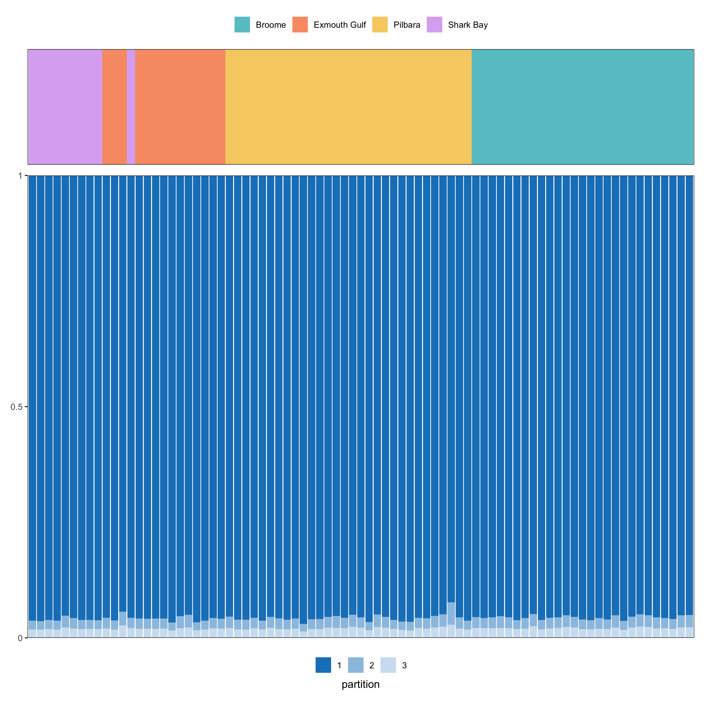
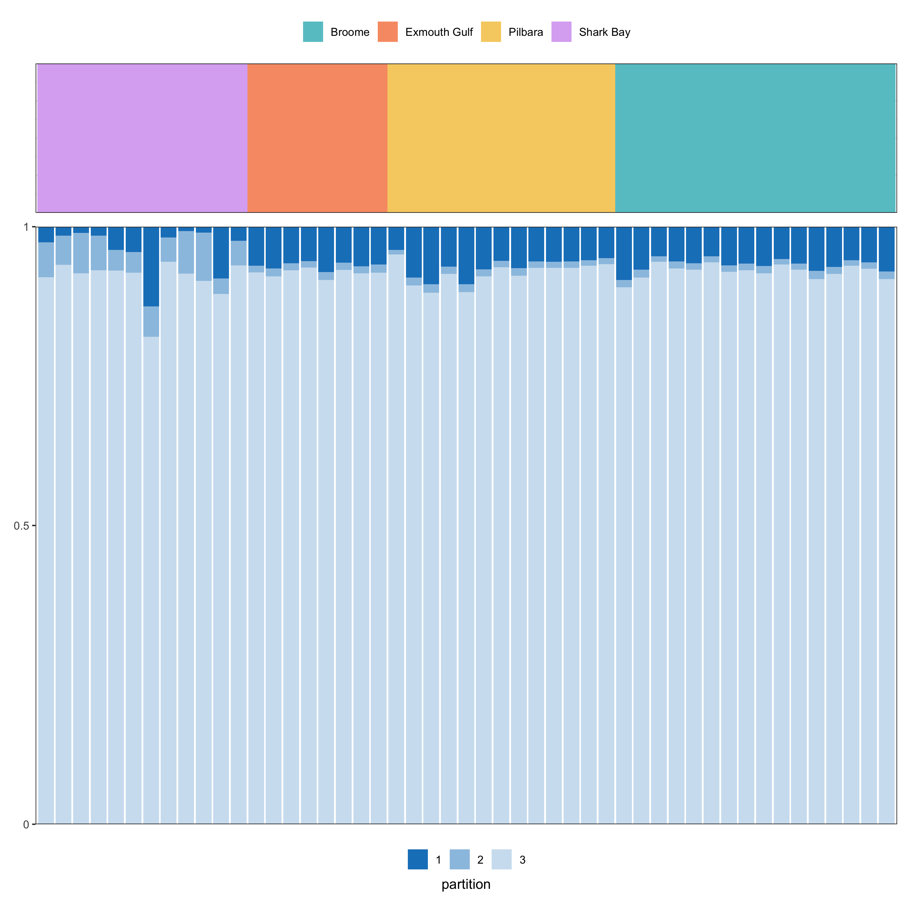
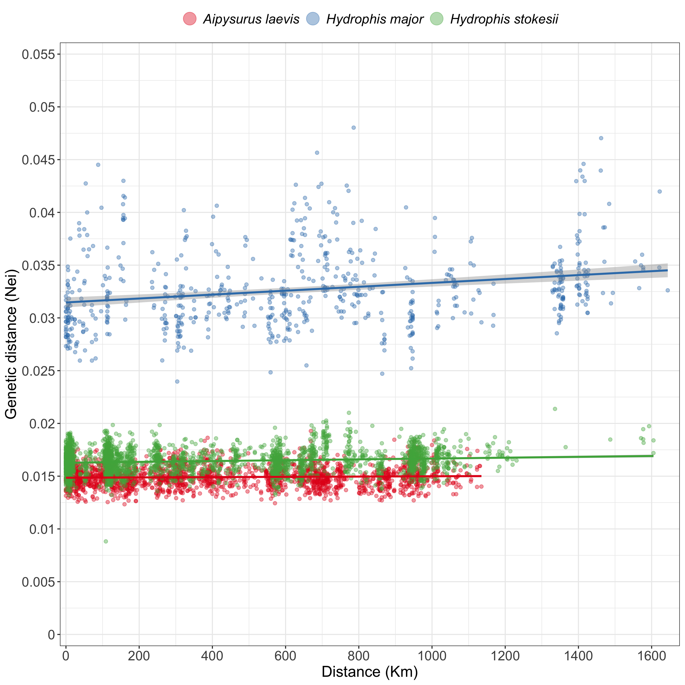

Population structure
================
2025-04-07

- [Helper functions](#helper-functions)
- [Removed samples](#removed-samples)
  - [PCA](#pca)
    - [All samples](#all-samples)
    - [WA Coast](#wa-coast)
  - [STRUCTURE](#structure)
    - [Choosing the correct K (N-ancestral
      populations)](#choosing-the-correct-k-n-ancestral-populations)
    - [*Aipysurus laevis*](#aipysurus-laevis)
    - [*Hydrophis major*](#hydrophis-major)
    - [*Hydrophis stokesii*](#hydrophis-stokesii)
  - [STRUCTURE: WA coast samples](#structure-wa-coast-samples)
    - [*Aipysurus laevis*](#aipysurus-laevis-1)
    - [*Hydrophis major*](#hydrophis-major-1)
    - [*Hydrophis stokesii*](#hydrophis-stokesii-1)
- [Isolation by Distance (IBD)](#isolation-by-distance-ibd)
  - [Mantel statistics and spatial
    auto-correlation](#mantel-statistics-and-spatial-auto-correlation)
  - [IBD visualisation](#ibd-visualisation)
    - [Geographic distance vs Genetic
      distance](#geographic-distance-vs-genetic-distance)
    - [Spatial auto-correlation](#spatial-auto-correlation)

This directory contains population structure results. The script
`population-structure.Rmd` renders this `README` and is responsible for
creating the relevant outputs.

## Helper functions

This helper function is for generating the PCAs. It handles finding `x`
and `y` maxima/minima and formatting.

``` r
# Function that takes the PCA list we'll generate below and plot the desired PCs
# for the specified population
plotPCA <- function(pca_dataframe, variance_dataframe, spec, WA_only, pcA, pcB, xstep = 1, ystep = 1, pal) {
    full_species <- set_names(c("ALA", "HMA", "HST"), c("Aipysurus laevis", "Hydrophis major", "Hydrophis stokesii"))
    plot_title <- names(full_species[full_species == spec])
    
    sp_pca <- pca_dataframe |>
        filter(species == spec, WA == WA_only)
    
    sp_var <- variance_dataframe |>
        filter(species == spec, WA == WA_only)
    
    # TODO: Figure out why this is being a piece of shit
    if(WA_only){
        wa_levels <- pca_dataframe |> 
            filter(WA == TRUE) |> 
            pull(population) |> 
            unique() |>
            as.character()
        
        sp_pca <- sp_pca |>
            mutate(
                population = factor(
                    population,
                    levels = wa_levels
                )
            )
    }
    
    # x-axis: max/min
    xmin <- sp_pca |>
        pull(pcA) |>
        min(na.rm = TRUE) |>
        floor()
    
    xmax <- sp_pca |>
        pull(pcA) |>
        max(na.rm = TRUE) |>
        ceiling()
    
    # y-axis: max/min
    ymin <- sp_pca |>
        pull(pcB) |>
        min(na.rm = TRUE) |>
        floor()
    
    ymax <- sp_pca |>
        pull(pcB) |>
        max(na.rm = TRUE) |>
        ceiling()
    
    # Variance strings
    pcA_var <- round(
        sp_var |>
            filter(pc_axes == pcA) |>
            pull(variance) * 100, digits = 2
    )
    
    pcB_var <- round(
        sp_var |>
            filter(pc_axes == pcB) |>
            pull(variance) * 100, digits = 2
    )
    
    sp_pca |>
        ggplot(
            aes(
                x = .data[[pcA]], y = .data[[pcB]],
                colour = population
            )
        ) +
        geom_point(size = 2.5, show.legend=TRUE) +
        scale_colour_manual(
            values = pal,
            drop = FALSE
        ) +
        labs(
            title = glue::glue("{plot_title}"),
            colour = "Population",
            x = glue::glue("{pcA} ({pcA_var}%)"),
            y = glue::glue("{pcB} ({pcB_var}%)")
        ) +
        scale_y_continuous(
            limits = c(ymin, ymax),
            breaks = seq(ymin, ymax, by = ystep),
            labels = as.character(seq(ymin, ymax, by = ystep)),
            expand = c(0, 0)
        ) +
        scale_x_continuous(
            limits = c(xmin, xmax),
            breaks = seq(xmin, xmax, by = xstep),
            labels = as.character(seq(xmin, xmax, by = xstep)),
            expand = c(0, 0)
        ) +
        theme(
            axis.text = element_text(size = 14),
            axis.title = element_text(size = 14),
            legend.position = "bottom",
            legend.title = element_text(hjust = 0.5, size = 14),
            legend.title.position = "top",
            legend.text = element_text(size = 14),
            plot.title = element_text(hjust = 0.5, face = "bold.italic")
        )
}
```

# Removed samples

A range of samples were excluded from the PCAs below. Further numerous
populations were ignored when running `STRUCTURE`. These can be found in
the following files

- \[dropped-samples.tsv\]\[dropped\]
- Per-species populations to ignore (\[here\]\[ignore\])

## PCA

Principal component analysis (PCA) was conducted using the \[Ipyrad
analysis toolkit\]\[ipatools\]. The code responsible for the CSV files
we’re loading in below can be found \[here\]\[pcaipynb\]. Below, we’re
simply creating custom figures. We generate PCAs for **all** samples
across all populations for each species.

``` r
pop_levels <- c(
    "Shark Bay" ,"Exmouth Gulf", "Pilbara", 
    "Broome", "North Kimberley", "Scott Reef", "Ashmore", "Heywood Shoal",
    "Gulf of Carpentaria", "North QLD", "South QLD", "New Caledonia"
)

# PCA dataframes
df_pca <- fs::dir_ls(here("results", "population-structure", "pca"), glob = "*.csv") |>
    (\(x) x[!str_detect(x, "variance")])() |>
    imap(\(x, i) {
        fname <- str_remove(basename(i), ".csv")
        spec <- str_remove(fname, "-.*")
        wa <- if(str_detect(fname, "WA")) TRUE else FALSE
        
        tmp <- x |>
            read_csv(col_names = TRUE, col_types = cols())
        colnames(tmp) <- c("sample", paste0("PC", 1:(ncol(tmp) - 1)))
        pops |>
            filter(species == spec) |>
            inner_join(tmp) |>
            mutate(WA = wa, .after = species)
    }) |>
    list_rbind() |>
    select(species, WA, sample, population, PC1, PC2, PC3) |>
    mutate(
        population = str_replace_all(population, "_", " "),
        population = factor(population, levels = pop_levels)
    )

# Variance dataframes
df_variance <- fs::dir_ls(here("results", "population-structure", "pca"), glob = "*variance.csv") |>
    imap(\(x, i) {
        fname <- str_remove(basename(i), ".csv")
        spec <- str_remove(fname, "-.*")
        wa <- if(str_detect(fname, "WA")) TRUE else FALSE
        x |>
            read_csv(
                skip = 1,
                col_names = c("pc_axes", "variance"),
                col_types = cols()
            ) |>
            mutate(
                species = spec,
                WA = wa,
                pc_axes = pc_axes + 1,
                pc_axes = paste0("PC", pc_axes)
            ) |>
            filter(pc_axes %in% c("PC1", "PC2", "PC3"))
    }) |>
    list_rbind()
```

``` r
# Custom ordering of colour palette
pal_PCA <- c(
    "#DCB0F2FF","#F89C74FF", "#F6CF71FF", "#66C5CCFF","#FE88B1FF", "#87C55FFF",
    "#B497E7FF", "#B3B3B3FF", "#C9DB74FF", "#9EB9F3FF", "#D3B484FF", "#8BE0A4FF"
)
names(pal_PCA) <- pop_levels
```

### All samples

``` r
ala_pc_1_2 <- plotPCA(pca_dataframe = df_pca, variance_dataframe = df_variance, WA_only = FALSE, spec = "ALA", pcA = "PC1", pcB = "PC2", xstep = 2, pal = pal_PCA)
hst_pc_1_2 <- plotPCA(pca_dataframe = df_pca, variance_dataframe = df_variance, WA_only = FALSE, spec = "HMA", pcA = "PC1", pcB = "PC2", xstep = 2, ystep = 2, pal = pal_PCA)
hma_pc_1_2 <- plotPCA(pca_dataframe = df_pca, variance_dataframe = df_variance, WA_only = FALSE, spec = "HST", pcA = "PC1", pcB = "PC2", xstep = 2, ystep = 2, pal = pal_PCA)

design <- "12\n34"

plot_pca_all <- ala_pc_1_2 + hst_pc_1_2 + hma_pc_1_2 + guide_area() +
    plot_layout(
        design = design,
        guides = "collect",
        axes = "collect"
    ) +
    plot_annotation(tag_levels = 'A') &
    guides(colour = guide_legend(ncol = 2, override.aes = list(size = 3))) &
    theme(plot.tag = element_text(size = 14, face = "bold"))

ragg::agg_png(
    filename = here("results", "population-structure", "pca-all-species-all-pops.png"),
    width = 1500, 
    height = 1500,
    units = "px",  
    res = 150
)
plot_pca_all
invisible(dev.off())

plot_pca_all
```


### WA Coast

And the same for *just* the WA coastline samples

``` r
ala_pc_1_2 <- plotPCA(pca_dataframe = df_pca, variance_dataframe = df_variance, WA_only = TRUE, spec = "ALA", pcA = "PC1", pcB = "PC2", xstep = 2, ystep = 2, pal = pal_PCA)
hma_pc_1_2 <- plotPCA(pca_dataframe = df_pca, variance_dataframe = df_variance, WA_only = TRUE, spec = "HMA", pcA = "PC1", pcB = "PC2", xstep = 2, ystep = 2, pal = pal_PCA)
hst_pc_1_2 <- plotPCA(pca_dataframe = df_pca, variance_dataframe = df_variance, WA_only = TRUE, spec = "HST", pcA = "PC1", pcB = "PC2", xstep = 2, ystep = 2, pal = pal_PCA)

design <- "12\n34"

plot_pca_wa <- ala_pc_1_2 + hma_pc_1_2 + hst_pc_1_2 + guide_area() +
    plot_layout(
        design = design,
        guides = "collect",
        axes = "collect"
    ) &
    plot_annotation(tag_levels = 'A') &
    guides(colour = guide_legend(ncol = 2, override.aes = list(size = 3))) &
    theme(plot.tag = element_text(size = 14, face = "bold"))

ragg::agg_png(
    filename = here("results", "population-structure", "pca-all-species-WA-pops.png"),
    width = 1500, 
    height = 1500,
    units = "px",  
    res = 150
)
plot_pca_wa
invisible(dev.off())

plot_pca_wa
```


We can see that the Shark Bay samples partition off in both *A. laevis*
and *H. major*.

## STRUCTURE

`STRUCTURE` plots are then generated for WA populations, specifically:
Broome, Pilbara, Exmouth Gulf, Shark Bay and North Kimberley. In the
PCAs above, samples from these populations typically cluster together,
showing little structure. Consequently, we’re using this method as a
more granular approach to determine if there is any allele sharing
between the populations.

``` r
structure_df <- fs::dir_ls(
    here("results", "population-structure", "structure-all-updated"), 
    glob = "*plot.csv", 
    recurse = TRUE
) |>
    map(\(x) {
        tmp <- x |>
            read_csv(col_names = TRUE, col_types = cols())
        tmp |>
            mutate(K = glue::glue("K{ncol(tmp) - 1}")) |>
            pivot_longer(names_to = "partition", values_to = "proportion", 2:ncol(tmp)) |>
            mutate(partition = as.numeric(partition) + 1) |>
            rename(sample = `...1`) |>
            left_join(pops) |>
            left_join(popmap_lat_long)
    }) |>
    bind_rows() |>
    mutate(
        partition = forcats::fct_inorder(as.character(partition)),
        population = str_replace_all(population, "_", " "),
        # population = factor(population, levels = structure_pops),
        .by = K
    ) |>
    arrange(species, longitude) |>
    mutate(
        sample = forcats::fct_inorder(sample),
        population = forcats::fct_inorder(population)
    )

# Custom ordering of colour palette
# pal <- c(
#     "#ff595e", "#ffca3a", "#8ac926", "#1982c4"
# )
pal <- c("#1982c4", "#1982c480", "#1982c440", "#1982c410")
names(pal) <- 1:4
```

### Choosing the correct K (N-ancestral populations)

Choosing the best `K` value can be determined by plotting the estimated
log-probability for each `K` value, in addition to the delta-K value.
The values can be interpreted as follows:

- **Estimated log-probability**: Higher values equal better model fit.
- **Delta-K**: The rate of change between successive K-values. Larger
  values indicate greater change in the model fit.

The results for the three species are shown below.

``` r
etable <- fs::dir_ls(
    here("results", "population-structure", "structure-all-updated"), 
    glob = "*etable.csv",
    recurse = TRUE
) |>
    read_csv(col_names = TRUE, col_types = cols(), id = "species") |>
    mutate(species = str_remove(basename(species), "-.*")) |>
    rename(K = `...1`)

etable |>
    gt(groupname_col = "species") |>
    fmt_number(
        columns = c("K", "Nreps"),
        drop_trailing_zeros = TRUE
    ) |>
    fmt_number(
        columns = 3:7,
        n_sigfig = 4
    ) |>
    as_raw_html()
```

<div id="xtzlmlnogq" style="padding-left:0px;padding-right:0px;padding-top:10px;padding-bottom:10px;overflow-x:auto;overflow-y:auto;width:auto;height:auto;">
  &#10;  <table class="gt_table" data-quarto-disable-processing="false" data-quarto-bootstrap="false" style="-webkit-font-smoothing: antialiased; -moz-osx-font-smoothing: grayscale; font-family: system-ui, 'Segoe UI', Roboto, Helvetica, Arial, sans-serif, 'Apple Color Emoji', 'Segoe UI Emoji', 'Segoe UI Symbol', 'Noto Color Emoji'; display: table; border-collapse: collapse; line-height: normal; margin-left: auto; margin-right: auto; color: #333333; font-size: 16px; font-weight: normal; font-style: normal; background-color: #FFFFFF; width: auto; border-top-style: solid; border-top-width: 2px; border-top-color: #A8A8A8; border-right-style: none; border-right-width: 2px; border-right-color: #D3D3D3; border-bottom-style: solid; border-bottom-width: 2px; border-bottom-color: #A8A8A8; border-left-style: none; border-left-width: 2px; border-left-color: #D3D3D3;" bgcolor="#FFFFFF">
  <thead style="border-style: none;">
    <tr class="gt_col_headings" style="border-style: none; border-top-style: solid; border-top-width: 2px; border-top-color: #D3D3D3; border-bottom-style: solid; border-bottom-width: 2px; border-bottom-color: #D3D3D3; border-left-style: none; border-left-width: 1px; border-left-color: #D3D3D3; border-right-style: none; border-right-width: 1px; border-right-color: #D3D3D3;">
      <th class="gt_col_heading gt_columns_bottom_border gt_right" rowspan="1" colspan="1" scope="col" id="K" style="border-style: none; color: #333333; background-color: #FFFFFF; font-size: 100%; font-weight: normal; text-transform: inherit; border-left-style: none; border-left-width: 1px; border-left-color: #D3D3D3; border-right-style: none; border-right-width: 1px; border-right-color: #D3D3D3; vertical-align: bottom; padding-top: 5px; padding-bottom: 6px; padding-left: 5px; padding-right: 5px; overflow-x: hidden; text-align: right; font-variant-numeric: tabular-nums;" bgcolor="#FFFFFF" valign="bottom" align="right">K</th>
      <th class="gt_col_heading gt_columns_bottom_border gt_right" rowspan="1" colspan="1" scope="col" id="Nreps" style="border-style: none; color: #333333; background-color: #FFFFFF; font-size: 100%; font-weight: normal; text-transform: inherit; border-left-style: none; border-left-width: 1px; border-left-color: #D3D3D3; border-right-style: none; border-right-width: 1px; border-right-color: #D3D3D3; vertical-align: bottom; padding-top: 5px; padding-bottom: 6px; padding-left: 5px; padding-right: 5px; overflow-x: hidden; text-align: right; font-variant-numeric: tabular-nums;" bgcolor="#FFFFFF" valign="bottom" align="right">Nreps</th>
      <th class="gt_col_heading gt_columns_bottom_border gt_right" rowspan="1" colspan="1" scope="col" id="lnPK" style="border-style: none; color: #333333; background-color: #FFFFFF; font-size: 100%; font-weight: normal; text-transform: inherit; border-left-style: none; border-left-width: 1px; border-left-color: #D3D3D3; border-right-style: none; border-right-width: 1px; border-right-color: #D3D3D3; vertical-align: bottom; padding-top: 5px; padding-bottom: 6px; padding-left: 5px; padding-right: 5px; overflow-x: hidden; text-align: right; font-variant-numeric: tabular-nums;" bgcolor="#FFFFFF" valign="bottom" align="right">lnPK</th>
      <th class="gt_col_heading gt_columns_bottom_border gt_right" rowspan="1" colspan="1" scope="col" id="lnPPK" style="border-style: none; color: #333333; background-color: #FFFFFF; font-size: 100%; font-weight: normal; text-transform: inherit; border-left-style: none; border-left-width: 1px; border-left-color: #D3D3D3; border-right-style: none; border-right-width: 1px; border-right-color: #D3D3D3; vertical-align: bottom; padding-top: 5px; padding-bottom: 6px; padding-left: 5px; padding-right: 5px; overflow-x: hidden; text-align: right; font-variant-numeric: tabular-nums;" bgcolor="#FFFFFF" valign="bottom" align="right">lnPPK</th>
      <th class="gt_col_heading gt_columns_bottom_border gt_right" rowspan="1" colspan="1" scope="col" id="deltaK" style="border-style: none; color: #333333; background-color: #FFFFFF; font-size: 100%; font-weight: normal; text-transform: inherit; border-left-style: none; border-left-width: 1px; border-left-color: #D3D3D3; border-right-style: none; border-right-width: 1px; border-right-color: #D3D3D3; vertical-align: bottom; padding-top: 5px; padding-bottom: 6px; padding-left: 5px; padding-right: 5px; overflow-x: hidden; text-align: right; font-variant-numeric: tabular-nums;" bgcolor="#FFFFFF" valign="bottom" align="right">deltaK</th>
      <th class="gt_col_heading gt_columns_bottom_border gt_right" rowspan="1" colspan="1" scope="col" id="estLnProbMean" style="border-style: none; color: #333333; background-color: #FFFFFF; font-size: 100%; font-weight: normal; text-transform: inherit; border-left-style: none; border-left-width: 1px; border-left-color: #D3D3D3; border-right-style: none; border-right-width: 1px; border-right-color: #D3D3D3; vertical-align: bottom; padding-top: 5px; padding-bottom: 6px; padding-left: 5px; padding-right: 5px; overflow-x: hidden; text-align: right; font-variant-numeric: tabular-nums;" bgcolor="#FFFFFF" valign="bottom" align="right">estLnProbMean</th>
      <th class="gt_col_heading gt_columns_bottom_border gt_right" rowspan="1" colspan="1" scope="col" id="estLnProbStdev" style="border-style: none; color: #333333; background-color: #FFFFFF; font-size: 100%; font-weight: normal; text-transform: inherit; border-left-style: none; border-left-width: 1px; border-left-color: #D3D3D3; border-right-style: none; border-right-width: 1px; border-right-color: #D3D3D3; vertical-align: bottom; padding-top: 5px; padding-bottom: 6px; padding-left: 5px; padding-right: 5px; overflow-x: hidden; text-align: right; font-variant-numeric: tabular-nums;" bgcolor="#FFFFFF" valign="bottom" align="right">estLnProbStdev</th>
    </tr>
  </thead>
  <tbody class="gt_table_body" style="border-style: none; border-top-style: solid; border-top-width: 2px; border-top-color: #D3D3D3; border-bottom-style: solid; border-bottom-width: 2px; border-bottom-color: #D3D3D3;">
    <tr class="gt_group_heading_row" style="border-style: none;">
      <th colspan="7" class="gt_group_heading" scope="colgroup" id="ALA" style="border-style: none; padding-top: 8px; padding-bottom: 8px; padding-left: 5px; padding-right: 5px; color: #333333; background-color: #FFFFFF; font-size: 100%; font-weight: initial; text-transform: inherit; border-top-style: solid; border-top-width: 2px; border-top-color: #D3D3D3; border-bottom-style: solid; border-bottom-width: 2px; border-bottom-color: #D3D3D3; border-left-style: none; border-left-width: 1px; border-left-color: #D3D3D3; border-right-style: none; border-right-width: 1px; border-right-color: #D3D3D3; vertical-align: middle; text-align: left;" bgcolor="#FFFFFF" valign="middle" align="left">ALA</th>
    </tr>
    <tr class="gt_row_group_first" style="border-style: none;"><td headers="ALA  K" class="gt_row gt_right" style="border-style: none; padding-top: 8px; padding-bottom: 8px; padding-left: 5px; padding-right: 5px; margin: 10px; border-top-style: solid; border-top-color: #D3D3D3; border-left-style: none; border-left-width: 1px; border-left-color: #D3D3D3; border-right-style: none; border-right-width: 1px; border-right-color: #D3D3D3; vertical-align: middle; overflow-x: hidden; text-align: right; font-variant-numeric: tabular-nums; border-top-width: 2px;" valign="middle" align="right">2</td>
<td headers="ALA  Nreps" class="gt_row gt_right" style="border-style: none; padding-top: 8px; padding-bottom: 8px; padding-left: 5px; padding-right: 5px; margin: 10px; border-top-style: solid; border-top-color: #D3D3D3; border-left-style: none; border-left-width: 1px; border-left-color: #D3D3D3; border-right-style: none; border-right-width: 1px; border-right-color: #D3D3D3; vertical-align: middle; overflow-x: hidden; text-align: right; font-variant-numeric: tabular-nums; border-top-width: 2px;" valign="middle" align="right">10.00</td>
<td headers="ALA  lnPK" class="gt_row gt_right" style="border-style: none; padding-top: 8px; padding-bottom: 8px; padding-left: 5px; padding-right: 5px; margin: 10px; border-top-style: solid; border-top-color: #D3D3D3; border-left-style: none; border-left-width: 1px; border-left-color: #D3D3D3; border-right-style: none; border-right-width: 1px; border-right-color: #D3D3D3; vertical-align: middle; overflow-x: hidden; text-align: right; font-variant-numeric: tabular-nums; border-top-width: 2px;" valign="middle" align="right">0</td>
<td headers="ALA  lnPPK" class="gt_row gt_right" style="border-style: none; padding-top: 8px; padding-bottom: 8px; padding-left: 5px; padding-right: 5px; margin: 10px; border-top-style: solid; border-top-color: #D3D3D3; border-left-style: none; border-left-width: 1px; border-left-color: #D3D3D3; border-right-style: none; border-right-width: 1px; border-right-color: #D3D3D3; vertical-align: middle; overflow-x: hidden; text-align: right; font-variant-numeric: tabular-nums; border-top-width: 2px;" valign="middle" align="right">0</td>
<td headers="ALA  deltaK" class="gt_row gt_right" style="border-style: none; padding-top: 8px; padding-bottom: 8px; padding-left: 5px; padding-right: 5px; margin: 10px; border-top-style: solid; border-top-color: #D3D3D3; border-left-style: none; border-left-width: 1px; border-left-color: #D3D3D3; border-right-style: none; border-right-width: 1px; border-right-color: #D3D3D3; vertical-align: middle; overflow-x: hidden; text-align: right; font-variant-numeric: tabular-nums; border-top-width: 2px;" valign="middle" align="right">0</td>
<td headers="ALA  estLnProbMean" class="gt_row gt_right" style="border-style: none; padding-top: 8px; padding-bottom: 8px; padding-left: 5px; padding-right: 5px; margin: 10px; border-top-style: solid; border-top-color: #D3D3D3; border-left-style: none; border-left-width: 1px; border-left-color: #D3D3D3; border-right-style: none; border-right-width: 1px; border-right-color: #D3D3D3; vertical-align: middle; overflow-x: hidden; text-align: right; font-variant-numeric: tabular-nums; border-top-width: 2px;" valign="middle" align="right">−34,690</td>
<td headers="ALA  estLnProbStdev" class="gt_row gt_right" style="border-style: none; padding-top: 8px; padding-bottom: 8px; padding-left: 5px; padding-right: 5px; margin: 10px; border-top-style: solid; border-top-color: #D3D3D3; border-left-style: none; border-left-width: 1px; border-left-color: #D3D3D3; border-right-style: none; border-right-width: 1px; border-right-color: #D3D3D3; vertical-align: middle; overflow-x: hidden; text-align: right; font-variant-numeric: tabular-nums; border-top-width: 2px;" valign="middle" align="right">1013.4942</td></tr>
    <tr style="border-style: none;"><td headers="ALA  K" class="gt_row gt_right" style="border-style: none; padding-top: 8px; padding-bottom: 8px; padding-left: 5px; padding-right: 5px; margin: 10px; border-top-style: solid; border-top-width: 1px; border-top-color: #D3D3D3; border-left-style: none; border-left-width: 1px; border-left-color: #D3D3D3; border-right-style: none; border-right-width: 1px; border-right-color: #D3D3D3; vertical-align: middle; overflow-x: hidden; text-align: right; font-variant-numeric: tabular-nums;" valign="middle" align="right">3</td>
<td headers="ALA  Nreps" class="gt_row gt_right" style="border-style: none; padding-top: 8px; padding-bottom: 8px; padding-left: 5px; padding-right: 5px; margin: 10px; border-top-style: solid; border-top-width: 1px; border-top-color: #D3D3D3; border-left-style: none; border-left-width: 1px; border-left-color: #D3D3D3; border-right-style: none; border-right-width: 1px; border-right-color: #D3D3D3; vertical-align: middle; overflow-x: hidden; text-align: right; font-variant-numeric: tabular-nums;" valign="middle" align="right">10.00</td>
<td headers="ALA  lnPK" class="gt_row gt_right" style="border-style: none; padding-top: 8px; padding-bottom: 8px; padding-left: 5px; padding-right: 5px; margin: 10px; border-top-style: solid; border-top-width: 1px; border-top-color: #D3D3D3; border-left-style: none; border-left-width: 1px; border-left-color: #D3D3D3; border-right-style: none; border-right-width: 1px; border-right-color: #D3D3D3; vertical-align: middle; overflow-x: hidden; text-align: right; font-variant-numeric: tabular-nums;" valign="middle" align="right">356.0</td>
<td headers="ALA  lnPPK" class="gt_row gt_right" style="border-style: none; padding-top: 8px; padding-bottom: 8px; padding-left: 5px; padding-right: 5px; margin: 10px; border-top-style: solid; border-top-width: 1px; border-top-color: #D3D3D3; border-left-style: none; border-left-width: 1px; border-left-color: #D3D3D3; border-right-style: none; border-right-width: 1px; border-right-color: #D3D3D3; vertical-align: middle; overflow-x: hidden; text-align: right; font-variant-numeric: tabular-nums;" valign="middle" align="right">2.920</td>
<td headers="ALA  deltaK" class="gt_row gt_right" style="border-style: none; padding-top: 8px; padding-bottom: 8px; padding-left: 5px; padding-right: 5px; margin: 10px; border-top-style: solid; border-top-width: 1px; border-top-color: #D3D3D3; border-left-style: none; border-left-width: 1px; border-left-color: #D3D3D3; border-right-style: none; border-right-width: 1px; border-right-color: #D3D3D3; vertical-align: middle; overflow-x: hidden; text-align: right; font-variant-numeric: tabular-nums;" valign="middle" align="right">0.003532</td>
<td headers="ALA  estLnProbMean" class="gt_row gt_right" style="border-style: none; padding-top: 8px; padding-bottom: 8px; padding-left: 5px; padding-right: 5px; margin: 10px; border-top-style: solid; border-top-width: 1px; border-top-color: #D3D3D3; border-left-style: none; border-left-width: 1px; border-left-color: #D3D3D3; border-right-style: none; border-right-width: 1px; border-right-color: #D3D3D3; vertical-align: middle; overflow-x: hidden; text-align: right; font-variant-numeric: tabular-nums;" valign="middle" align="right">−34,330</td>
<td headers="ALA  estLnProbStdev" class="gt_row gt_right" style="border-style: none; padding-top: 8px; padding-bottom: 8px; padding-left: 5px; padding-right: 5px; margin: 10px; border-top-style: solid; border-top-width: 1px; border-top-color: #D3D3D3; border-left-style: none; border-left-width: 1px; border-left-color: #D3D3D3; border-right-style: none; border-right-width: 1px; border-right-color: #D3D3D3; vertical-align: middle; overflow-x: hidden; text-align: right; font-variant-numeric: tabular-nums;" valign="middle" align="right">826.7418</td></tr>
    <tr style="border-style: none;"><td headers="ALA  K" class="gt_row gt_right" style="border-style: none; padding-top: 8px; padding-bottom: 8px; padding-left: 5px; padding-right: 5px; margin: 10px; border-top-style: solid; border-top-width: 1px; border-top-color: #D3D3D3; border-left-style: none; border-left-width: 1px; border-left-color: #D3D3D3; border-right-style: none; border-right-width: 1px; border-right-color: #D3D3D3; vertical-align: middle; overflow-x: hidden; text-align: right; font-variant-numeric: tabular-nums;" valign="middle" align="right">4</td>
<td headers="ALA  Nreps" class="gt_row gt_right" style="border-style: none; padding-top: 8px; padding-bottom: 8px; padding-left: 5px; padding-right: 5px; margin: 10px; border-top-style: solid; border-top-width: 1px; border-top-color: #D3D3D3; border-left-style: none; border-left-width: 1px; border-left-color: #D3D3D3; border-right-style: none; border-right-width: 1px; border-right-color: #D3D3D3; vertical-align: middle; overflow-x: hidden; text-align: right; font-variant-numeric: tabular-nums;" valign="middle" align="right">10.00</td>
<td headers="ALA  lnPK" class="gt_row gt_right" style="border-style: none; padding-top: 8px; padding-bottom: 8px; padding-left: 5px; padding-right: 5px; margin: 10px; border-top-style: solid; border-top-width: 1px; border-top-color: #D3D3D3; border-left-style: none; border-left-width: 1px; border-left-color: #D3D3D3; border-right-style: none; border-right-width: 1px; border-right-color: #D3D3D3; vertical-align: middle; overflow-x: hidden; text-align: right; font-variant-numeric: tabular-nums;" valign="middle" align="right">353.1</td>
<td headers="ALA  lnPPK" class="gt_row gt_right" style="border-style: none; padding-top: 8px; padding-bottom: 8px; padding-left: 5px; padding-right: 5px; margin: 10px; border-top-style: solid; border-top-width: 1px; border-top-color: #D3D3D3; border-left-style: none; border-left-width: 1px; border-left-color: #D3D3D3; border-right-style: none; border-right-width: 1px; border-right-color: #D3D3D3; vertical-align: middle; overflow-x: hidden; text-align: right; font-variant-numeric: tabular-nums;" valign="middle" align="right">799.9</td>
<td headers="ALA  deltaK" class="gt_row gt_right" style="border-style: none; padding-top: 8px; padding-bottom: 8px; padding-left: 5px; padding-right: 5px; margin: 10px; border-top-style: solid; border-top-width: 1px; border-top-color: #D3D3D3; border-left-style: none; border-left-width: 1px; border-left-color: #D3D3D3; border-right-style: none; border-right-width: 1px; border-right-color: #D3D3D3; vertical-align: middle; overflow-x: hidden; text-align: right; font-variant-numeric: tabular-nums;" valign="middle" align="right">0.9035</td>
<td headers="ALA  estLnProbMean" class="gt_row gt_right" style="border-style: none; padding-top: 8px; padding-bottom: 8px; padding-left: 5px; padding-right: 5px; margin: 10px; border-top-style: solid; border-top-width: 1px; border-top-color: #D3D3D3; border-left-style: none; border-left-width: 1px; border-left-color: #D3D3D3; border-right-style: none; border-right-width: 1px; border-right-color: #D3D3D3; vertical-align: middle; overflow-x: hidden; text-align: right; font-variant-numeric: tabular-nums;" valign="middle" align="right">−33,980</td>
<td headers="ALA  estLnProbStdev" class="gt_row gt_right" style="border-style: none; padding-top: 8px; padding-bottom: 8px; padding-left: 5px; padding-right: 5px; margin: 10px; border-top-style: solid; border-top-width: 1px; border-top-color: #D3D3D3; border-left-style: none; border-left-width: 1px; border-left-color: #D3D3D3; border-right-style: none; border-right-width: 1px; border-right-color: #D3D3D3; vertical-align: middle; overflow-x: hidden; text-align: right; font-variant-numeric: tabular-nums;" valign="middle" align="right">885.3255</td></tr>
    <tr style="border-style: none;"><td headers="ALA  K" class="gt_row gt_right" style="border-style: none; padding-top: 8px; padding-bottom: 8px; padding-left: 5px; padding-right: 5px; margin: 10px; border-top-style: solid; border-top-width: 1px; border-top-color: #D3D3D3; border-left-style: none; border-left-width: 1px; border-left-color: #D3D3D3; border-right-style: none; border-right-width: 1px; border-right-color: #D3D3D3; vertical-align: middle; overflow-x: hidden; text-align: right; font-variant-numeric: tabular-nums;" valign="middle" align="right">5</td>
<td headers="ALA  Nreps" class="gt_row gt_right" style="border-style: none; padding-top: 8px; padding-bottom: 8px; padding-left: 5px; padding-right: 5px; margin: 10px; border-top-style: solid; border-top-width: 1px; border-top-color: #D3D3D3; border-left-style: none; border-left-width: 1px; border-left-color: #D3D3D3; border-right-style: none; border-right-width: 1px; border-right-color: #D3D3D3; vertical-align: middle; overflow-x: hidden; text-align: right; font-variant-numeric: tabular-nums;" valign="middle" align="right">10.00</td>
<td headers="ALA  lnPK" class="gt_row gt_right" style="border-style: none; padding-top: 8px; padding-bottom: 8px; padding-left: 5px; padding-right: 5px; margin: 10px; border-top-style: solid; border-top-width: 1px; border-top-color: #D3D3D3; border-left-style: none; border-left-width: 1px; border-left-color: #D3D3D3; border-right-style: none; border-right-width: 1px; border-right-color: #D3D3D3; vertical-align: middle; overflow-x: hidden; text-align: right; font-variant-numeric: tabular-nums;" valign="middle" align="right">−446.8</td>
<td headers="ALA  lnPPK" class="gt_row gt_right" style="border-style: none; padding-top: 8px; padding-bottom: 8px; padding-left: 5px; padding-right: 5px; margin: 10px; border-top-style: solid; border-top-width: 1px; border-top-color: #D3D3D3; border-left-style: none; border-left-width: 1px; border-left-color: #D3D3D3; border-right-style: none; border-right-width: 1px; border-right-color: #D3D3D3; vertical-align: middle; overflow-x: hidden; text-align: right; font-variant-numeric: tabular-nums;" valign="middle" align="right">0</td>
<td headers="ALA  deltaK" class="gt_row gt_right" style="border-style: none; padding-top: 8px; padding-bottom: 8px; padding-left: 5px; padding-right: 5px; margin: 10px; border-top-style: solid; border-top-width: 1px; border-top-color: #D3D3D3; border-left-style: none; border-left-width: 1px; border-left-color: #D3D3D3; border-right-style: none; border-right-width: 1px; border-right-color: #D3D3D3; vertical-align: middle; overflow-x: hidden; text-align: right; font-variant-numeric: tabular-nums;" valign="middle" align="right">0</td>
<td headers="ALA  estLnProbMean" class="gt_row gt_right" style="border-style: none; padding-top: 8px; padding-bottom: 8px; padding-left: 5px; padding-right: 5px; margin: 10px; border-top-style: solid; border-top-width: 1px; border-top-color: #D3D3D3; border-left-style: none; border-left-width: 1px; border-left-color: #D3D3D3; border-right-style: none; border-right-width: 1px; border-right-color: #D3D3D3; vertical-align: middle; overflow-x: hidden; text-align: right; font-variant-numeric: tabular-nums;" valign="middle" align="right">−34,430</td>
<td headers="ALA  estLnProbStdev" class="gt_row gt_right" style="border-style: none; padding-top: 8px; padding-bottom: 8px; padding-left: 5px; padding-right: 5px; margin: 10px; border-top-style: solid; border-top-width: 1px; border-top-color: #D3D3D3; border-left-style: none; border-left-width: 1px; border-left-color: #D3D3D3; border-right-style: none; border-right-width: 1px; border-right-color: #D3D3D3; vertical-align: middle; overflow-x: hidden; text-align: right; font-variant-numeric: tabular-nums;" valign="middle" align="right">914.7533</td></tr>
    <tr class="gt_group_heading_row" style="border-style: none;">
      <th colspan="7" class="gt_group_heading" scope="colgroup" id="HMA" style="border-style: none; padding-top: 8px; padding-bottom: 8px; padding-left: 5px; padding-right: 5px; color: #333333; background-color: #FFFFFF; font-size: 100%; font-weight: initial; text-transform: inherit; border-top-style: solid; border-top-width: 2px; border-top-color: #D3D3D3; border-bottom-style: solid; border-bottom-width: 2px; border-bottom-color: #D3D3D3; border-left-style: none; border-left-width: 1px; border-left-color: #D3D3D3; border-right-style: none; border-right-width: 1px; border-right-color: #D3D3D3; vertical-align: middle; text-align: left;" bgcolor="#FFFFFF" valign="middle" align="left">HMA</th>
    </tr>
    <tr class="gt_row_group_first" style="border-style: none;"><td headers="HMA  K" class="gt_row gt_right" style="border-style: none; padding-top: 8px; padding-bottom: 8px; padding-left: 5px; padding-right: 5px; margin: 10px; border-top-style: solid; border-top-color: #D3D3D3; border-left-style: none; border-left-width: 1px; border-left-color: #D3D3D3; border-right-style: none; border-right-width: 1px; border-right-color: #D3D3D3; vertical-align: middle; overflow-x: hidden; text-align: right; font-variant-numeric: tabular-nums; border-top-width: 2px;" valign="middle" align="right">2</td>
<td headers="HMA  Nreps" class="gt_row gt_right" style="border-style: none; padding-top: 8px; padding-bottom: 8px; padding-left: 5px; padding-right: 5px; margin: 10px; border-top-style: solid; border-top-color: #D3D3D3; border-left-style: none; border-left-width: 1px; border-left-color: #D3D3D3; border-right-style: none; border-right-width: 1px; border-right-color: #D3D3D3; vertical-align: middle; overflow-x: hidden; text-align: right; font-variant-numeric: tabular-nums; border-top-width: 2px;" valign="middle" align="right">10.00</td>
<td headers="HMA  lnPK" class="gt_row gt_right" style="border-style: none; padding-top: 8px; padding-bottom: 8px; padding-left: 5px; padding-right: 5px; margin: 10px; border-top-style: solid; border-top-color: #D3D3D3; border-left-style: none; border-left-width: 1px; border-left-color: #D3D3D3; border-right-style: none; border-right-width: 1px; border-right-color: #D3D3D3; vertical-align: middle; overflow-x: hidden; text-align: right; font-variant-numeric: tabular-nums; border-top-width: 2px;" valign="middle" align="right">0</td>
<td headers="HMA  lnPPK" class="gt_row gt_right" style="border-style: none; padding-top: 8px; padding-bottom: 8px; padding-left: 5px; padding-right: 5px; margin: 10px; border-top-style: solid; border-top-color: #D3D3D3; border-left-style: none; border-left-width: 1px; border-left-color: #D3D3D3; border-right-style: none; border-right-width: 1px; border-right-color: #D3D3D3; vertical-align: middle; overflow-x: hidden; text-align: right; font-variant-numeric: tabular-nums; border-top-width: 2px;" valign="middle" align="right">0</td>
<td headers="HMA  deltaK" class="gt_row gt_right" style="border-style: none; padding-top: 8px; padding-bottom: 8px; padding-left: 5px; padding-right: 5px; margin: 10px; border-top-style: solid; border-top-color: #D3D3D3; border-left-style: none; border-left-width: 1px; border-left-color: #D3D3D3; border-right-style: none; border-right-width: 1px; border-right-color: #D3D3D3; vertical-align: middle; overflow-x: hidden; text-align: right; font-variant-numeric: tabular-nums; border-top-width: 2px;" valign="middle" align="right">0</td>
<td headers="HMA  estLnProbMean" class="gt_row gt_right" style="border-style: none; padding-top: 8px; padding-bottom: 8px; padding-left: 5px; padding-right: 5px; margin: 10px; border-top-style: solid; border-top-color: #D3D3D3; border-left-style: none; border-left-width: 1px; border-left-color: #D3D3D3; border-right-style: none; border-right-width: 1px; border-right-color: #D3D3D3; vertical-align: middle; overflow-x: hidden; text-align: right; font-variant-numeric: tabular-nums; border-top-width: 2px;" valign="middle" align="right">−24,510</td>
<td headers="HMA  estLnProbStdev" class="gt_row gt_right" style="border-style: none; padding-top: 8px; padding-bottom: 8px; padding-left: 5px; padding-right: 5px; margin: 10px; border-top-style: solid; border-top-color: #D3D3D3; border-left-style: none; border-left-width: 1px; border-left-color: #D3D3D3; border-right-style: none; border-right-width: 1px; border-right-color: #D3D3D3; vertical-align: middle; overflow-x: hidden; text-align: right; font-variant-numeric: tabular-nums; border-top-width: 2px;" valign="middle" align="right">409.4447</td></tr>
    <tr style="border-style: none;"><td headers="HMA  K" class="gt_row gt_right" style="border-style: none; padding-top: 8px; padding-bottom: 8px; padding-left: 5px; padding-right: 5px; margin: 10px; border-top-style: solid; border-top-width: 1px; border-top-color: #D3D3D3; border-left-style: none; border-left-width: 1px; border-left-color: #D3D3D3; border-right-style: none; border-right-width: 1px; border-right-color: #D3D3D3; vertical-align: middle; overflow-x: hidden; text-align: right; font-variant-numeric: tabular-nums;" valign="middle" align="right">3</td>
<td headers="HMA  Nreps" class="gt_row gt_right" style="border-style: none; padding-top: 8px; padding-bottom: 8px; padding-left: 5px; padding-right: 5px; margin: 10px; border-top-style: solid; border-top-width: 1px; border-top-color: #D3D3D3; border-left-style: none; border-left-width: 1px; border-left-color: #D3D3D3; border-right-style: none; border-right-width: 1px; border-right-color: #D3D3D3; vertical-align: middle; overflow-x: hidden; text-align: right; font-variant-numeric: tabular-nums;" valign="middle" align="right">10.00</td>
<td headers="HMA  lnPK" class="gt_row gt_right" style="border-style: none; padding-top: 8px; padding-bottom: 8px; padding-left: 5px; padding-right: 5px; margin: 10px; border-top-style: solid; border-top-width: 1px; border-top-color: #D3D3D3; border-left-style: none; border-left-width: 1px; border-left-color: #D3D3D3; border-right-style: none; border-right-width: 1px; border-right-color: #D3D3D3; vertical-align: middle; overflow-x: hidden; text-align: right; font-variant-numeric: tabular-nums;" valign="middle" align="right">946.1</td>
<td headers="HMA  lnPPK" class="gt_row gt_right" style="border-style: none; padding-top: 8px; padding-bottom: 8px; padding-left: 5px; padding-right: 5px; margin: 10px; border-top-style: solid; border-top-width: 1px; border-top-color: #D3D3D3; border-left-style: none; border-left-width: 1px; border-left-color: #D3D3D3; border-right-style: none; border-right-width: 1px; border-right-color: #D3D3D3; vertical-align: middle; overflow-x: hidden; text-align: right; font-variant-numeric: tabular-nums;" valign="middle" align="right">1,206</td>
<td headers="HMA  deltaK" class="gt_row gt_right" style="border-style: none; padding-top: 8px; padding-bottom: 8px; padding-left: 5px; padding-right: 5px; margin: 10px; border-top-style: solid; border-top-width: 1px; border-top-color: #D3D3D3; border-left-style: none; border-left-width: 1px; border-left-color: #D3D3D3; border-right-style: none; border-right-width: 1px; border-right-color: #D3D3D3; vertical-align: middle; overflow-x: hidden; text-align: right; font-variant-numeric: tabular-nums;" valign="middle" align="right">3.416</td>
<td headers="HMA  estLnProbMean" class="gt_row gt_right" style="border-style: none; padding-top: 8px; padding-bottom: 8px; padding-left: 5px; padding-right: 5px; margin: 10px; border-top-style: solid; border-top-width: 1px; border-top-color: #D3D3D3; border-left-style: none; border-left-width: 1px; border-left-color: #D3D3D3; border-right-style: none; border-right-width: 1px; border-right-color: #D3D3D3; vertical-align: middle; overflow-x: hidden; text-align: right; font-variant-numeric: tabular-nums;" valign="middle" align="right">−23,560</td>
<td headers="HMA  estLnProbStdev" class="gt_row gt_right" style="border-style: none; padding-top: 8px; padding-bottom: 8px; padding-left: 5px; padding-right: 5px; margin: 10px; border-top-style: solid; border-top-width: 1px; border-top-color: #D3D3D3; border-left-style: none; border-left-width: 1px; border-left-color: #D3D3D3; border-right-style: none; border-right-width: 1px; border-right-color: #D3D3D3; vertical-align: middle; overflow-x: hidden; text-align: right; font-variant-numeric: tabular-nums;" valign="middle" align="right">353.0281</td></tr>
    <tr style="border-style: none;"><td headers="HMA  K" class="gt_row gt_right" style="border-style: none; padding-top: 8px; padding-bottom: 8px; padding-left: 5px; padding-right: 5px; margin: 10px; border-top-style: solid; border-top-width: 1px; border-top-color: #D3D3D3; border-left-style: none; border-left-width: 1px; border-left-color: #D3D3D3; border-right-style: none; border-right-width: 1px; border-right-color: #D3D3D3; vertical-align: middle; overflow-x: hidden; text-align: right; font-variant-numeric: tabular-nums;" valign="middle" align="right">4</td>
<td headers="HMA  Nreps" class="gt_row gt_right" style="border-style: none; padding-top: 8px; padding-bottom: 8px; padding-left: 5px; padding-right: 5px; margin: 10px; border-top-style: solid; border-top-width: 1px; border-top-color: #D3D3D3; border-left-style: none; border-left-width: 1px; border-left-color: #D3D3D3; border-right-style: none; border-right-width: 1px; border-right-color: #D3D3D3; vertical-align: middle; overflow-x: hidden; text-align: right; font-variant-numeric: tabular-nums;" valign="middle" align="right">10.00</td>
<td headers="HMA  lnPK" class="gt_row gt_right" style="border-style: none; padding-top: 8px; padding-bottom: 8px; padding-left: 5px; padding-right: 5px; margin: 10px; border-top-style: solid; border-top-width: 1px; border-top-color: #D3D3D3; border-left-style: none; border-left-width: 1px; border-left-color: #D3D3D3; border-right-style: none; border-right-width: 1px; border-right-color: #D3D3D3; vertical-align: middle; overflow-x: hidden; text-align: right; font-variant-numeric: tabular-nums;" valign="middle" align="right">−259.9</td>
<td headers="HMA  lnPPK" class="gt_row gt_right" style="border-style: none; padding-top: 8px; padding-bottom: 8px; padding-left: 5px; padding-right: 5px; margin: 10px; border-top-style: solid; border-top-width: 1px; border-top-color: #D3D3D3; border-left-style: none; border-left-width: 1px; border-left-color: #D3D3D3; border-right-style: none; border-right-width: 1px; border-right-color: #D3D3D3; vertical-align: middle; overflow-x: hidden; text-align: right; font-variant-numeric: tabular-nums;" valign="middle" align="right">238.0</td>
<td headers="HMA  deltaK" class="gt_row gt_right" style="border-style: none; padding-top: 8px; padding-bottom: 8px; padding-left: 5px; padding-right: 5px; margin: 10px; border-top-style: solid; border-top-width: 1px; border-top-color: #D3D3D3; border-left-style: none; border-left-width: 1px; border-left-color: #D3D3D3; border-right-style: none; border-right-width: 1px; border-right-color: #D3D3D3; vertical-align: middle; overflow-x: hidden; text-align: right; font-variant-numeric: tabular-nums;" valign="middle" align="right">0.5230</td>
<td headers="HMA  estLnProbMean" class="gt_row gt_right" style="border-style: none; padding-top: 8px; padding-bottom: 8px; padding-left: 5px; padding-right: 5px; margin: 10px; border-top-style: solid; border-top-width: 1px; border-top-color: #D3D3D3; border-left-style: none; border-left-width: 1px; border-left-color: #D3D3D3; border-right-style: none; border-right-width: 1px; border-right-color: #D3D3D3; vertical-align: middle; overflow-x: hidden; text-align: right; font-variant-numeric: tabular-nums;" valign="middle" align="right">−23,820</td>
<td headers="HMA  estLnProbStdev" class="gt_row gt_right" style="border-style: none; padding-top: 8px; padding-bottom: 8px; padding-left: 5px; padding-right: 5px; margin: 10px; border-top-style: solid; border-top-width: 1px; border-top-color: #D3D3D3; border-left-style: none; border-left-width: 1px; border-left-color: #D3D3D3; border-right-style: none; border-right-width: 1px; border-right-color: #D3D3D3; vertical-align: middle; overflow-x: hidden; text-align: right; font-variant-numeric: tabular-nums;" valign="middle" align="right">455.0185</td></tr>
    <tr style="border-style: none;"><td headers="HMA  K" class="gt_row gt_right" style="border-style: none; padding-top: 8px; padding-bottom: 8px; padding-left: 5px; padding-right: 5px; margin: 10px; border-top-style: solid; border-top-width: 1px; border-top-color: #D3D3D3; border-left-style: none; border-left-width: 1px; border-left-color: #D3D3D3; border-right-style: none; border-right-width: 1px; border-right-color: #D3D3D3; vertical-align: middle; overflow-x: hidden; text-align: right; font-variant-numeric: tabular-nums;" valign="middle" align="right">5</td>
<td headers="HMA  Nreps" class="gt_row gt_right" style="border-style: none; padding-top: 8px; padding-bottom: 8px; padding-left: 5px; padding-right: 5px; margin: 10px; border-top-style: solid; border-top-width: 1px; border-top-color: #D3D3D3; border-left-style: none; border-left-width: 1px; border-left-color: #D3D3D3; border-right-style: none; border-right-width: 1px; border-right-color: #D3D3D3; vertical-align: middle; overflow-x: hidden; text-align: right; font-variant-numeric: tabular-nums;" valign="middle" align="right">10.00</td>
<td headers="HMA  lnPK" class="gt_row gt_right" style="border-style: none; padding-top: 8px; padding-bottom: 8px; padding-left: 5px; padding-right: 5px; margin: 10px; border-top-style: solid; border-top-width: 1px; border-top-color: #D3D3D3; border-left-style: none; border-left-width: 1px; border-left-color: #D3D3D3; border-right-style: none; border-right-width: 1px; border-right-color: #D3D3D3; vertical-align: middle; overflow-x: hidden; text-align: right; font-variant-numeric: tabular-nums;" valign="middle" align="right">−21.92</td>
<td headers="HMA  lnPPK" class="gt_row gt_right" style="border-style: none; padding-top: 8px; padding-bottom: 8px; padding-left: 5px; padding-right: 5px; margin: 10px; border-top-style: solid; border-top-width: 1px; border-top-color: #D3D3D3; border-left-style: none; border-left-width: 1px; border-left-color: #D3D3D3; border-right-style: none; border-right-width: 1px; border-right-color: #D3D3D3; vertical-align: middle; overflow-x: hidden; text-align: right; font-variant-numeric: tabular-nums;" valign="middle" align="right">0</td>
<td headers="HMA  deltaK" class="gt_row gt_right" style="border-style: none; padding-top: 8px; padding-bottom: 8px; padding-left: 5px; padding-right: 5px; margin: 10px; border-top-style: solid; border-top-width: 1px; border-top-color: #D3D3D3; border-left-style: none; border-left-width: 1px; border-left-color: #D3D3D3; border-right-style: none; border-right-width: 1px; border-right-color: #D3D3D3; vertical-align: middle; overflow-x: hidden; text-align: right; font-variant-numeric: tabular-nums;" valign="middle" align="right">0</td>
<td headers="HMA  estLnProbMean" class="gt_row gt_right" style="border-style: none; padding-top: 8px; padding-bottom: 8px; padding-left: 5px; padding-right: 5px; margin: 10px; border-top-style: solid; border-top-width: 1px; border-top-color: #D3D3D3; border-left-style: none; border-left-width: 1px; border-left-color: #D3D3D3; border-right-style: none; border-right-width: 1px; border-right-color: #D3D3D3; vertical-align: middle; overflow-x: hidden; text-align: right; font-variant-numeric: tabular-nums;" valign="middle" align="right">−23,840</td>
<td headers="HMA  estLnProbStdev" class="gt_row gt_right" style="border-style: none; padding-top: 8px; padding-bottom: 8px; padding-left: 5px; padding-right: 5px; margin: 10px; border-top-style: solid; border-top-width: 1px; border-top-color: #D3D3D3; border-left-style: none; border-left-width: 1px; border-left-color: #D3D3D3; border-right-style: none; border-right-width: 1px; border-right-color: #D3D3D3; vertical-align: middle; overflow-x: hidden; text-align: right; font-variant-numeric: tabular-nums;" valign="middle" align="right">444.5028</td></tr>
    <tr class="gt_group_heading_row" style="border-style: none;">
      <th colspan="7" class="gt_group_heading" scope="colgroup" id="HST" style="border-style: none; padding-top: 8px; padding-bottom: 8px; padding-left: 5px; padding-right: 5px; color: #333333; background-color: #FFFFFF; font-size: 100%; font-weight: initial; text-transform: inherit; border-top-style: solid; border-top-width: 2px; border-top-color: #D3D3D3; border-bottom-style: solid; border-bottom-width: 2px; border-bottom-color: #D3D3D3; border-left-style: none; border-left-width: 1px; border-left-color: #D3D3D3; border-right-style: none; border-right-width: 1px; border-right-color: #D3D3D3; vertical-align: middle; text-align: left;" bgcolor="#FFFFFF" valign="middle" align="left">HST</th>
    </tr>
    <tr class="gt_row_group_first" style="border-style: none;"><td headers="HST  K" class="gt_row gt_right" style="border-style: none; padding-top: 8px; padding-bottom: 8px; padding-left: 5px; padding-right: 5px; margin: 10px; border-top-style: solid; border-top-color: #D3D3D3; border-left-style: none; border-left-width: 1px; border-left-color: #D3D3D3; border-right-style: none; border-right-width: 1px; border-right-color: #D3D3D3; vertical-align: middle; overflow-x: hidden; text-align: right; font-variant-numeric: tabular-nums; border-top-width: 2px;" valign="middle" align="right">2</td>
<td headers="HST  Nreps" class="gt_row gt_right" style="border-style: none; padding-top: 8px; padding-bottom: 8px; padding-left: 5px; padding-right: 5px; margin: 10px; border-top-style: solid; border-top-color: #D3D3D3; border-left-style: none; border-left-width: 1px; border-left-color: #D3D3D3; border-right-style: none; border-right-width: 1px; border-right-color: #D3D3D3; vertical-align: middle; overflow-x: hidden; text-align: right; font-variant-numeric: tabular-nums; border-top-width: 2px;" valign="middle" align="right">10.00</td>
<td headers="HST  lnPK" class="gt_row gt_right" style="border-style: none; padding-top: 8px; padding-bottom: 8px; padding-left: 5px; padding-right: 5px; margin: 10px; border-top-style: solid; border-top-color: #D3D3D3; border-left-style: none; border-left-width: 1px; border-left-color: #D3D3D3; border-right-style: none; border-right-width: 1px; border-right-color: #D3D3D3; vertical-align: middle; overflow-x: hidden; text-align: right; font-variant-numeric: tabular-nums; border-top-width: 2px;" valign="middle" align="right">0</td>
<td headers="HST  lnPPK" class="gt_row gt_right" style="border-style: none; padding-top: 8px; padding-bottom: 8px; padding-left: 5px; padding-right: 5px; margin: 10px; border-top-style: solid; border-top-color: #D3D3D3; border-left-style: none; border-left-width: 1px; border-left-color: #D3D3D3; border-right-style: none; border-right-width: 1px; border-right-color: #D3D3D3; vertical-align: middle; overflow-x: hidden; text-align: right; font-variant-numeric: tabular-nums; border-top-width: 2px;" valign="middle" align="right">0</td>
<td headers="HST  deltaK" class="gt_row gt_right" style="border-style: none; padding-top: 8px; padding-bottom: 8px; padding-left: 5px; padding-right: 5px; margin: 10px; border-top-style: solid; border-top-color: #D3D3D3; border-left-style: none; border-left-width: 1px; border-left-color: #D3D3D3; border-right-style: none; border-right-width: 1px; border-right-color: #D3D3D3; vertical-align: middle; overflow-x: hidden; text-align: right; font-variant-numeric: tabular-nums; border-top-width: 2px;" valign="middle" align="right">0</td>
<td headers="HST  estLnProbMean" class="gt_row gt_right" style="border-style: none; padding-top: 8px; padding-bottom: 8px; padding-left: 5px; padding-right: 5px; margin: 10px; border-top-style: solid; border-top-color: #D3D3D3; border-left-style: none; border-left-width: 1px; border-left-color: #D3D3D3; border-right-style: none; border-right-width: 1px; border-right-color: #D3D3D3; vertical-align: middle; overflow-x: hidden; text-align: right; font-variant-numeric: tabular-nums; border-top-width: 2px;" valign="middle" align="right">−49,990</td>
<td headers="HST  estLnProbStdev" class="gt_row gt_right" style="border-style: none; padding-top: 8px; padding-bottom: 8px; padding-left: 5px; padding-right: 5px; margin: 10px; border-top-style: solid; border-top-color: #D3D3D3; border-left-style: none; border-left-width: 1px; border-left-color: #D3D3D3; border-right-style: none; border-right-width: 1px; border-right-color: #D3D3D3; vertical-align: middle; overflow-x: hidden; text-align: right; font-variant-numeric: tabular-nums; border-top-width: 2px;" valign="middle" align="right">911.7151</td></tr>
    <tr style="border-style: none;"><td headers="HST  K" class="gt_row gt_right" style="border-style: none; padding-top: 8px; padding-bottom: 8px; padding-left: 5px; padding-right: 5px; margin: 10px; border-top-style: solid; border-top-width: 1px; border-top-color: #D3D3D3; border-left-style: none; border-left-width: 1px; border-left-color: #D3D3D3; border-right-style: none; border-right-width: 1px; border-right-color: #D3D3D3; vertical-align: middle; overflow-x: hidden; text-align: right; font-variant-numeric: tabular-nums;" valign="middle" align="right">3</td>
<td headers="HST  Nreps" class="gt_row gt_right" style="border-style: none; padding-top: 8px; padding-bottom: 8px; padding-left: 5px; padding-right: 5px; margin: 10px; border-top-style: solid; border-top-width: 1px; border-top-color: #D3D3D3; border-left-style: none; border-left-width: 1px; border-left-color: #D3D3D3; border-right-style: none; border-right-width: 1px; border-right-color: #D3D3D3; vertical-align: middle; overflow-x: hidden; text-align: right; font-variant-numeric: tabular-nums;" valign="middle" align="right">10.00</td>
<td headers="HST  lnPK" class="gt_row gt_right" style="border-style: none; padding-top: 8px; padding-bottom: 8px; padding-left: 5px; padding-right: 5px; margin: 10px; border-top-style: solid; border-top-width: 1px; border-top-color: #D3D3D3; border-left-style: none; border-left-width: 1px; border-left-color: #D3D3D3; border-right-style: none; border-right-width: 1px; border-right-color: #D3D3D3; vertical-align: middle; overflow-x: hidden; text-align: right; font-variant-numeric: tabular-nums;" valign="middle" align="right">461.4</td>
<td headers="HST  lnPPK" class="gt_row gt_right" style="border-style: none; padding-top: 8px; padding-bottom: 8px; padding-left: 5px; padding-right: 5px; margin: 10px; border-top-style: solid; border-top-width: 1px; border-top-color: #D3D3D3; border-left-style: none; border-left-width: 1px; border-left-color: #D3D3D3; border-right-style: none; border-right-width: 1px; border-right-color: #D3D3D3; vertical-align: middle; overflow-x: hidden; text-align: right; font-variant-numeric: tabular-nums;" valign="middle" align="right">88.33</td>
<td headers="HST  deltaK" class="gt_row gt_right" style="border-style: none; padding-top: 8px; padding-bottom: 8px; padding-left: 5px; padding-right: 5px; margin: 10px; border-top-style: solid; border-top-width: 1px; border-top-color: #D3D3D3; border-left-style: none; border-left-width: 1px; border-left-color: #D3D3D3; border-right-style: none; border-right-width: 1px; border-right-color: #D3D3D3; vertical-align: middle; overflow-x: hidden; text-align: right; font-variant-numeric: tabular-nums;" valign="middle" align="right">0.1265</td>
<td headers="HST  estLnProbMean" class="gt_row gt_right" style="border-style: none; padding-top: 8px; padding-bottom: 8px; padding-left: 5px; padding-right: 5px; margin: 10px; border-top-style: solid; border-top-width: 1px; border-top-color: #D3D3D3; border-left-style: none; border-left-width: 1px; border-left-color: #D3D3D3; border-right-style: none; border-right-width: 1px; border-right-color: #D3D3D3; vertical-align: middle; overflow-x: hidden; text-align: right; font-variant-numeric: tabular-nums;" valign="middle" align="right">−49,530</td>
<td headers="HST  estLnProbStdev" class="gt_row gt_right" style="border-style: none; padding-top: 8px; padding-bottom: 8px; padding-left: 5px; padding-right: 5px; margin: 10px; border-top-style: solid; border-top-width: 1px; border-top-color: #D3D3D3; border-left-style: none; border-left-width: 1px; border-left-color: #D3D3D3; border-right-style: none; border-right-width: 1px; border-right-color: #D3D3D3; vertical-align: middle; overflow-x: hidden; text-align: right; font-variant-numeric: tabular-nums;" valign="middle" align="right">698.3716</td></tr>
    <tr style="border-style: none;"><td headers="HST  K" class="gt_row gt_right" style="border-style: none; padding-top: 8px; padding-bottom: 8px; padding-left: 5px; padding-right: 5px; margin: 10px; border-top-style: solid; border-top-width: 1px; border-top-color: #D3D3D3; border-left-style: none; border-left-width: 1px; border-left-color: #D3D3D3; border-right-style: none; border-right-width: 1px; border-right-color: #D3D3D3; vertical-align: middle; overflow-x: hidden; text-align: right; font-variant-numeric: tabular-nums;" valign="middle" align="right">4</td>
<td headers="HST  Nreps" class="gt_row gt_right" style="border-style: none; padding-top: 8px; padding-bottom: 8px; padding-left: 5px; padding-right: 5px; margin: 10px; border-top-style: solid; border-top-width: 1px; border-top-color: #D3D3D3; border-left-style: none; border-left-width: 1px; border-left-color: #D3D3D3; border-right-style: none; border-right-width: 1px; border-right-color: #D3D3D3; vertical-align: middle; overflow-x: hidden; text-align: right; font-variant-numeric: tabular-nums;" valign="middle" align="right">10.00</td>
<td headers="HST  lnPK" class="gt_row gt_right" style="border-style: none; padding-top: 8px; padding-bottom: 8px; padding-left: 5px; padding-right: 5px; margin: 10px; border-top-style: solid; border-top-width: 1px; border-top-color: #D3D3D3; border-left-style: none; border-left-width: 1px; border-left-color: #D3D3D3; border-right-style: none; border-right-width: 1px; border-right-color: #D3D3D3; vertical-align: middle; overflow-x: hidden; text-align: right; font-variant-numeric: tabular-nums;" valign="middle" align="right">373.1</td>
<td headers="HST  lnPPK" class="gt_row gt_right" style="border-style: none; padding-top: 8px; padding-bottom: 8px; padding-left: 5px; padding-right: 5px; margin: 10px; border-top-style: solid; border-top-width: 1px; border-top-color: #D3D3D3; border-left-style: none; border-left-width: 1px; border-left-color: #D3D3D3; border-right-style: none; border-right-width: 1px; border-right-color: #D3D3D3; vertical-align: middle; overflow-x: hidden; text-align: right; font-variant-numeric: tabular-nums;" valign="middle" align="right">844.2</td>
<td headers="HST  deltaK" class="gt_row gt_right" style="border-style: none; padding-top: 8px; padding-bottom: 8px; padding-left: 5px; padding-right: 5px; margin: 10px; border-top-style: solid; border-top-width: 1px; border-top-color: #D3D3D3; border-left-style: none; border-left-width: 1px; border-left-color: #D3D3D3; border-right-style: none; border-right-width: 1px; border-right-color: #D3D3D3; vertical-align: middle; overflow-x: hidden; text-align: right; font-variant-numeric: tabular-nums;" valign="middle" align="right">0.9758</td>
<td headers="HST  estLnProbMean" class="gt_row gt_right" style="border-style: none; padding-top: 8px; padding-bottom: 8px; padding-left: 5px; padding-right: 5px; margin: 10px; border-top-style: solid; border-top-width: 1px; border-top-color: #D3D3D3; border-left-style: none; border-left-width: 1px; border-left-color: #D3D3D3; border-right-style: none; border-right-width: 1px; border-right-color: #D3D3D3; vertical-align: middle; overflow-x: hidden; text-align: right; font-variant-numeric: tabular-nums;" valign="middle" align="right">−49,160</td>
<td headers="HST  estLnProbStdev" class="gt_row gt_right" style="border-style: none; padding-top: 8px; padding-bottom: 8px; padding-left: 5px; padding-right: 5px; margin: 10px; border-top-style: solid; border-top-width: 1px; border-top-color: #D3D3D3; border-left-style: none; border-left-width: 1px; border-left-color: #D3D3D3; border-right-style: none; border-right-width: 1px; border-right-color: #D3D3D3; vertical-align: middle; overflow-x: hidden; text-align: right; font-variant-numeric: tabular-nums;" valign="middle" align="right">865.1795</td></tr>
    <tr style="border-style: none;"><td headers="HST  K" class="gt_row gt_right" style="border-style: none; padding-top: 8px; padding-bottom: 8px; padding-left: 5px; padding-right: 5px; margin: 10px; border-top-style: solid; border-top-width: 1px; border-top-color: #D3D3D3; border-left-style: none; border-left-width: 1px; border-left-color: #D3D3D3; border-right-style: none; border-right-width: 1px; border-right-color: #D3D3D3; vertical-align: middle; overflow-x: hidden; text-align: right; font-variant-numeric: tabular-nums;" valign="middle" align="right">5</td>
<td headers="HST  Nreps" class="gt_row gt_right" style="border-style: none; padding-top: 8px; padding-bottom: 8px; padding-left: 5px; padding-right: 5px; margin: 10px; border-top-style: solid; border-top-width: 1px; border-top-color: #D3D3D3; border-left-style: none; border-left-width: 1px; border-left-color: #D3D3D3; border-right-style: none; border-right-width: 1px; border-right-color: #D3D3D3; vertical-align: middle; overflow-x: hidden; text-align: right; font-variant-numeric: tabular-nums;" valign="middle" align="right">10.00</td>
<td headers="HST  lnPK" class="gt_row gt_right" style="border-style: none; padding-top: 8px; padding-bottom: 8px; padding-left: 5px; padding-right: 5px; margin: 10px; border-top-style: solid; border-top-width: 1px; border-top-color: #D3D3D3; border-left-style: none; border-left-width: 1px; border-left-color: #D3D3D3; border-right-style: none; border-right-width: 1px; border-right-color: #D3D3D3; vertical-align: middle; overflow-x: hidden; text-align: right; font-variant-numeric: tabular-nums;" valign="middle" align="right">−471.1</td>
<td headers="HST  lnPPK" class="gt_row gt_right" style="border-style: none; padding-top: 8px; padding-bottom: 8px; padding-left: 5px; padding-right: 5px; margin: 10px; border-top-style: solid; border-top-width: 1px; border-top-color: #D3D3D3; border-left-style: none; border-left-width: 1px; border-left-color: #D3D3D3; border-right-style: none; border-right-width: 1px; border-right-color: #D3D3D3; vertical-align: middle; overflow-x: hidden; text-align: right; font-variant-numeric: tabular-nums;" valign="middle" align="right">0</td>
<td headers="HST  deltaK" class="gt_row gt_right" style="border-style: none; padding-top: 8px; padding-bottom: 8px; padding-left: 5px; padding-right: 5px; margin: 10px; border-top-style: solid; border-top-width: 1px; border-top-color: #D3D3D3; border-left-style: none; border-left-width: 1px; border-left-color: #D3D3D3; border-right-style: none; border-right-width: 1px; border-right-color: #D3D3D3; vertical-align: middle; overflow-x: hidden; text-align: right; font-variant-numeric: tabular-nums;" valign="middle" align="right">0</td>
<td headers="HST  estLnProbMean" class="gt_row gt_right" style="border-style: none; padding-top: 8px; padding-bottom: 8px; padding-left: 5px; padding-right: 5px; margin: 10px; border-top-style: solid; border-top-width: 1px; border-top-color: #D3D3D3; border-left-style: none; border-left-width: 1px; border-left-color: #D3D3D3; border-right-style: none; border-right-width: 1px; border-right-color: #D3D3D3; vertical-align: middle; overflow-x: hidden; text-align: right; font-variant-numeric: tabular-nums;" valign="middle" align="right">−49,630</td>
<td headers="HST  estLnProbStdev" class="gt_row gt_right" style="border-style: none; padding-top: 8px; padding-bottom: 8px; padding-left: 5px; padding-right: 5px; margin: 10px; border-top-style: solid; border-top-width: 1px; border-top-color: #D3D3D3; border-left-style: none; border-left-width: 1px; border-left-color: #D3D3D3; border-right-style: none; border-right-width: 1px; border-right-color: #D3D3D3; vertical-align: middle; overflow-x: hidden; text-align: right; font-variant-numeric: tabular-nums;" valign="middle" align="right">793.8169</td></tr>
  </tbody>
  &#10;  
</table>
</div>

Plotting the table above looks like the following.

``` r
prb <- etable |>
    ggplot(aes(x = K, y = estLnProbMean, colour = species)) +
    geom_point() +
    geom_line() +
    scale_y_continuous(
        name = "Estimated mean log-probability",
        breaks = seq(0, -105000, -10000),
        limits = c(-105e3, -2e4),
        labels = scales::label_number(style_negative = "minus")
    ) +
    scale_x_continuous(breaks = seq(2, 9, 1))

dk <- etable |>
    ggplot(aes(x = K, y = deltaK, colour = species)) +
    geom_point() +
    geom_line() +
    scale_x_continuous(breaks = seq(2, 9, 1)) +
    scale_y_continuous(
        name = "Delta-K",
        breaks = seq(0, 15, 1)
    )

plot_models <- prb/dk +
    plot_layout(axes = "collect", guides = "collect")

ragg::agg_png(
    filename = here("results", "population-structure", "structure-model-fit.png"),
    width = 1000, 
    height = 800,
    units = "px",  
    res = 150
)
plot_models
invisible(dev.off())

plot_models
```


From the figures above, it looks like `K = 3` is the best model fit in
*Aipysurus* *laevis* and *Hydrophis major*, while `K = 4` appears the be
the best fit for *Hydrophis stokesii*.

### *Aipysurus laevis*

``` r
pop_groups <- structure_df |>
    filter(species == "ALA", K == "K4") |> 
    select(sample, population, species) |>
    distinct() |>
    mutate(size = 1) |>
    ggplot(aes(x = sample, y = size, fill = population)) +
    geom_col(width = 1) +
    scale_fill_manual(values = pal_PCA) +
    scale_y_continuous(expand = c(0,0)) +
    labs(x = NULL) + 
    theme(
        axis.text.y = element_blank(),
        axis.title.y = element_blank(),
        axis.ticks.y = element_blank(),
        axis.text.x = element_text(angle = 90, vjust = 0.5, hjust = 0.98),
    ) +
    theme(
        legend.position = "top",
        legend.title = element_blank()
    )

plot_structure_ALA <- structure_df |>
    filter(species == "ALA", K =="K4") |>
    ggplot(aes(x = sample, y = proportion, fill = partition)) +
    geom_col(position = "stack") +
    scale_fill_manual(values = pal) +
    scale_y_continuous(
        limits = c(0, 1),
        breaks = c(0, 0.5, 1),
        labels = as.character(seq(0, 1, 0.5)),
        expand = c(0, 0)
    ) +
    labs(x = NULL) +
    guides(fill = guide_legend(title.position = "bottom")) +
    theme(
        axis.title.y = element_blank(),
        axis.text.x = element_text(angle = 90, vjust = 0.5, hjust = 0.98),
        legend.position = "bottom",
        legend.title = element_text(hjust = 0.5),
        strip.text.x = element_text(
            face = "bold", 
            hjust = 0.5,
            size = 14,
            angle = 90
        ),
        strip.text.y = element_text(size = 14, hjust = 0.5),
        strip.background = element_rect(fill='transparent', colour = NA),
        panel.spacing.x = unit(0.4, "line"),
        panel.grid.major = element_blank(),
        panel.grid.minor = element_blank()
    )

plot_structure_ALA <- pop_groups / plot_structure_ALA +
    plot_layout(heights = c(1,4), axes = "collect") &
    theme(
        axis.text.x = element_blank(),
        axis.ticks.x = element_blank()
    )

ragg::agg_png(
    filename = here("results", "population-structure", "structure-ALA.png"),
    width = 1500, 
    height = 1000,
    units = "px",  
    res = 150
)
plot_structure_ALA
invisible(dev.off())

plot_structure_ALA
```


### *Hydrophis major*

``` r
pop_groups <- structure_df |>
    filter(species == "HMA", K == "K3") |> 
    select(sample, population, species) |>
    distinct() |>
    mutate(size = 1) |>
    ggplot(aes(x = sample, y = size, fill = population)) +
    geom_col(width = 1) +
    scale_fill_manual(values = pal_PCA) +
    scale_y_continuous(expand = c(0,0)) +
    labs(x = NULL) + 
    theme(
        axis.text.y = element_blank(),
        axis.title.y = element_blank(),
        axis.ticks.y = element_blank(),
        axis.text.x = element_text(angle = 90, vjust = 0.5, hjust = 0.98),
    ) +
    theme(
        legend.position = "top",
        legend.title = element_blank()
    )

plot_structure_HMA <- structure_df |>
    filter(species == "HMA", K == "K3") |>
    ggplot(aes(x = sample, y = proportion, fill = partition)) +
    geom_col(position = "stack") +
    scale_fill_manual(values = pal) +
    scale_y_continuous(
        breaks = c(0, 0.5, 1),
        labels = as.character(seq(0, 1, 0.5)),
        expand = c(0, 0)
    ) +
    labs(x = NULL) + 
    guides(fill = guide_legend(title.position = "bottom")) +
    theme(
        axis.title.y = element_blank(),
        axis.text.x = element_text(angle = 90, vjust = 0.5, hjust = 0.98),
        legend.position = "bottom",
        legend.title = element_text(hjust = 0.5),
        strip.text.x = element_text(
            face = "bold", 
            hjust = 0.5,
            size = 14,
            angle = 45
        ),
        strip.text.y = element_text(size = 14, hjust = 0.5),
        strip.background = element_rect(fill='transparent', colour = NA),
        panel.spacing.x = unit(0.4, "line"),
        panel.grid.major = element_blank(),
        panel.grid.minor = element_blank()
    )

plot_structure_HMA <- pop_groups / plot_structure_HMA +
    plot_layout(heights = c(1,4), axes = "collect") &
    theme(
        axis.text.x = element_blank(),
        axis.ticks.x = element_blank()
    )

ragg::agg_png(
    filename = here("results", "population-structure", "structure-HMA.png"),
    width = 1500, 
    height = 1000,
    units = "px",  
    res = 150
)
plot_structure_HMA
invisible(dev.off())

plot_structure_HMA
```


### *Hydrophis stokesii*

``` r
pop_groups <- structure_df |>
    filter(species == "HST", K == "K4") |> 
    select(sample, population, species) |>
    distinct() |>
    mutate(size = 1) |>
    ggplot(aes(x = sample, y = size, fill = population)) +
    geom_col(width = 1) +
    scale_fill_manual(values = pal_PCA) +
    scale_y_continuous(expand = c(0,0)) +
    labs(x = NULL) + 
    theme(
        axis.text.y = element_blank(),
        axis.title.y = element_blank(),
        axis.ticks.y = element_blank(),
        axis.text.x = element_text(angle = 90, vjust = 0.5, hjust = 0.98),
    ) +
    theme(
        legend.position = "top",
        legend.title = element_blank()
    )

plot_structure_HST <- structure_df |>
    filter(species == "HST", K == "K4") |>
    ggplot(aes(x = sample, y = proportion, fill = partition)) +
    geom_col(position = "stack") +
    scale_fill_manual(values = pal) +
    scale_y_continuous(
        breaks = c(0, 0.5, 1),
        labels = as.character(seq(0, 1, 0.5)),
        expand = c(0, 0)
    ) +
    labs(x = NULL) + 
    guides(fill = guide_legend(title.position = "bottom")) +
    theme(
        axis.title.y = element_blank(),
        axis.text.x = element_text(angle = 90, vjust = 0.5, hjust = 0.98),
        legend.position = "bottom",
        legend.title = element_text(hjust = 0.5),
        strip.text.x = element_text(
            face = "bold", 
            hjust = 0.1,
            vjust = 0.5,
            size = 14,
            angle = 90
        ),
        strip.text.y = element_text(size = 14, hjust = 0.5),
        strip.background = element_rect(fill='transparent', colour = NA),
        panel.spacing.x = unit(0.4, "line"),
        panel.grid.major = element_blank(),
        panel.grid.minor = element_blank()
    )

plot_structure_HST <- pop_groups / plot_structure_HST +
    plot_layout(heights = c(1,4), axes = "collect") &
    theme(
        axis.text.x = element_blank(),
        axis.ticks.x = element_blank()
    )

ragg::agg_png(
    filename = here("results", "population-structure", "structure-HST.png"),
    width = 1500, 
    height = 1000,
    units = "px",  
    res = 150
)
plot_structure_HST
invisible(dev.off())

plot_structure_HST
```


## STRUCTURE: WA coast samples

``` r
structure_df_wa <- fs::dir_ls(
    here("results", "population-structure", "structure"), 
    glob = "*plot.csv", 
    recurse = TRUE
) |>
    map(\(x) {
        tmp <- x |>
            read_csv(col_names = TRUE, col_types = cols())
        tmp |>
            mutate(K = glue::glue("K{ncol(tmp) - 1}")) |>
            pivot_longer(names_to = "partition", values_to = "proportion", 2:ncol(tmp)) |>
            mutate(partition = as.numeric(partition) + 1) |>
            rename(sample = `...1`) |>
            left_join(pops) |>
            left_join(popmap_lat_long)
    }) |>
    bind_rows() |>
    mutate(
        partition = forcats::fct_inorder(as.character(partition)),
        population = str_replace_all(population, "_", " "),
        population = factor(pop, levels = wa_pops),
        .by = K
    ) |>
    arrange(species, longitude) |>
    mutate(sample = forcats::fct_inorder(sample))
```

### *Aipysurus laevis*

``` r
pop_groups <- structure_df_wa |>
    filter(species == "ALA", K == "K3") |> 
    select(sample, population = pop, species) |>
    distinct() |>
    mutate(
        size = 1,
        population = str_replace_all(population, "_", " ")
    ) |>
    ggplot(aes(x = sample, y = size, fill = population)) +
    geom_col(width = 1) +
    scale_fill_manual(values = pal_PCA) +
    scale_y_continuous(expand = c(0,0)) +
    labs(x = NULL) + 
    theme(
        axis.text.y = element_blank(),
        axis.title.y = element_blank(),
        axis.ticks.y = element_blank(),
        axis.text.x = element_text(angle = 90, vjust = 0.5, hjust = 0.98),
    ) +
    theme(
        legend.position = "top",
        legend.title = element_blank()
    )

plot_structure_ALA_wa <- structure_df_wa |>
    filter(species == "ALA", K == "K3") |>
    ggplot(aes(x = sample, y = proportion, fill = partition)) +
    geom_col(position = "stack") +
    scale_fill_manual(values = pal) +
    scale_y_continuous(
        breaks = c(0, 0.5, 1),
        labels = as.character(seq(0, 1, 0.5)),
        expand = c(0, 0)
    ) +
    labs(x = NULL) + 
    guides(fill = guide_legend(title.position = "bottom")) +
    theme(
        axis.title.y = element_blank(),
        axis.text.x = element_text(angle = 90, vjust = 0.5, hjust = 0.98),
        legend.position = "bottom",
        legend.title = element_text(hjust = 0.5),
        strip.text.x = element_text(
            face = "bold", 
            hjust = 0.1,
            vjust = 0.5,
            size = 14,
            angle = 90
        ),
        strip.text.y = element_text(size = 14, hjust = 0.5),
        strip.background = element_rect(fill='transparent', colour = NA),
        panel.spacing.x = unit(0.4, "line"),
        panel.grid.major = element_blank(),
        panel.grid.minor = element_blank()
    )

plot_structure_ALA_wa <- pop_groups / plot_structure_ALA_wa +
    plot_layout(heights = c(1,4), axes = "collect") &
    theme(
        axis.text.x = element_blank(),
        axis.ticks.x = element_blank()
    )

ragg::agg_png(
    filename = here("results", "population-structure", "structure-ALA-WA.png"),
    width = 1500, 
    height = 1000,
    units = "px",  
    res = 150
)
plot_structure_ALA_wa
invisible(dev.off())

plot_structure_ALA_wa
```


### *Hydrophis major*

``` r
pop_groups <- structure_df_wa |>
    filter(species == "HMA", K == "K3") |> 
    select(sample, population = pop, species) |>
    distinct() |>
    mutate(
        size = 1,
        population = str_replace_all(population, "_", " ")
    ) |>
    ggplot(aes(x = sample, y = size, fill = population)) +
    geom_col(width = 1) +
    scale_fill_manual(values = pal_PCA) +
    scale_y_continuous(expand = c(0,0)) +
    labs(x = NULL) + 
    theme(
        axis.text.y = element_blank(),
        axis.title.y = element_blank(),
        axis.ticks.y = element_blank(),
        axis.text.x = element_text(angle = 90, vjust = 0.5, hjust = 0.98),
    ) +
    theme(
        legend.position = "top",
        legend.title = element_blank()
    )

plot_structure_HMA_wa <- structure_df_wa |>
    filter(species == "HMA", K == "K3") |>
    ggplot(aes(x = sample, y = proportion, fill = partition)) +
    geom_col(position = "stack") +
    scale_fill_manual(values = pal) +
    scale_y_continuous(
        breaks = c(0, 0.5, 1),
        labels = as.character(seq(0, 1, 0.5)),
        expand = c(0, 0)
    ) +
    labs(x = NULL) + 
    guides(fill = guide_legend(title.position = "bottom")) +
    theme(
        axis.title.y = element_blank(),
        axis.text.x = element_text(angle = 90, vjust = 0.5, hjust = 0.98),
        legend.position = "bottom",
        legend.title = element_text(hjust = 0.5),
        strip.text.x = element_text(
            face = "bold", 
            hjust = 0.1,
            vjust = 0.5,
            size = 14,
            angle = 90
        ),
        strip.text.y = element_text(size = 14, hjust = 0.5),
        strip.background = element_rect(fill='transparent', colour = NA),
        panel.spacing.x = unit(0.4, "line"),
        panel.grid.major = element_blank(),
        panel.grid.minor = element_blank()
    )

plot_structure_HMA_wa <- pop_groups / plot_structure_HMA_wa +
    plot_layout(heights = c(1,4), axes = "collect") &
    theme(
        axis.text.x = element_blank(),
        axis.ticks.x = element_blank()
    )

ragg::agg_png(
    filename = here("results", "population-structure", "structure-HMA-WA.png"),
    width = 1500, 
    height = 1000,
    units = "px",  
    res = 150
)
plot_structure_HMA_wa
invisible(dev.off())

plot_structure_HMA_wa
```



### *Hydrophis stokesii*

``` r
pop_groups <- structure_df_wa |>
    filter(species == "HST", K == "K3") |> 
    select(sample, population = pop, species) |>
    distinct() |>
    mutate(
        size = 1,
        population = str_replace_all(population, "_", " ")
    ) |>
    ggplot(aes(x = sample, y = size, fill = population)) +
    geom_col(width = 1) +
    scale_fill_manual(values = pal_PCA) +
    scale_y_continuous(expand = c(0,0)) +
    labs(x = NULL) + 
    theme(
        axis.text.y = element_blank(),
        axis.title.y = element_blank(),
        axis.ticks.y = element_blank(),
        axis.text.x = element_text(angle = 90, vjust = 0.5, hjust = 0.98),
    ) +
    theme(
        legend.position = "top",
        legend.title = element_blank()
    )

plot_structure_HST_wa <- structure_df_wa |>
    filter(species == "HST", K == "K3") |>
    ggplot(aes(x = sample, y = proportion, fill = partition)) +
    geom_col(position = "stack") +
    scale_fill_manual(values = pal) +
    scale_y_continuous(
        breaks = c(0, 0.5, 1),
        labels = as.character(seq(0, 1, 0.5)),
        expand = c(0, 0)
    ) +
    labs(x = NULL) + 
    guides(fill = guide_legend(title.position = "bottom")) +
    theme(
        axis.title.y = element_blank(),
        axis.text.x = element_text(angle = 90, vjust = 0.5, hjust = 0.98),
        legend.position = "bottom",
        legend.title = element_text(hjust = 0.5),
        strip.text.x = element_text(
            face = "bold", 
            hjust = 0.1,
            vjust = 0.5,
            size = 14,
            angle = 90
        ),
        strip.text.y = element_text(size = 14, hjust = 0.5),
        strip.background = element_rect(fill='transparent', colour = NA),
        panel.spacing.x = unit(0.4, "line"),
        panel.grid.major = element_blank(),
        panel.grid.minor = element_blank()
    )

plot_structure_HST_wa <- pop_groups / plot_structure_HST_wa +
    plot_layout(heights = c(1,4), axes = "collect") &
    theme(
        axis.text.x = element_blank(),
        axis.ticks.x = element_blank()
    )

ragg::agg_png(
    filename = here("results", "population-structure", "structure-HST-WA.png"),
    width = 1500, 
    height = 1000,
    units = "px",  
    res = 150
)
plot_structure_HST_wa
invisible(dev.off())

plot_structure_HST_wa
```



# Isolation by Distance (IBD)

Lastly, we’ll perform Isolation-by-distance analysis. We’ll first load
the VCF data and estimate the genetic distance matrix (Nei’s genetic
distance).

Note: I also found this repo helpful -
<https://github.com/jdalapicolla/IBD_models.R>

``` r
# Load the snpR library and the custom scripts (found in the scripts directory)
library(snpR)
library(marmap)
library(fossil)
library(vegan)
source(here("scripts", "snpR-edited.R"))

# Load updated lat/long popmaps
set.seed(123)
meta_latLong <- fs::dir_ls(here("data", "IBD-popmaps"), glob = "*avg.csv") |>
    (\(x) set_names(x, str_remove(basename(x), "-.*")))() |> 
    purrr::map(\(x) {
        x |>
            read_csv(col_types = cols()) |>
            select(species, id, targetid, pop, latitude, longitude) |>
            unite(col = "sampID", sep = "-", species, id, targetid) |>
            filter(!is.na(latitude), pop %in% wa_pops, ! sampID %in% samples_remove) |>
            select(sampID, pop, x = longitude, y = latitude) |>
            # For snakes with identical long/lat + population, choose one at random
            slice_sample(n = 1, by = c(pop, x, y))
    })

# Load the VCF files as snpR data objects
vcfs <- fs::dir_ls(
    here("results", "ipyrad"),
    glob = "*stringent.vcf.gz",
    recurse = TRUE
) |>
    (\(x) set_names(x, str_remove(basename(x), "-stringent.*")))() |>
    imap(\(v,i) {
        filter_val <- case_when(
            i == "ALA" ~ 0.9, 
            i == "HMA" ~ 0.9, 
            i == "HST" ~ 0.95
        )
        tmp_vcf <- read_vcf(file = v)
        
        filt_vcf <- filter_snps(
            tmp_vcf,
            min_ind = filter_val,
            re_run = "full"
        )
        
        # Subset for samples to keep + add in metadata
        filt_vcf <- subset_snpR_data(
            x = filt_vcf, 
            .facets = "sampID",
            .subfacets = meta_latLong[[i]]$sampID
        )
        
        sample.meta(filt_vcf) <- left_join(sample.meta(filt_vcf), meta_latLong[[i]])
        
        filt_vcf <- custom_calc_genetic_distances(
            filt_vcf, 
            facets = c("sampID", "pop"), 
            method = "Nei"
        )
        filt_vcf
    })
```

    ## Scanning file to determine attributes.
    ## File attributes:
    ##   meta lines: 10
    ##   header_line: 11
    ##   variant count: 133969
    ##   column count: 214
    ## Meta line 10 read in.
    ## All meta lines processed.
    ## gt matrix initialized.
    ## Character matrix gt created.
    ##   Character matrix gt rows: 133969
    ##   Character matrix gt cols: 214
    ##   skip: 0
    ##   nrows: 133969
    ##   row_num: 0
    ## Processed variant 1000Processed variant 2000Processed variant 3000Processed variant 4000Processed variant 5000Processed variant 6000Processed variant 7000Processed variant 8000Processed variant 9000Processed variant 10000Processed variant 11000Processed variant 12000Processed variant 13000Processed variant 14000Processed variant 15000Processed variant 16000Processed variant 17000Processed variant 18000Processed variant 19000Processed variant 20000Processed variant 21000Processed variant 22000Processed variant 23000Processed variant 24000Processed variant 25000Processed variant 26000Processed variant 27000Processed variant 28000Processed variant 29000Processed variant 30000Processed variant 31000Processed variant 32000Processed variant 33000Processed variant 34000Processed variant 35000Processed variant 36000Processed variant 37000Processed variant 38000Processed variant 39000Processed variant 40000Processed variant 41000Processed variant 42000Processed variant 43000Processed variant 44000Processed variant 45000Processed variant 46000Processed variant 47000Processed variant 48000Processed variant 49000Processed variant 50000Processed variant 51000Processed variant 52000Processed variant 53000Processed variant 54000Processed variant 55000Processed variant 56000Processed variant 57000Processed variant 58000Processed variant 59000Processed variant 60000Processed variant 61000Processed variant 62000Processed variant 63000Processed variant 64000Processed variant 65000Processed variant 66000Processed variant 67000Processed variant 68000Processed variant 69000Processed variant 70000Processed variant 71000Processed variant 72000Processed variant 73000Processed variant 74000Processed variant 75000Processed variant 76000Processed variant 77000Processed variant 78000Processed variant 79000Processed variant 80000Processed variant 81000Processed variant 82000Processed variant 83000Processed variant 84000Processed variant 85000Processed variant 86000Processed variant 87000Processed variant 88000Processed variant 89000Processed variant 90000Processed variant 91000Processed variant 92000Processed variant 93000Processed variant 94000Processed variant 95000Processed variant 96000Processed variant 97000Processed variant 98000Processed variant 99000Processed variant 100000Processed variant 101000Processed variant 102000Processed variant 103000Processed variant 104000Processed variant 105000Processed variant 106000Processed variant 107000Processed variant 108000Processed variant 109000Processed variant 110000Processed variant 111000Processed variant 112000Processed variant 113000Processed variant 114000Processed variant 115000Processed variant 116000Processed variant 117000Processed variant 118000Processed variant 119000Processed variant 120000Processed variant 121000Processed variant 122000Processed variant 123000Processed variant 124000Processed variant 125000Processed variant 126000Processed variant 127000Processed variant 128000Processed variant 129000Processed variant 130000Processed variant 131000Processed variant 132000Processed variant 133000Processed variant: 133969
    ## All variants processed

    ## Initializing...
    ## Filtering loci. Starting loci: 130955 
    ## Filtering non-biallelic loci...
    ##  0 bad loci
    ## Filtering non_polymorphic loci...
    ##  0 bad loci
    ## Filtering loci sequenced in few individuals...
    ##  107701 bad loci

    ##  Ending loci: 23254 
    ## Re-filtering loci...
    ## Filtering non-biallelic loci...
    ##  0 bad loci
    ## Filtering non_polymorphic loci...
    ##  0 bad loci
    ## Filtering loci sequenced in few individuals...
    ##  0 bad loci
    ##  Final loci count: 23254

    ## Scanning file to determine attributes.
    ## File attributes:
    ##   meta lines: 10
    ##   header_line: 11
    ##   variant count: 52666
    ##   column count: 101
    ## Meta line 10 read in.
    ## All meta lines processed.
    ## gt matrix initialized.
    ## Character matrix gt created.
    ##   Character matrix gt rows: 52666
    ##   Character matrix gt cols: 101
    ##   skip: 0
    ##   nrows: 52666
    ##   row_num: 0
    ## Processed variant 1000Processed variant 2000Processed variant 3000Processed variant 4000Processed variant 5000Processed variant 6000Processed variant 7000Processed variant 8000Processed variant 9000Processed variant 10000Processed variant 11000Processed variant 12000Processed variant 13000Processed variant 14000Processed variant 15000Processed variant 16000Processed variant 17000Processed variant 18000Processed variant 19000Processed variant 20000Processed variant 21000Processed variant 22000Processed variant 23000Processed variant 24000Processed variant 25000Processed variant 26000Processed variant 27000Processed variant 28000Processed variant 29000Processed variant 30000Processed variant 31000Processed variant 32000Processed variant 33000Processed variant 34000Processed variant 35000Processed variant 36000Processed variant 37000Processed variant 38000Processed variant 39000Processed variant 40000Processed variant 41000Processed variant 42000Processed variant 43000Processed variant 44000Processed variant 45000Processed variant 46000Processed variant 47000Processed variant 48000Processed variant 49000Processed variant 50000Processed variant 51000Processed variant 52000Processed variant: 52666
    ## All variants processed

    ## Initializing...
    ## Filtering loci. Starting loci: 51961 
    ## Filtering non-biallelic loci...
    ##  0 bad loci
    ## Filtering non_polymorphic loci...
    ##  0 bad loci
    ## Filtering loci sequenced in few individuals...
    ##  44925 bad loci

    ##  Ending loci: 7036 
    ## Re-filtering loci...
    ## Filtering non-biallelic loci...
    ##  0 bad loci
    ## Filtering non_polymorphic loci...
    ##  0 bad loci
    ## Filtering loci sequenced in few individuals...
    ##  0 bad loci
    ##  Final loci count: 7036

    ## Scanning file to determine attributes.
    ## File attributes:
    ##   meta lines: 10
    ##   header_line: 11
    ##   variant count: 90080
    ##   column count: 123
    ## Meta line 10 read in.
    ## All meta lines processed.
    ## gt matrix initialized.
    ## Character matrix gt created.
    ##   Character matrix gt rows: 90080
    ##   Character matrix gt cols: 123
    ##   skip: 0
    ##   nrows: 90080
    ##   row_num: 0
    ## Processed variant 1000Processed variant 2000Processed variant 3000Processed variant 4000Processed variant 5000Processed variant 6000Processed variant 7000Processed variant 8000Processed variant 9000Processed variant 10000Processed variant 11000Processed variant 12000Processed variant 13000Processed variant 14000Processed variant 15000Processed variant 16000Processed variant 17000Processed variant 18000Processed variant 19000Processed variant 20000Processed variant 21000Processed variant 22000Processed variant 23000Processed variant 24000Processed variant 25000Processed variant 26000Processed variant 27000Processed variant 28000Processed variant 29000Processed variant 30000Processed variant 31000Processed variant 32000Processed variant 33000Processed variant 34000Processed variant 35000Processed variant 36000Processed variant 37000Processed variant 38000Processed variant 39000Processed variant 40000Processed variant 41000Processed variant 42000Processed variant 43000Processed variant 44000Processed variant 45000Processed variant 46000Processed variant 47000Processed variant 48000Processed variant 49000Processed variant 50000Processed variant 51000Processed variant 52000Processed variant 53000Processed variant 54000Processed variant 55000Processed variant 56000Processed variant 57000Processed variant 58000Processed variant 59000Processed variant 60000Processed variant 61000Processed variant 62000Processed variant 63000Processed variant 64000Processed variant 65000Processed variant 66000Processed variant 67000Processed variant 68000Processed variant 69000Processed variant 70000Processed variant 71000Processed variant 72000Processed variant 73000Processed variant 74000Processed variant 75000Processed variant 76000Processed variant 77000Processed variant 78000Processed variant 79000Processed variant 80000Processed variant 81000Processed variant 82000Processed variant 83000Processed variant 84000Processed variant 85000Processed variant 86000Processed variant 87000Processed variant 88000Processed variant 89000Processed variant 90000Processed variant: 90080
    ## All variants processed

    ## Initializing...
    ## Filtering loci. Starting loci: 88607 
    ## Filtering non-biallelic loci...
    ##  0 bad loci
    ## Filtering non_polymorphic loci...
    ##  0 bad loci
    ## Filtering loci sequenced in few individuals...
    ##  80988 bad loci

    ##  Ending loci: 7619 
    ## Re-filtering loci...
    ## Filtering non-biallelic loci...
    ##  0 bad loci
    ## Filtering non_polymorphic loci...
    ##  0 bad loci
    ## Filtering loci sequenced in few individuals...
    ##  0 bad loci
    ##  Final loci count: 7619

## Mantel statistics and spatial auto-correlation

Next we’ll perform the Mantel tests and generate the autocorrelation
plots. We’re using `vegan` to perform Mantel tests as this package has
the autocorrelation function as well. Consequently, we’re not using the
in-built IBD function in `snpR`.

``` r
mantel_results <- vcfs |>
    imap(\(x, i) {
        genMat <- get.snpR.stats(x, facets = "sampID", stats = "genetic_distance")
        genMat <-as.matrix(genMat$sampID$.base$Nei)
        
        lat_long <- meta_latLong[[i]] |>
            select(3, 4)
        
        if(i == "ALA") {
            WAcoast <- getNOAA.bathy(
                lon1 = 111.7, lon2 = 127.2,
                lat1 = -26.8, lat2 = -9.9,
                resolution = 3, 
                keep = TRUE
            )
        } else if(i == "HMA") {
            WAcoast <- getNOAA.bathy(
                lon1 = 111.7, lon2 = 127.2,
                lat1 = -26.8, lat2 = -9.9, 
                resolution = 3, keep = TRUE
            )
        } else {
            WAcoast <- getNOAA.bathy(
                lon1 = 111.7, lon2 = 127.2,
                lat1 = -26.8, lat2 = -9.9, 
                resolution = 3, 
                keep = TRUE
            )
        }
        
        transMat <- trans.mat(WAcoast) 
        lcDist <- lc.dist(transMat, lat_long, res = "dist")
        lcDist <- as.matrix(lcDist)
        
        rownames(lcDist) <- meta_latLong[[i]]$sampID
        colnames(lcDist) <- meta_latLong[[i]]$sampID
        
        # Arrange geographic distance matrix by genetic distance matrix
        lcDist <- lcDist[rownames(genMat), colnames(genMat)]
        
        # Grouping data into 200km bins - increases amount of data for correlation
        classes <- seq(0, round( (max(lcDist, na.rm = TRUE) + 50), digits = -2 ), 200)
        
        # Example of running the Mantel statistic using vegan
        output.mantel <- vegan::mantel(
            as.dist(genMat),
            as.dist(lcDist),
            permutations = 10000
        )
        
        output.mantel.summary <- tibble(
            "Observed correlation" = output.mantel$statistic,
            "Significance" = output.mantel$signif,
            "Replicates" = output.mantel$permutations
        )
        
        # Correlog analysis - binned data
        output.mantel.correlog <- vegan::mantel.correlog(
            D.eco = as.dist(genMat),
            D.geo = as.dist(lcDist),
            break.pts = classes,
            nperm = 10000,
            progressive = TRUE,
            cutoff = FALSE
        )
        
        list(
            "mantel" = output.mantel.summary,
            "correlog" = output.mantel.correlog,
            "genetic_dist" = genMat,
            "geo_dist" = lcDist
        )
    })
```

    ##         lon       lat       depth
    ## 1  122.1067 -17.97833 -13.9575005
    ## 2  122.0600 -18.00167 -19.2374992
    ## 3  122.0400 -18.00500 -19.2374992
    ## 4  122.0450 -17.98000 -19.2374992
    ## 5  122.0400 -18.00333 -19.2374992
    ## 6  122.0850 -17.99333 -13.9575005
    ## 7  122.0983 -17.99167 -13.9575005
    ## 8  122.0867 -17.99167 -13.9575005
    ## 9  122.0400 -18.03833 -16.6725006
    ## 10 122.9350 -15.73817 -67.4124985
    ## 11 122.2069 -16.97113 -17.4700012
    ## 12 122.1577 -16.98824 -18.8700008
    ## 13 121.7862 -16.65644 -35.4074974
    ## 14 119.7377 -19.64632 -36.1199989
    ## 15 119.7984 -19.64341 -35.3525009
    ## 16 114.2222 -22.05493 -17.1450005
    ## 17 114.2251 -22.05482 -17.1450005
    ## 18 114.2617 -22.10583 -13.9550009
    ## 19 116.8626 -20.30130 -36.1549988
    ## 20 117.0407 -20.30280 -32.6124992
    ## 21 117.3285 -20.32714 -29.0725002
    ## 22 117.3584 -20.31939 -29.1825008
    ## 23 114.7242 -21.52025 -17.1024990
    ## 24 115.9902 -20.79189 -14.8425016
    ## 25 116.1058 -20.85746  -2.1425014
    ## 26 116.8829 -20.60396  -1.6075013
    ## 27 119.7372 -19.74326 -19.1999989
    ## 28 116.9746 -20.30999 -35.6250000
    ## 29 113.5445 -25.32753  -4.2450013
    ## 30 113.6564 -25.29146  -6.6375003
    ## 31 113.4100 -25.24705 -19.4350014
    ## 32 113.3827 -25.37616 -11.1250010
    ## 33 113.4071 -25.38893 -11.1250010
    ## 34 113.3268 -25.18902 -18.7350006
    ## 35 113.7000 -25.80000   0.7300003
    ## 36 113.6483 -25.73222  -2.0425003
    ## 37 113.7319 -25.74639  -6.3725004

``` r
mantel_results |>
    purrr::map(\(x) {
        x$mantel
    }) |>
    bind_rows(.id = "Species") |>
    gt() |>
    fmt_number(
        columns = c("Observed correlation", "Significance"),
        decimals = 4
    ) |>
    fmt_number(
        columns = "Replicates", use_seps = TRUE, drop_trailing_zeros = TRUE
    ) |>
    as_raw_html()
```

<div id="swwntekvin" style="padding-left:0px;padding-right:0px;padding-top:10px;padding-bottom:10px;overflow-x:auto;overflow-y:auto;width:auto;height:auto;">
  &#10;  <table class="gt_table" data-quarto-disable-processing="false" data-quarto-bootstrap="false" style="-webkit-font-smoothing: antialiased; -moz-osx-font-smoothing: grayscale; font-family: system-ui, 'Segoe UI', Roboto, Helvetica, Arial, sans-serif, 'Apple Color Emoji', 'Segoe UI Emoji', 'Segoe UI Symbol', 'Noto Color Emoji'; display: table; border-collapse: collapse; line-height: normal; margin-left: auto; margin-right: auto; color: #333333; font-size: 16px; font-weight: normal; font-style: normal; background-color: #FFFFFF; width: auto; border-top-style: solid; border-top-width: 2px; border-top-color: #A8A8A8; border-right-style: none; border-right-width: 2px; border-right-color: #D3D3D3; border-bottom-style: solid; border-bottom-width: 2px; border-bottom-color: #A8A8A8; border-left-style: none; border-left-width: 2px; border-left-color: #D3D3D3;" bgcolor="#FFFFFF">
  <thead style="border-style: none;">
    <tr class="gt_col_headings" style="border-style: none; border-top-style: solid; border-top-width: 2px; border-top-color: #D3D3D3; border-bottom-style: solid; border-bottom-width: 2px; border-bottom-color: #D3D3D3; border-left-style: none; border-left-width: 1px; border-left-color: #D3D3D3; border-right-style: none; border-right-width: 1px; border-right-color: #D3D3D3;">
      <th class="gt_col_heading gt_columns_bottom_border gt_left" rowspan="1" colspan="1" scope="col" id="Species" style="border-style: none; color: #333333; background-color: #FFFFFF; font-size: 100%; font-weight: normal; text-transform: inherit; border-left-style: none; border-left-width: 1px; border-left-color: #D3D3D3; border-right-style: none; border-right-width: 1px; border-right-color: #D3D3D3; vertical-align: bottom; padding-top: 5px; padding-bottom: 6px; padding-left: 5px; padding-right: 5px; overflow-x: hidden; text-align: left;" bgcolor="#FFFFFF" valign="bottom" align="left">Species</th>
      <th class="gt_col_heading gt_columns_bottom_border gt_right" rowspan="1" colspan="1" scope="col" id="Observed-correlation" style="border-style: none; color: #333333; background-color: #FFFFFF; font-size: 100%; font-weight: normal; text-transform: inherit; border-left-style: none; border-left-width: 1px; border-left-color: #D3D3D3; border-right-style: none; border-right-width: 1px; border-right-color: #D3D3D3; vertical-align: bottom; padding-top: 5px; padding-bottom: 6px; padding-left: 5px; padding-right: 5px; overflow-x: hidden; text-align: right; font-variant-numeric: tabular-nums;" bgcolor="#FFFFFF" valign="bottom" align="right">Observed correlation</th>
      <th class="gt_col_heading gt_columns_bottom_border gt_right" rowspan="1" colspan="1" scope="col" id="Significance" style="border-style: none; color: #333333; background-color: #FFFFFF; font-size: 100%; font-weight: normal; text-transform: inherit; border-left-style: none; border-left-width: 1px; border-left-color: #D3D3D3; border-right-style: none; border-right-width: 1px; border-right-color: #D3D3D3; vertical-align: bottom; padding-top: 5px; padding-bottom: 6px; padding-left: 5px; padding-right: 5px; overflow-x: hidden; text-align: right; font-variant-numeric: tabular-nums;" bgcolor="#FFFFFF" valign="bottom" align="right">Significance</th>
      <th class="gt_col_heading gt_columns_bottom_border gt_right" rowspan="1" colspan="1" scope="col" id="Replicates" style="border-style: none; color: #333333; background-color: #FFFFFF; font-size: 100%; font-weight: normal; text-transform: inherit; border-left-style: none; border-left-width: 1px; border-left-color: #D3D3D3; border-right-style: none; border-right-width: 1px; border-right-color: #D3D3D3; vertical-align: bottom; padding-top: 5px; padding-bottom: 6px; padding-left: 5px; padding-right: 5px; overflow-x: hidden; text-align: right; font-variant-numeric: tabular-nums;" bgcolor="#FFFFFF" valign="bottom" align="right">Replicates</th>
    </tr>
  </thead>
  <tbody class="gt_table_body" style="border-style: none; border-top-style: solid; border-top-width: 2px; border-top-color: #D3D3D3; border-bottom-style: solid; border-bottom-width: 2px; border-bottom-color: #D3D3D3;">
    <tr style="border-style: none;"><td headers="Species" class="gt_row gt_left" style="border-style: none; padding-top: 8px; padding-bottom: 8px; padding-left: 5px; padding-right: 5px; margin: 10px; border-top-style: solid; border-top-width: 1px; border-top-color: #D3D3D3; border-left-style: none; border-left-width: 1px; border-left-color: #D3D3D3; border-right-style: none; border-right-width: 1px; border-right-color: #D3D3D3; vertical-align: middle; overflow-x: hidden; text-align: left;" valign="middle" align="left">ALA</td>
<td headers="Observed correlation" class="gt_row gt_right" style="border-style: none; padding-top: 8px; padding-bottom: 8px; padding-left: 5px; padding-right: 5px; margin: 10px; border-top-style: solid; border-top-width: 1px; border-top-color: #D3D3D3; border-left-style: none; border-left-width: 1px; border-left-color: #D3D3D3; border-right-style: none; border-right-width: 1px; border-right-color: #D3D3D3; vertical-align: middle; overflow-x: hidden; text-align: right; font-variant-numeric: tabular-nums;" valign="middle" align="right">0.0445</td>
<td headers="Significance" class="gt_row gt_right" style="border-style: none; padding-top: 8px; padding-bottom: 8px; padding-left: 5px; padding-right: 5px; margin: 10px; border-top-style: solid; border-top-width: 1px; border-top-color: #D3D3D3; border-left-style: none; border-left-width: 1px; border-left-color: #D3D3D3; border-right-style: none; border-right-width: 1px; border-right-color: #D3D3D3; vertical-align: middle; overflow-x: hidden; text-align: right; font-variant-numeric: tabular-nums;" valign="middle" align="right">0.1071</td>
<td headers="Replicates" class="gt_row gt_right" style="border-style: none; padding-top: 8px; padding-bottom: 8px; padding-left: 5px; padding-right: 5px; margin: 10px; border-top-style: solid; border-top-width: 1px; border-top-color: #D3D3D3; border-left-style: none; border-left-width: 1px; border-left-color: #D3D3D3; border-right-style: none; border-right-width: 1px; border-right-color: #D3D3D3; vertical-align: middle; overflow-x: hidden; text-align: right; font-variant-numeric: tabular-nums;" valign="middle" align="right">10,000</td></tr>
    <tr style="border-style: none;"><td headers="Species" class="gt_row gt_left" style="border-style: none; padding-top: 8px; padding-bottom: 8px; padding-left: 5px; padding-right: 5px; margin: 10px; border-top-style: solid; border-top-width: 1px; border-top-color: #D3D3D3; border-left-style: none; border-left-width: 1px; border-left-color: #D3D3D3; border-right-style: none; border-right-width: 1px; border-right-color: #D3D3D3; vertical-align: middle; overflow-x: hidden; text-align: left;" valign="middle" align="left">HMA</td>
<td headers="Observed correlation" class="gt_row gt_right" style="border-style: none; padding-top: 8px; padding-bottom: 8px; padding-left: 5px; padding-right: 5px; margin: 10px; border-top-style: solid; border-top-width: 1px; border-top-color: #D3D3D3; border-left-style: none; border-left-width: 1px; border-left-color: #D3D3D3; border-right-style: none; border-right-width: 1px; border-right-color: #D3D3D3; vertical-align: middle; overflow-x: hidden; text-align: right; font-variant-numeric: tabular-nums;" valign="middle" align="right">0.2288</td>
<td headers="Significance" class="gt_row gt_right" style="border-style: none; padding-top: 8px; padding-bottom: 8px; padding-left: 5px; padding-right: 5px; margin: 10px; border-top-style: solid; border-top-width: 1px; border-top-color: #D3D3D3; border-left-style: none; border-left-width: 1px; border-left-color: #D3D3D3; border-right-style: none; border-right-width: 1px; border-right-color: #D3D3D3; vertical-align: middle; overflow-x: hidden; text-align: right; font-variant-numeric: tabular-nums;" valign="middle" align="right">0.0001</td>
<td headers="Replicates" class="gt_row gt_right" style="border-style: none; padding-top: 8px; padding-bottom: 8px; padding-left: 5px; padding-right: 5px; margin: 10px; border-top-style: solid; border-top-width: 1px; border-top-color: #D3D3D3; border-left-style: none; border-left-width: 1px; border-left-color: #D3D3D3; border-right-style: none; border-right-width: 1px; border-right-color: #D3D3D3; vertical-align: middle; overflow-x: hidden; text-align: right; font-variant-numeric: tabular-nums;" valign="middle" align="right">10,000</td></tr>
    <tr style="border-style: none;"><td headers="Species" class="gt_row gt_left" style="border-style: none; padding-top: 8px; padding-bottom: 8px; padding-left: 5px; padding-right: 5px; margin: 10px; border-top-style: solid; border-top-width: 1px; border-top-color: #D3D3D3; border-left-style: none; border-left-width: 1px; border-left-color: #D3D3D3; border-right-style: none; border-right-width: 1px; border-right-color: #D3D3D3; vertical-align: middle; overflow-x: hidden; text-align: left;" valign="middle" align="left">HST</td>
<td headers="Observed correlation" class="gt_row gt_right" style="border-style: none; padding-top: 8px; padding-bottom: 8px; padding-left: 5px; padding-right: 5px; margin: 10px; border-top-style: solid; border-top-width: 1px; border-top-color: #D3D3D3; border-left-style: none; border-left-width: 1px; border-left-color: #D3D3D3; border-right-style: none; border-right-width: 1px; border-right-color: #D3D3D3; vertical-align: middle; overflow-x: hidden; text-align: right; font-variant-numeric: tabular-nums;" valign="middle" align="right">0.1314</td>
<td headers="Significance" class="gt_row gt_right" style="border-style: none; padding-top: 8px; padding-bottom: 8px; padding-left: 5px; padding-right: 5px; margin: 10px; border-top-style: solid; border-top-width: 1px; border-top-color: #D3D3D3; border-left-style: none; border-left-width: 1px; border-left-color: #D3D3D3; border-right-style: none; border-right-width: 1px; border-right-color: #D3D3D3; vertical-align: middle; overflow-x: hidden; text-align: right; font-variant-numeric: tabular-nums;" valign="middle" align="right">0.0363</td>
<td headers="Replicates" class="gt_row gt_right" style="border-style: none; padding-top: 8px; padding-bottom: 8px; padding-left: 5px; padding-right: 5px; margin: 10px; border-top-style: solid; border-top-width: 1px; border-top-color: #D3D3D3; border-left-style: none; border-left-width: 1px; border-left-color: #D3D3D3; border-right-style: none; border-right-width: 1px; border-right-color: #D3D3D3; vertical-align: middle; overflow-x: hidden; text-align: right; font-variant-numeric: tabular-nums;" valign="middle" align="right">10,000</td></tr>
  </tbody>
  &#10;  
</table>
</div>

## IBD visualisation

### Geographic distance vs Genetic distance

Lastly, let’s generate a scatter plot of distance vs genetic distance.
Add the correlation coefficients and p-values in Inkscape or something.

``` r
df_gen_geo <- mantel_results |>
    imap(\(x, i) {
        genDist <- x[["genetic_dist"]]
        geoDist <- x[["geo_dist"]]
        
        # Reformat genetic distance matrix
        genDist[upper.tri(genDist, diag = T)] = NA
        genDist <- genDist |>
            reshape2::melt() |>
            na.omit() |>
            arrange(Var1) |>
            setNames(c("X1", "X2","GenDist")) |>
            as_tibble()
        
        # Reformat geographic distance matrix
        geoDist[upper.tri(geoDist, diag = T)] = NA
        geoDist <- geoDist |>
            reshape2::melt() |>
            na.omit() |>
            arrange(Var1) |>
            setNames(c("X1", "X2","GeoDist")) |>
            as_tibble()
        
        left_join(genDist, geoDist) |>
            na.omit()
    }) |>
    bind_rows(.id = "species") |>
    mutate(species = case_when(
        species == "ALA" ~ "Aipysurus laevis",
        species == "HMA" ~ "Hydrophis major",
        species == "HST" ~ "Hydrophis stokesii"
    ))

# Plot distance (kilometres) vs genetic distance (Nei)
plot_scatter <- df_gen_geo |>
    mutate(species = factor(species, levels = c("Aipysurus laevis", "Hydrophis major", "Hydrophis stokesii"))) |>
    ggplot(aes(x = GeoDist, y = GenDist, colour = species)) +
    geom_point(alpha = 0.4) +
    geom_smooth(mapping = aes(colour = species), method = "lm", show.legend = FALSE) +
    scale_x_continuous(
        name = "Distance (Km)",
        breaks = seq(0, 1600, 200),
        labels = as.character(seq(0, 1600, 200)),
        expand = c(0.01, 0, 0.02, 0)
    ) +
    scale_y_continuous(
        name = "Genetic distance (Nei)",
        breaks = seq(0, 0.055, 0.005),
        labels = as.character(seq(0, 0.055, 0.005)),
        limits = c(0, 0.055),
        expand = c(0.02, 0)
    ) +
    scale_colour_brewer(palette = "Set1") +
    guides(colour = guide_legend(override.aes = list(size = 6))) +
    theme(
        axis.text = element_text(size = 14),
        axis.title = element_text(size = 16),
        legend.position = "top",
        legend.text = element_text(size = 14, face = "italic"),
        legend.title = element_blank()
    )

cairo_pdf(
    here("results", "population-structure", "mantel-scatter.pdf"),
    width = 12, height = 12
)
plot_scatter
invisible(dev.off())

plot_scatter
```


### Spatial auto-correlation

``` r
plots <- mantel_results |>
    purrr::imap(\(x, i) {
        spc <- case_when(
            i == "ALA" ~ "Aipysurus laevis",
            i == "HMA" ~ "Hydrophis major",
            i == "HST" ~ "Hydrophis stokesii"
        )
        tmp <- x$correlog$mantel.res |>
            as_tibble()
        
        tmp |>
            mutate(
                classification = case_when(
                    `Mantel.cor` < 0 & `Pr(corrected)` < 0.05 ~ "Lower",
                    `Mantel.cor` > 0 & `Pr(corrected)` < 0.05 ~ "Higher",
                    .default = "Neutral"
                ),
                classification = factor(classification, levels = c("Higher", "Neutral", "Lower"))
            ) |>
            ggplot(aes(x = class.index, y = Mantel.cor)) +
            geom_hline(yintercept = 0, colour = "red") +
            geom_line(colour = "black") +
            geom_point(
                mapping = aes(fill = classification), 
                shape = 22, 
                size = 4, 
                show.legend = TRUE, 
                colour = "black"
            ) +
            labs(
                x = "Least-cost distance (KM)",
                y = "Mantel correlation",
                fill = NULL,
                title = spc
            ) +
            scale_fill_manual(values = c("#00BA38", "grey80", "#619CFF"), drop = FALSE) +
            scale_y_continuous(
                limits = c(-0.3, 0.2),
                breaks = seq(-0.3, 0.2, 0.1),
                labels = c("0.3", "-0.2", "-0.1", "0", "0.1", "0.2"),
                expand = c(0.01, 0)
            ) +
            scale_x_continuous(
                limits = c(0, (max(tmp$class.index) + 100) ),
                breaks = seq(0, ( max(tmp$class.index) + 100), 200 ),
                labels = seq(0, ( max(tmp$class.index) + 100), 200 ),
                expand = c(0.01, 0)
            ) +
            guides(fill = guide_legend(override.aes = list(size = 6))) +
            theme(
                axis.text = element_text(size = 14),
                axis.title = element_text(size = 16),
                legend.text = element_text(size = 14),
                plot.title = element_text(face = "italic", hjust = 0.5)
            )
    })

design <- "12\n34"

plot_correlog <- plots$ALA + plots$HMA + plots$HST + guide_area() +
    plot_layout(
        design = design,
        guides = "collect",
        axes = "collect"
    )

cairo_pdf(
    here("results", "population-structure", "mantel-correlog.pdf"),
    width = 12, height = 12
)
plot_correlog
invisible(dev.off())

plot_correlog
```


