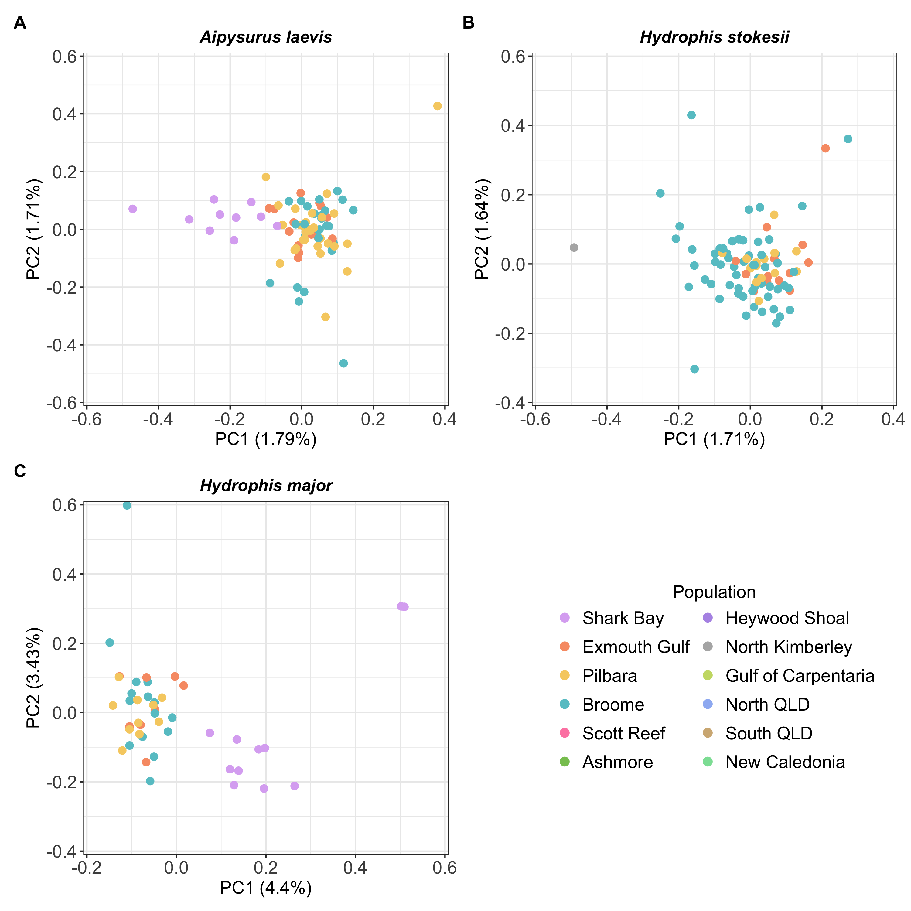
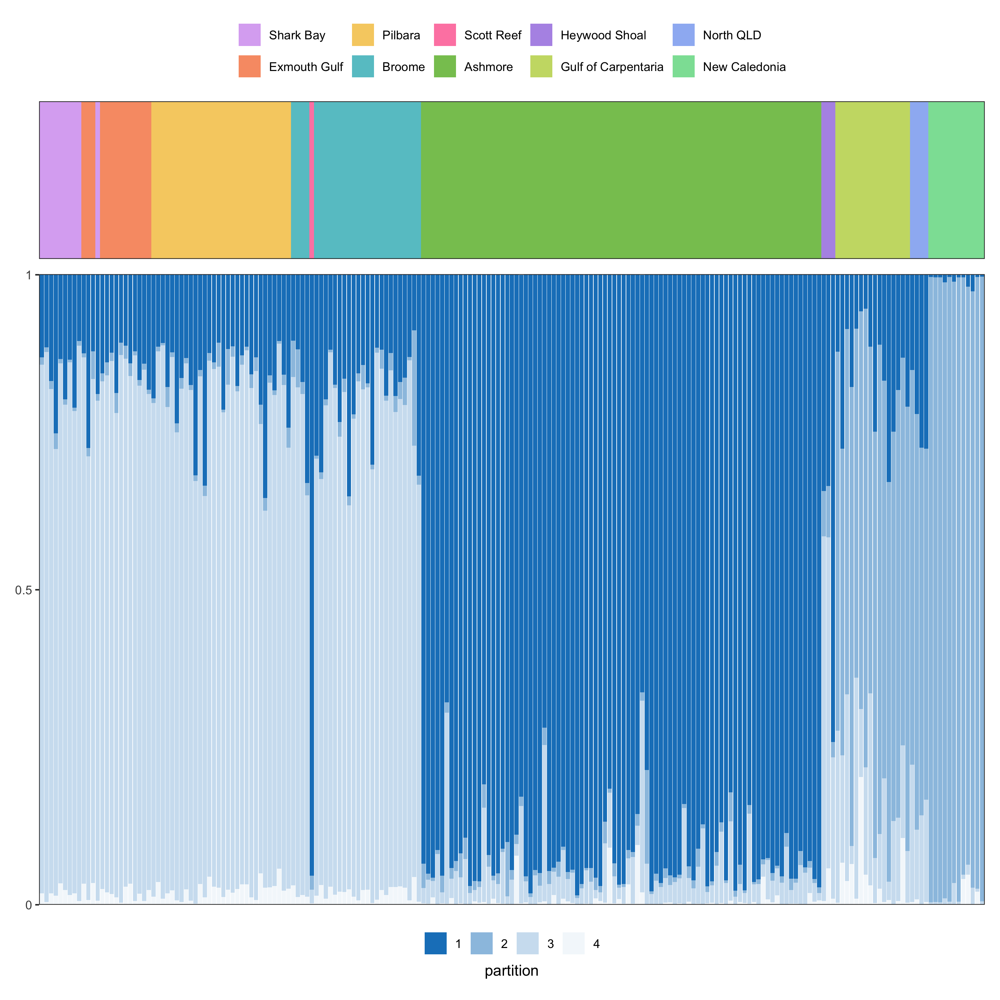
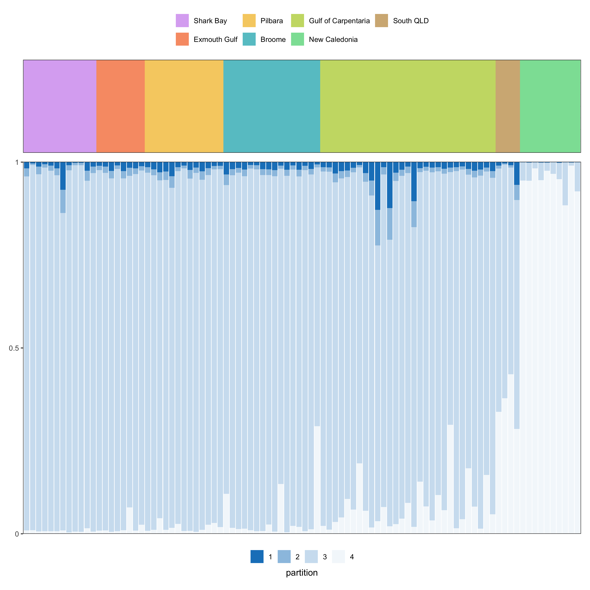

Population structure
================
2025-01-31

- [Helper functions](#helper-functions)
- [Removed samples](#removed-samples)
  - [PCA](#pca)
    - [All samples](#all-samples)
    - [WA Coast](#wa-coast)
  - [STRUCTURE](#structure)
    - [Choosing the correct K (N-ancestral
      populations)](#choosing-the-correct-k-n-ancestral-populations)
    - [*Aipysurus laevis*](#aipysurus-laevis)
    - [*Hydrophis major*](#hydrophis-major)
    - [*Hydrophis stokesii*](#hydrophis-stokesii)

This directory contains population structure results. The script
`population-structure.Rmd` renders this `README` and is responsible for
creating the relevant outputs.

## Helper functions

This helper function is for generating the PCAs. It handles finding `x`
and `y` maxima/minima and formatting.

``` r
# Function that takes the PCA list we'll generate below and plot the desired PCs
# for the specified population
plotPCA <- function(pca_dataframe, variance_dataframe, spec, WA_only, pcA, pcB, xstep = 1, ystep = 1, pal) {
    full_species <- set_names(c("ALA", "HMA", "HST"), c("Aipysurus laevis", "Hydrophis major", "Hydrophis stokesii"))
    plot_title <- names(full_species[full_species == spec])
    
    sp_pca <- pca_dataframe |>
        filter(species == spec, WA == WA_only)
    
    sp_var <- variance_dataframe |>
        filter(species == spec, WA == WA_only)
    
    # TODO: Figure out why this is being a piece of shit
    if(WA_only){
        wa_levels <- pca_dataframe |> 
            filter(WA == TRUE) |> 
            pull(population) |> 
            unique() |>
            as.character()
        
        sp_pca <- sp_pca |>
            mutate(
                population = factor(
                    population,
                    levels = wa_levels
                )
            )
    }
    
    # x-axis: max/min
    xmin <- sp_pca |>
        pull(pcA) |>
        min(na.rm = TRUE) |>
        floor()
    
    xmax <- sp_pca |>
        pull(pcA) |>
        max(na.rm = TRUE) |>
        ceiling()
    
    # y-axis: max/min
    ymin <- sp_pca |>
        pull(pcB) |>
        min(na.rm = TRUE) |>
        floor()
    
    ymax <- sp_pca |>
        pull(pcB) |>
        max(na.rm = TRUE) |>
        ceiling()
    
    # Variance strings
    pcA_var <- round(
        sp_var |>
            filter(pc_axes == pcA) |>
            pull(variance) * 100, digits = 2
    )
    
    pcB_var <- round(
        sp_var |>
            filter(pc_axes == pcB) |>
            pull(variance) * 100, digits = 2
    )
    
    sp_pca |>
        ggplot(
            aes(
                x = .data[[pcA]], y = .data[[pcB]],
                colour = population
            )
        ) +
        geom_point(size = 2.5, show.legend=TRUE) +
        scale_colour_manual(
            values = pal,
            drop = FALSE
        ) +
        labs(
            title = glue::glue("{plot_title}"),
            colour = "Population",
            x = glue::glue("{pcA} ({pcA_var}%)"),
            y = glue::glue("{pcB} ({pcB_var}%)")
        ) +
        scale_y_continuous(
            limits = c(ymin, ymax),
            breaks = seq(ymin, ymax, by = ystep),
            labels = as.character(seq(ymin, ymax, by = ystep)),
            expand = c(0, 0)
        ) +
        scale_x_continuous(
            limits = c(xmin, xmax),
            breaks = seq(xmin, xmax, by = xstep),
            labels = as.character(seq(xmin, xmax, by = xstep)),
            expand = c(0, 0)
        ) +
        theme(
            axis.text = element_text(size = 14),
            axis.title = element_text(size = 14),
            legend.position = "bottom",
            legend.title = element_text(hjust = 0.5, size = 14),
            legend.title.position = "top",
            legend.text = element_text(size = 14),
            plot.title = element_text(hjust = 0.5, face = "bold.italic")
        )
}
```

# Removed samples

A range of samples were excluded from the PCAs below. Further numerous
populations were ignored when running `STRUCTURE`. These can be found in
the following files

- \[dropped-samples.tsv\]\[dropped\]
- Per-species populations to ignore (\[here\]\[ignore\])

## PCA

Principal component analysis (PCA) was conducted using the \[Ipyrad
analysis toolkit\]\[ipatools\]. The code responsible for the CSV files
we’re loading in below can be found \[here\]\[pcaipynb\]. Below, we’re
simply creating custom figures. We generate PCAs for **all** samples
across all populations for each species.

``` r
pop_levels <- c(
    "Shark Bay" ,"Exmouth Gulf", "Pilbara", 
    "Broome", "North Kimberley", "Scott Reef", "Ashmore", "Heywood Shoal",
    "Gulf of Carpentaria", "North QLD", "South QLD", "New Caledonia"
)

# PCA dataframes
df_pca <- fs::dir_ls(here("results", "population-structure", "pca"), glob = "*.csv") |>
    (\(x) x[!str_detect(x, "variance")])() |>
    imap(\(x, i) {
        fname <- str_remove(basename(i), ".csv")
        spec <- str_remove(fname, "-.*")
        wa <- if(str_detect(fname, "WA")) TRUE else FALSE
        
        tmp <- x |>
            read_csv(col_names = TRUE, col_types = cols())
        colnames(tmp) <- c("sample", paste0("PC", 1:(ncol(tmp) - 1)))
        pops |>
            filter(species == spec) |>
            inner_join(tmp) |>
            mutate(WA = wa, .after = species)
    }) |>
    list_rbind() |>
    select(species, WA, sample, population, PC1, PC2, PC3) |>
    mutate(
        population = str_replace_all(population, "_", " "),
        population = factor(population, levels = pop_levels)
    )

# Variance dataframes
df_variance <- fs::dir_ls(here("results", "population-structure", "pca"), glob = "*variance.csv") |>
    imap(\(x, i) {
        fname <- str_remove(basename(i), ".csv")
        spec <- str_remove(fname, "-.*")
        wa <- if(str_detect(fname, "WA")) TRUE else FALSE
        x |>
            read_csv(
                skip = 1,
                col_names = c("pc_axes", "variance"),
                col_types = cols()
            ) |>
            mutate(
                species = spec,
                WA = wa,
                pc_axes = pc_axes + 1,
                pc_axes = paste0("PC", pc_axes)
            ) |>
            filter(pc_axes %in% c("PC1", "PC2", "PC3"))
    }) |>
    list_rbind()
```

``` r
# Custom ordering of colour palette
pal_PCA <- c(
    "#8da0cb", "#66c2a5", "#fc8d62", 
    "#e78ac3", "#a6d854", "#ffd92f", 
    "#f0ad4e", "#d9534f", "#5cb85c",
    "#66C2A5", "#FC8D62", "#8DA0CB",
    "#B3B3B3"
)
names(pal_PCA) <- pop_levels
```

### All samples

``` r
ala_pc_1_2 <- plotPCA(pca_dataframe = df_pca, variance_dataframe = df_variance, WA_only = FALSE, spec = "ALA", pcA = "PC1", pcB = "PC2", xstep = 2, pal = pal_PCA)
hst_pc_1_2 <- plotPCA(pca_dataframe = df_pca, variance_dataframe = df_variance, WA_only = FALSE, spec = "HMA", pcA = "PC1", pcB = "PC2", xstep = 2, ystep = 2, pal = pal_PCA)
hma_pc_1_2 <- plotPCA(pca_dataframe = df_pca, variance_dataframe = df_variance, WA_only = FALSE, spec = "HST", pcA = "PC1", pcB = "PC2", xstep = 2, ystep = 2, pal = pal_PCA)

design <- "12\n34"

plot_pca_all <- ala_pc_1_2 + hst_pc_1_2 + hma_pc_1_2 + guide_area() +
    plot_layout(
        design = design,
        guides = "collect",
        axes = "collect"
    ) +
    plot_annotation(tag_levels = 'A') &
    guides(colour = guide_legend(ncol = 2, override.aes = list(size = 3))) &
    theme(plot.tag = element_text(size = 14, face = "bold"))

ragg::agg_png(
    filename = here("results", "population-structure", "pca-all-species-all-pops.png"),
    width = 1500, 
    height = 1500,
    units = "px",  
    res = 150
)
plot_pca_all
invisible(dev.off())

plot_pca_all
```


### WA Coast

And the same for *just* the WA coastline samples

``` r
ala_pc_1_2 <- plotPCA(pca_dataframe = df_pca, variance_dataframe = df_variance, WA_only = TRUE, spec = "ALA", pcA = "PC1", pcB = "PC2", xstep = 2, ystep = 2, pal = pal_PCA)
hma_pc_1_2 <- plotPCA(pca_dataframe = df_pca, variance_dataframe = df_variance, WA_only = TRUE, spec = "HMA", pcA = "PC1", pcB = "PC2", xstep = 2, ystep = 2, pal = pal_PCA)
hst_pc_1_2 <- plotPCA(pca_dataframe = df_pca, variance_dataframe = df_variance, WA_only = TRUE, spec = "HST", pcA = "PC1", pcB = "PC2", xstep = 2, ystep = 2, pal = pal_PCA)

design <- "12\n34"

plot_pca_wa <- ala_pc_1_2 + hma_pc_1_2 + hst_pc_1_2 + guide_area() +
    plot_layout(
        design = design,
        guides = "collect",
        axes = "collect"
    ) &
    plot_annotation(tag_levels = 'A') &
    guides(colour = guide_legend(ncol = 2, override.aes = list(size = 3))) &
    theme(plot.tag = element_text(size = 14, face = "bold"))

ragg::agg_png(
    filename = here("results", "population-structure", "pca-all-species-WA-pops.png"),
    width = 1500, 
    height = 1500,
    units = "px",  
    res = 150
)
plot_pca_wa
invisible(dev.off())

plot_pca_wa
```



We can see that the Shark Bay samples partition off in both *A. laevis*
and *H. major*.

## STRUCTURE

`STRUCTURE` plots are then generated for WA populations, specifically:
Broome, Pilbara, Exmouth Gulf, Shark Bay and North Kimberley. In the
PCAs above, samples from these populations typically cluster together,
showing little structure. Consequently, we’re using this method as a
more granular approach to determine if there is any allele sharing
between the populations.

``` r
structure_pops <- unique(pops$population)[ ! unique(pops$population) %in% ignore ]

# Custom ordering of colour palette
pal <- c(
    "#8da0cb", "#66c2a5", "#fc8d62", 
    "#e78ac3", "#a6d854", "#ffd92f", 
    "#f0ad4e", "#d9534f", "#5cb85c"
)
names(pal) <- 1:9

structure_df <- fs::dir_ls(
    here("results", "population-structure", "structure"), 
    glob = "*plot.csv", 
    recurse = TRUE
) |>
    map(\(x) {
        tmp <- x |>
            read_csv(col_names = TRUE, col_types = cols())
        tmp |>
            mutate(K = glue::glue("K{ncol(tmp) - 1}")) |>
            pivot_longer(names_to = "partition", values_to = "proportion", 2:ncol(tmp)) |>
            mutate(partition = as.numeric(partition) + 1) |>
            rename(sample = `...1`) |>
            left_join(pops)
    }) |>
    list_rbind() |>
    mutate(
        partition = forcats::fct_inorder(as.character(partition)),
        population = str_replace_all(population, "_", " "),
        population = factor(population, levels = structure_pops),
        .by = K
    )
```

### Choosing the correct K (N-ancestral populations)

Choosing the best `K` value can be determined by plotting the estimated
log-probability for each `K` value, in addition to the delta-K value.
The values can be interpreted as follows:

- **Estimated log-probability**: Higher values equal better model fit.
- **Delta-K**: The rate of change between successive K-values. Larger
  values indicate greater change in the model fit.

The results for the three species are shown below.

``` r
etable <- fs::dir_ls(
    here("results", "population-structure", "structure"), 
    glob = "*etable.csv",
    recurse = TRUE
) |>
    read_csv(col_names = TRUE, col_types = cols(), id = "species") |>
    mutate(species = str_remove(basename(species), "-.*")) |>
    rename(K = `...1`)

etable |>
    gt(groupname_col = "species") |>
    fmt_number(
        columns = c("K", "Nreps"),
        drop_trailing_zeros = TRUE
    ) |>
    fmt_number(
        columns = 3:7,
        n_sigfig = 4
    ) |>
    as_raw_html()
```

<div id="zdviegdgag" style="padding-left:0px;padding-right:0px;padding-top:10px;padding-bottom:10px;overflow-x:auto;overflow-y:auto;width:auto;height:auto;">
  &#10;  <table class="gt_table" data-quarto-disable-processing="false" data-quarto-bootstrap="false" style="-webkit-font-smoothing: antialiased; -moz-osx-font-smoothing: grayscale; font-family: system-ui, 'Segoe UI', Roboto, Helvetica, Arial, sans-serif, 'Apple Color Emoji', 'Segoe UI Emoji', 'Segoe UI Symbol', 'Noto Color Emoji'; display: table; border-collapse: collapse; line-height: normal; margin-left: auto; margin-right: auto; color: #333333; font-size: 16px; font-weight: normal; font-style: normal; background-color: #FFFFFF; width: auto; border-top-style: solid; border-top-width: 2px; border-top-color: #A8A8A8; border-right-style: none; border-right-width: 2px; border-right-color: #D3D3D3; border-bottom-style: solid; border-bottom-width: 2px; border-bottom-color: #A8A8A8; border-left-style: none; border-left-width: 2px; border-left-color: #D3D3D3;" bgcolor="#FFFFFF">
  <thead style="border-style: none;">
    <tr class="gt_col_headings" style="border-style: none; border-top-style: solid; border-top-width: 2px; border-top-color: #D3D3D3; border-bottom-style: solid; border-bottom-width: 2px; border-bottom-color: #D3D3D3; border-left-style: none; border-left-width: 1px; border-left-color: #D3D3D3; border-right-style: none; border-right-width: 1px; border-right-color: #D3D3D3;">
      <th class="gt_col_heading gt_columns_bottom_border gt_right" rowspan="1" colspan="1" scope="col" id="K" style="border-style: none; color: #333333; background-color: #FFFFFF; font-size: 100%; font-weight: normal; text-transform: inherit; border-left-style: none; border-left-width: 1px; border-left-color: #D3D3D3; border-right-style: none; border-right-width: 1px; border-right-color: #D3D3D3; vertical-align: bottom; padding-top: 5px; padding-bottom: 6px; padding-left: 5px; padding-right: 5px; overflow-x: hidden; text-align: right; font-variant-numeric: tabular-nums;" bgcolor="#FFFFFF" valign="bottom" align="right">K</th>
      <th class="gt_col_heading gt_columns_bottom_border gt_right" rowspan="1" colspan="1" scope="col" id="Nreps" style="border-style: none; color: #333333; background-color: #FFFFFF; font-size: 100%; font-weight: normal; text-transform: inherit; border-left-style: none; border-left-width: 1px; border-left-color: #D3D3D3; border-right-style: none; border-right-width: 1px; border-right-color: #D3D3D3; vertical-align: bottom; padding-top: 5px; padding-bottom: 6px; padding-left: 5px; padding-right: 5px; overflow-x: hidden; text-align: right; font-variant-numeric: tabular-nums;" bgcolor="#FFFFFF" valign="bottom" align="right">Nreps</th>
      <th class="gt_col_heading gt_columns_bottom_border gt_right" rowspan="1" colspan="1" scope="col" id="lnPK" style="border-style: none; color: #333333; background-color: #FFFFFF; font-size: 100%; font-weight: normal; text-transform: inherit; border-left-style: none; border-left-width: 1px; border-left-color: #D3D3D3; border-right-style: none; border-right-width: 1px; border-right-color: #D3D3D3; vertical-align: bottom; padding-top: 5px; padding-bottom: 6px; padding-left: 5px; padding-right: 5px; overflow-x: hidden; text-align: right; font-variant-numeric: tabular-nums;" bgcolor="#FFFFFF" valign="bottom" align="right">lnPK</th>
      <th class="gt_col_heading gt_columns_bottom_border gt_right" rowspan="1" colspan="1" scope="col" id="lnPPK" style="border-style: none; color: #333333; background-color: #FFFFFF; font-size: 100%; font-weight: normal; text-transform: inherit; border-left-style: none; border-left-width: 1px; border-left-color: #D3D3D3; border-right-style: none; border-right-width: 1px; border-right-color: #D3D3D3; vertical-align: bottom; padding-top: 5px; padding-bottom: 6px; padding-left: 5px; padding-right: 5px; overflow-x: hidden; text-align: right; font-variant-numeric: tabular-nums;" bgcolor="#FFFFFF" valign="bottom" align="right">lnPPK</th>
      <th class="gt_col_heading gt_columns_bottom_border gt_right" rowspan="1" colspan="1" scope="col" id="deltaK" style="border-style: none; color: #333333; background-color: #FFFFFF; font-size: 100%; font-weight: normal; text-transform: inherit; border-left-style: none; border-left-width: 1px; border-left-color: #D3D3D3; border-right-style: none; border-right-width: 1px; border-right-color: #D3D3D3; vertical-align: bottom; padding-top: 5px; padding-bottom: 6px; padding-left: 5px; padding-right: 5px; overflow-x: hidden; text-align: right; font-variant-numeric: tabular-nums;" bgcolor="#FFFFFF" valign="bottom" align="right">deltaK</th>
      <th class="gt_col_heading gt_columns_bottom_border gt_right" rowspan="1" colspan="1" scope="col" id="estLnProbMean" style="border-style: none; color: #333333; background-color: #FFFFFF; font-size: 100%; font-weight: normal; text-transform: inherit; border-left-style: none; border-left-width: 1px; border-left-color: #D3D3D3; border-right-style: none; border-right-width: 1px; border-right-color: #D3D3D3; vertical-align: bottom; padding-top: 5px; padding-bottom: 6px; padding-left: 5px; padding-right: 5px; overflow-x: hidden; text-align: right; font-variant-numeric: tabular-nums;" bgcolor="#FFFFFF" valign="bottom" align="right">estLnProbMean</th>
      <th class="gt_col_heading gt_columns_bottom_border gt_right" rowspan="1" colspan="1" scope="col" id="estLnProbStdev" style="border-style: none; color: #333333; background-color: #FFFFFF; font-size: 100%; font-weight: normal; text-transform: inherit; border-left-style: none; border-left-width: 1px; border-left-color: #D3D3D3; border-right-style: none; border-right-width: 1px; border-right-color: #D3D3D3; vertical-align: bottom; padding-top: 5px; padding-bottom: 6px; padding-left: 5px; padding-right: 5px; overflow-x: hidden; text-align: right; font-variant-numeric: tabular-nums;" bgcolor="#FFFFFF" valign="bottom" align="right">estLnProbStdev</th>
    </tr>
  </thead>
  <tbody class="gt_table_body" style="border-style: none; border-top-style: solid; border-top-width: 2px; border-top-color: #D3D3D3; border-bottom-style: solid; border-bottom-width: 2px; border-bottom-color: #D3D3D3;">
    <tr class="gt_group_heading_row" style="border-style: none;">
      <th colspan="7" class="gt_group_heading" scope="colgroup" id="ALA" style="border-style: none; padding-top: 8px; padding-bottom: 8px; padding-left: 5px; padding-right: 5px; color: #333333; background-color: #FFFFFF; font-size: 100%; font-weight: initial; text-transform: inherit; border-top-style: solid; border-top-width: 2px; border-top-color: #D3D3D3; border-bottom-style: solid; border-bottom-width: 2px; border-bottom-color: #D3D3D3; border-left-style: none; border-left-width: 1px; border-left-color: #D3D3D3; border-right-style: none; border-right-width: 1px; border-right-color: #D3D3D3; vertical-align: middle; text-align: left;" bgcolor="#FFFFFF" valign="middle" align="left">ALA</th>
    </tr>
    <tr class="gt_row_group_first" style="border-style: none;"><td headers="ALA  K" class="gt_row gt_right" style="border-style: none; padding-top: 8px; padding-bottom: 8px; padding-left: 5px; padding-right: 5px; margin: 10px; border-top-style: solid; border-top-color: #D3D3D3; border-left-style: none; border-left-width: 1px; border-left-color: #D3D3D3; border-right-style: none; border-right-width: 1px; border-right-color: #D3D3D3; vertical-align: middle; overflow-x: hidden; text-align: right; font-variant-numeric: tabular-nums; border-top-width: 2px;" valign="middle" align="right">2</td>
<td headers="ALA  Nreps" class="gt_row gt_right" style="border-style: none; padding-top: 8px; padding-bottom: 8px; padding-left: 5px; padding-right: 5px; margin: 10px; border-top-style: solid; border-top-color: #D3D3D3; border-left-style: none; border-left-width: 1px; border-left-color: #D3D3D3; border-right-style: none; border-right-width: 1px; border-right-color: #D3D3D3; vertical-align: middle; overflow-x: hidden; text-align: right; font-variant-numeric: tabular-nums; border-top-width: 2px;" valign="middle" align="right">10.00</td>
<td headers="ALA  lnPK" class="gt_row gt_right" style="border-style: none; padding-top: 8px; padding-bottom: 8px; padding-left: 5px; padding-right: 5px; margin: 10px; border-top-style: solid; border-top-color: #D3D3D3; border-left-style: none; border-left-width: 1px; border-left-color: #D3D3D3; border-right-style: none; border-right-width: 1px; border-right-color: #D3D3D3; vertical-align: middle; overflow-x: hidden; text-align: right; font-variant-numeric: tabular-nums; border-top-width: 2px;" valign="middle" align="right">0</td>
<td headers="ALA  lnPPK" class="gt_row gt_right" style="border-style: none; padding-top: 8px; padding-bottom: 8px; padding-left: 5px; padding-right: 5px; margin: 10px; border-top-style: solid; border-top-color: #D3D3D3; border-left-style: none; border-left-width: 1px; border-left-color: #D3D3D3; border-right-style: none; border-right-width: 1px; border-right-color: #D3D3D3; vertical-align: middle; overflow-x: hidden; text-align: right; font-variant-numeric: tabular-nums; border-top-width: 2px;" valign="middle" align="right">0</td>
<td headers="ALA  deltaK" class="gt_row gt_right" style="border-style: none; padding-top: 8px; padding-bottom: 8px; padding-left: 5px; padding-right: 5px; margin: 10px; border-top-style: solid; border-top-color: #D3D3D3; border-left-style: none; border-left-width: 1px; border-left-color: #D3D3D3; border-right-style: none; border-right-width: 1px; border-right-color: #D3D3D3; vertical-align: middle; overflow-x: hidden; text-align: right; font-variant-numeric: tabular-nums; border-top-width: 2px;" valign="middle" align="right">0</td>
<td headers="ALA  estLnProbMean" class="gt_row gt_right" style="border-style: none; padding-top: 8px; padding-bottom: 8px; padding-left: 5px; padding-right: 5px; margin: 10px; border-top-style: solid; border-top-color: #D3D3D3; border-left-style: none; border-left-width: 1px; border-left-color: #D3D3D3; border-right-style: none; border-right-width: 1px; border-right-color: #D3D3D3; vertical-align: middle; overflow-x: hidden; text-align: right; font-variant-numeric: tabular-nums; border-top-width: 2px;" valign="middle" align="right">−72,230</td>
<td headers="ALA  estLnProbStdev" class="gt_row gt_right" style="border-style: none; padding-top: 8px; padding-bottom: 8px; padding-left: 5px; padding-right: 5px; margin: 10px; border-top-style: solid; border-top-color: #D3D3D3; border-left-style: none; border-left-width: 1px; border-left-color: #D3D3D3; border-right-style: none; border-right-width: 1px; border-right-color: #D3D3D3; vertical-align: middle; overflow-x: hidden; text-align: right; font-variant-numeric: tabular-nums; border-top-width: 2px;" valign="middle" align="right">689.2483</td></tr>
    <tr style="border-style: none;"><td headers="ALA  K" class="gt_row gt_right" style="border-style: none; padding-top: 8px; padding-bottom: 8px; padding-left: 5px; padding-right: 5px; margin: 10px; border-top-style: solid; border-top-width: 1px; border-top-color: #D3D3D3; border-left-style: none; border-left-width: 1px; border-left-color: #D3D3D3; border-right-style: none; border-right-width: 1px; border-right-color: #D3D3D3; vertical-align: middle; overflow-x: hidden; text-align: right; font-variant-numeric: tabular-nums;" valign="middle" align="right">3</td>
<td headers="ALA  Nreps" class="gt_row gt_right" style="border-style: none; padding-top: 8px; padding-bottom: 8px; padding-left: 5px; padding-right: 5px; margin: 10px; border-top-style: solid; border-top-width: 1px; border-top-color: #D3D3D3; border-left-style: none; border-left-width: 1px; border-left-color: #D3D3D3; border-right-style: none; border-right-width: 1px; border-right-color: #D3D3D3; vertical-align: middle; overflow-x: hidden; text-align: right; font-variant-numeric: tabular-nums;" valign="middle" align="right">10.00</td>
<td headers="ALA  lnPK" class="gt_row gt_right" style="border-style: none; padding-top: 8px; padding-bottom: 8px; padding-left: 5px; padding-right: 5px; margin: 10px; border-top-style: solid; border-top-width: 1px; border-top-color: #D3D3D3; border-left-style: none; border-left-width: 1px; border-left-color: #D3D3D3; border-right-style: none; border-right-width: 1px; border-right-color: #D3D3D3; vertical-align: middle; overflow-x: hidden; text-align: right; font-variant-numeric: tabular-nums;" valign="middle" align="right">315.4</td>
<td headers="ALA  lnPPK" class="gt_row gt_right" style="border-style: none; padding-top: 8px; padding-bottom: 8px; padding-left: 5px; padding-right: 5px; margin: 10px; border-top-style: solid; border-top-width: 1px; border-top-color: #D3D3D3; border-left-style: none; border-left-width: 1px; border-left-color: #D3D3D3; border-right-style: none; border-right-width: 1px; border-right-color: #D3D3D3; vertical-align: middle; overflow-x: hidden; text-align: right; font-variant-numeric: tabular-nums;" valign="middle" align="right">963.0</td>
<td headers="ALA  deltaK" class="gt_row gt_right" style="border-style: none; padding-top: 8px; padding-bottom: 8px; padding-left: 5px; padding-right: 5px; margin: 10px; border-top-style: solid; border-top-width: 1px; border-top-color: #D3D3D3; border-left-style: none; border-left-width: 1px; border-left-color: #D3D3D3; border-right-style: none; border-right-width: 1px; border-right-color: #D3D3D3; vertical-align: middle; overflow-x: hidden; text-align: right; font-variant-numeric: tabular-nums;" valign="middle" align="right">1.060</td>
<td headers="ALA  estLnProbMean" class="gt_row gt_right" style="border-style: none; padding-top: 8px; padding-bottom: 8px; padding-left: 5px; padding-right: 5px; margin: 10px; border-top-style: solid; border-top-width: 1px; border-top-color: #D3D3D3; border-left-style: none; border-left-width: 1px; border-left-color: #D3D3D3; border-right-style: none; border-right-width: 1px; border-right-color: #D3D3D3; vertical-align: middle; overflow-x: hidden; text-align: right; font-variant-numeric: tabular-nums;" valign="middle" align="right">−71,910</td>
<td headers="ALA  estLnProbStdev" class="gt_row gt_right" style="border-style: none; padding-top: 8px; padding-bottom: 8px; padding-left: 5px; padding-right: 5px; margin: 10px; border-top-style: solid; border-top-width: 1px; border-top-color: #D3D3D3; border-left-style: none; border-left-width: 1px; border-left-color: #D3D3D3; border-right-style: none; border-right-width: 1px; border-right-color: #D3D3D3; vertical-align: middle; overflow-x: hidden; text-align: right; font-variant-numeric: tabular-nums;" valign="middle" align="right">908.5789</td></tr>
    <tr style="border-style: none;"><td headers="ALA  K" class="gt_row gt_right" style="border-style: none; padding-top: 8px; padding-bottom: 8px; padding-left: 5px; padding-right: 5px; margin: 10px; border-top-style: solid; border-top-width: 1px; border-top-color: #D3D3D3; border-left-style: none; border-left-width: 1px; border-left-color: #D3D3D3; border-right-style: none; border-right-width: 1px; border-right-color: #D3D3D3; vertical-align: middle; overflow-x: hidden; text-align: right; font-variant-numeric: tabular-nums;" valign="middle" align="right">4</td>
<td headers="ALA  Nreps" class="gt_row gt_right" style="border-style: none; padding-top: 8px; padding-bottom: 8px; padding-left: 5px; padding-right: 5px; margin: 10px; border-top-style: solid; border-top-width: 1px; border-top-color: #D3D3D3; border-left-style: none; border-left-width: 1px; border-left-color: #D3D3D3; border-right-style: none; border-right-width: 1px; border-right-color: #D3D3D3; vertical-align: middle; overflow-x: hidden; text-align: right; font-variant-numeric: tabular-nums;" valign="middle" align="right">10.00</td>
<td headers="ALA  lnPK" class="gt_row gt_right" style="border-style: none; padding-top: 8px; padding-bottom: 8px; padding-left: 5px; padding-right: 5px; margin: 10px; border-top-style: solid; border-top-width: 1px; border-top-color: #D3D3D3; border-left-style: none; border-left-width: 1px; border-left-color: #D3D3D3; border-right-style: none; border-right-width: 1px; border-right-color: #D3D3D3; vertical-align: middle; overflow-x: hidden; text-align: right; font-variant-numeric: tabular-nums;" valign="middle" align="right">−647.6</td>
<td headers="ALA  lnPPK" class="gt_row gt_right" style="border-style: none; padding-top: 8px; padding-bottom: 8px; padding-left: 5px; padding-right: 5px; margin: 10px; border-top-style: solid; border-top-width: 1px; border-top-color: #D3D3D3; border-left-style: none; border-left-width: 1px; border-left-color: #D3D3D3; border-right-style: none; border-right-width: 1px; border-right-color: #D3D3D3; vertical-align: middle; overflow-x: hidden; text-align: right; font-variant-numeric: tabular-nums;" valign="middle" align="right">329.2</td>
<td headers="ALA  deltaK" class="gt_row gt_right" style="border-style: none; padding-top: 8px; padding-bottom: 8px; padding-left: 5px; padding-right: 5px; margin: 10px; border-top-style: solid; border-top-width: 1px; border-top-color: #D3D3D3; border-left-style: none; border-left-width: 1px; border-left-color: #D3D3D3; border-right-style: none; border-right-width: 1px; border-right-color: #D3D3D3; vertical-align: middle; overflow-x: hidden; text-align: right; font-variant-numeric: tabular-nums;" valign="middle" align="right">0.2897</td>
<td headers="ALA  estLnProbMean" class="gt_row gt_right" style="border-style: none; padding-top: 8px; padding-bottom: 8px; padding-left: 5px; padding-right: 5px; margin: 10px; border-top-style: solid; border-top-width: 1px; border-top-color: #D3D3D3; border-left-style: none; border-left-width: 1px; border-left-color: #D3D3D3; border-right-style: none; border-right-width: 1px; border-right-color: #D3D3D3; vertical-align: middle; overflow-x: hidden; text-align: right; font-variant-numeric: tabular-nums;" valign="middle" align="right">−72,560</td>
<td headers="ALA  estLnProbStdev" class="gt_row gt_right" style="border-style: none; padding-top: 8px; padding-bottom: 8px; padding-left: 5px; padding-right: 5px; margin: 10px; border-top-style: solid; border-top-width: 1px; border-top-color: #D3D3D3; border-left-style: none; border-left-width: 1px; border-left-color: #D3D3D3; border-right-style: none; border-right-width: 1px; border-right-color: #D3D3D3; vertical-align: middle; overflow-x: hidden; text-align: right; font-variant-numeric: tabular-nums;" valign="middle" align="right">1136.1751</td></tr>
    <tr style="border-style: none;"><td headers="ALA  K" class="gt_row gt_right" style="border-style: none; padding-top: 8px; padding-bottom: 8px; padding-left: 5px; padding-right: 5px; margin: 10px; border-top-style: solid; border-top-width: 1px; border-top-color: #D3D3D3; border-left-style: none; border-left-width: 1px; border-left-color: #D3D3D3; border-right-style: none; border-right-width: 1px; border-right-color: #D3D3D3; vertical-align: middle; overflow-x: hidden; text-align: right; font-variant-numeric: tabular-nums;" valign="middle" align="right">5</td>
<td headers="ALA  Nreps" class="gt_row gt_right" style="border-style: none; padding-top: 8px; padding-bottom: 8px; padding-left: 5px; padding-right: 5px; margin: 10px; border-top-style: solid; border-top-width: 1px; border-top-color: #D3D3D3; border-left-style: none; border-left-width: 1px; border-left-color: #D3D3D3; border-right-style: none; border-right-width: 1px; border-right-color: #D3D3D3; vertical-align: middle; overflow-x: hidden; text-align: right; font-variant-numeric: tabular-nums;" valign="middle" align="right">10.00</td>
<td headers="ALA  lnPK" class="gt_row gt_right" style="border-style: none; padding-top: 8px; padding-bottom: 8px; padding-left: 5px; padding-right: 5px; margin: 10px; border-top-style: solid; border-top-width: 1px; border-top-color: #D3D3D3; border-left-style: none; border-left-width: 1px; border-left-color: #D3D3D3; border-right-style: none; border-right-width: 1px; border-right-color: #D3D3D3; vertical-align: middle; overflow-x: hidden; text-align: right; font-variant-numeric: tabular-nums;" valign="middle" align="right">−318.4</td>
<td headers="ALA  lnPPK" class="gt_row gt_right" style="border-style: none; padding-top: 8px; padding-bottom: 8px; padding-left: 5px; padding-right: 5px; margin: 10px; border-top-style: solid; border-top-width: 1px; border-top-color: #D3D3D3; border-left-style: none; border-left-width: 1px; border-left-color: #D3D3D3; border-right-style: none; border-right-width: 1px; border-right-color: #D3D3D3; vertical-align: middle; overflow-x: hidden; text-align: right; font-variant-numeric: tabular-nums;" valign="middle" align="right">0</td>
<td headers="ALA  deltaK" class="gt_row gt_right" style="border-style: none; padding-top: 8px; padding-bottom: 8px; padding-left: 5px; padding-right: 5px; margin: 10px; border-top-style: solid; border-top-width: 1px; border-top-color: #D3D3D3; border-left-style: none; border-left-width: 1px; border-left-color: #D3D3D3; border-right-style: none; border-right-width: 1px; border-right-color: #D3D3D3; vertical-align: middle; overflow-x: hidden; text-align: right; font-variant-numeric: tabular-nums;" valign="middle" align="right">0</td>
<td headers="ALA  estLnProbMean" class="gt_row gt_right" style="border-style: none; padding-top: 8px; padding-bottom: 8px; padding-left: 5px; padding-right: 5px; margin: 10px; border-top-style: solid; border-top-width: 1px; border-top-color: #D3D3D3; border-left-style: none; border-left-width: 1px; border-left-color: #D3D3D3; border-right-style: none; border-right-width: 1px; border-right-color: #D3D3D3; vertical-align: middle; overflow-x: hidden; text-align: right; font-variant-numeric: tabular-nums;" valign="middle" align="right">−72,880</td>
<td headers="ALA  estLnProbStdev" class="gt_row gt_right" style="border-style: none; padding-top: 8px; padding-bottom: 8px; padding-left: 5px; padding-right: 5px; margin: 10px; border-top-style: solid; border-top-width: 1px; border-top-color: #D3D3D3; border-left-style: none; border-left-width: 1px; border-left-color: #D3D3D3; border-right-style: none; border-right-width: 1px; border-right-color: #D3D3D3; vertical-align: middle; overflow-x: hidden; text-align: right; font-variant-numeric: tabular-nums;" valign="middle" align="right">1134.2884</td></tr>
    <tr class="gt_group_heading_row" style="border-style: none;">
      <th colspan="7" class="gt_group_heading" scope="colgroup" id="HMA" style="border-style: none; padding-top: 8px; padding-bottom: 8px; padding-left: 5px; padding-right: 5px; color: #333333; background-color: #FFFFFF; font-size: 100%; font-weight: initial; text-transform: inherit; border-top-style: solid; border-top-width: 2px; border-top-color: #D3D3D3; border-bottom-style: solid; border-bottom-width: 2px; border-bottom-color: #D3D3D3; border-left-style: none; border-left-width: 1px; border-left-color: #D3D3D3; border-right-style: none; border-right-width: 1px; border-right-color: #D3D3D3; vertical-align: middle; text-align: left;" bgcolor="#FFFFFF" valign="middle" align="left">HMA</th>
    </tr>
    <tr class="gt_row_group_first" style="border-style: none;"><td headers="HMA  K" class="gt_row gt_right" style="border-style: none; padding-top: 8px; padding-bottom: 8px; padding-left: 5px; padding-right: 5px; margin: 10px; border-top-style: solid; border-top-color: #D3D3D3; border-left-style: none; border-left-width: 1px; border-left-color: #D3D3D3; border-right-style: none; border-right-width: 1px; border-right-color: #D3D3D3; vertical-align: middle; overflow-x: hidden; text-align: right; font-variant-numeric: tabular-nums; border-top-width: 2px;" valign="middle" align="right">2</td>
<td headers="HMA  Nreps" class="gt_row gt_right" style="border-style: none; padding-top: 8px; padding-bottom: 8px; padding-left: 5px; padding-right: 5px; margin: 10px; border-top-style: solid; border-top-color: #D3D3D3; border-left-style: none; border-left-width: 1px; border-left-color: #D3D3D3; border-right-style: none; border-right-width: 1px; border-right-color: #D3D3D3; vertical-align: middle; overflow-x: hidden; text-align: right; font-variant-numeric: tabular-nums; border-top-width: 2px;" valign="middle" align="right">10.00</td>
<td headers="HMA  lnPK" class="gt_row gt_right" style="border-style: none; padding-top: 8px; padding-bottom: 8px; padding-left: 5px; padding-right: 5px; margin: 10px; border-top-style: solid; border-top-color: #D3D3D3; border-left-style: none; border-left-width: 1px; border-left-color: #D3D3D3; border-right-style: none; border-right-width: 1px; border-right-color: #D3D3D3; vertical-align: middle; overflow-x: hidden; text-align: right; font-variant-numeric: tabular-nums; border-top-width: 2px;" valign="middle" align="right">0</td>
<td headers="HMA  lnPPK" class="gt_row gt_right" style="border-style: none; padding-top: 8px; padding-bottom: 8px; padding-left: 5px; padding-right: 5px; margin: 10px; border-top-style: solid; border-top-color: #D3D3D3; border-left-style: none; border-left-width: 1px; border-left-color: #D3D3D3; border-right-style: none; border-right-width: 1px; border-right-color: #D3D3D3; vertical-align: middle; overflow-x: hidden; text-align: right; font-variant-numeric: tabular-nums; border-top-width: 2px;" valign="middle" align="right">0</td>
<td headers="HMA  deltaK" class="gt_row gt_right" style="border-style: none; padding-top: 8px; padding-bottom: 8px; padding-left: 5px; padding-right: 5px; margin: 10px; border-top-style: solid; border-top-color: #D3D3D3; border-left-style: none; border-left-width: 1px; border-left-color: #D3D3D3; border-right-style: none; border-right-width: 1px; border-right-color: #D3D3D3; vertical-align: middle; overflow-x: hidden; text-align: right; font-variant-numeric: tabular-nums; border-top-width: 2px;" valign="middle" align="right">0</td>
<td headers="HMA  estLnProbMean" class="gt_row gt_right" style="border-style: none; padding-top: 8px; padding-bottom: 8px; padding-left: 5px; padding-right: 5px; margin: 10px; border-top-style: solid; border-top-color: #D3D3D3; border-left-style: none; border-left-width: 1px; border-left-color: #D3D3D3; border-right-style: none; border-right-width: 1px; border-right-color: #D3D3D3; vertical-align: middle; overflow-x: hidden; text-align: right; font-variant-numeric: tabular-nums; border-top-width: 2px;" valign="middle" align="right">−34,650</td>
<td headers="HMA  estLnProbStdev" class="gt_row gt_right" style="border-style: none; padding-top: 8px; padding-bottom: 8px; padding-left: 5px; padding-right: 5px; margin: 10px; border-top-style: solid; border-top-color: #D3D3D3; border-left-style: none; border-left-width: 1px; border-left-color: #D3D3D3; border-right-style: none; border-right-width: 1px; border-right-color: #D3D3D3; vertical-align: middle; overflow-x: hidden; text-align: right; font-variant-numeric: tabular-nums; border-top-width: 2px;" valign="middle" align="right">466.9570</td></tr>
    <tr style="border-style: none;"><td headers="HMA  K" class="gt_row gt_right" style="border-style: none; padding-top: 8px; padding-bottom: 8px; padding-left: 5px; padding-right: 5px; margin: 10px; border-top-style: solid; border-top-width: 1px; border-top-color: #D3D3D3; border-left-style: none; border-left-width: 1px; border-left-color: #D3D3D3; border-right-style: none; border-right-width: 1px; border-right-color: #D3D3D3; vertical-align: middle; overflow-x: hidden; text-align: right; font-variant-numeric: tabular-nums;" valign="middle" align="right">3</td>
<td headers="HMA  Nreps" class="gt_row gt_right" style="border-style: none; padding-top: 8px; padding-bottom: 8px; padding-left: 5px; padding-right: 5px; margin: 10px; border-top-style: solid; border-top-width: 1px; border-top-color: #D3D3D3; border-left-style: none; border-left-width: 1px; border-left-color: #D3D3D3; border-right-style: none; border-right-width: 1px; border-right-color: #D3D3D3; vertical-align: middle; overflow-x: hidden; text-align: right; font-variant-numeric: tabular-nums;" valign="middle" align="right">10.00</td>
<td headers="HMA  lnPK" class="gt_row gt_right" style="border-style: none; padding-top: 8px; padding-bottom: 8px; padding-left: 5px; padding-right: 5px; margin: 10px; border-top-style: solid; border-top-width: 1px; border-top-color: #D3D3D3; border-left-style: none; border-left-width: 1px; border-left-color: #D3D3D3; border-right-style: none; border-right-width: 1px; border-right-color: #D3D3D3; vertical-align: middle; overflow-x: hidden; text-align: right; font-variant-numeric: tabular-nums;" valign="middle" align="right">−327.3</td>
<td headers="HMA  lnPPK" class="gt_row gt_right" style="border-style: none; padding-top: 8px; padding-bottom: 8px; padding-left: 5px; padding-right: 5px; margin: 10px; border-top-style: solid; border-top-width: 1px; border-top-color: #D3D3D3; border-left-style: none; border-left-width: 1px; border-left-color: #D3D3D3; border-right-style: none; border-right-width: 1px; border-right-color: #D3D3D3; vertical-align: middle; overflow-x: hidden; text-align: right; font-variant-numeric: tabular-nums;" valign="middle" align="right">232.4</td>
<td headers="HMA  deltaK" class="gt_row gt_right" style="border-style: none; padding-top: 8px; padding-bottom: 8px; padding-left: 5px; padding-right: 5px; margin: 10px; border-top-style: solid; border-top-width: 1px; border-top-color: #D3D3D3; border-left-style: none; border-left-width: 1px; border-left-color: #D3D3D3; border-right-style: none; border-right-width: 1px; border-right-color: #D3D3D3; vertical-align: middle; overflow-x: hidden; text-align: right; font-variant-numeric: tabular-nums;" valign="middle" align="right">0.6919</td>
<td headers="HMA  estLnProbMean" class="gt_row gt_right" style="border-style: none; padding-top: 8px; padding-bottom: 8px; padding-left: 5px; padding-right: 5px; margin: 10px; border-top-style: solid; border-top-width: 1px; border-top-color: #D3D3D3; border-left-style: none; border-left-width: 1px; border-left-color: #D3D3D3; border-right-style: none; border-right-width: 1px; border-right-color: #D3D3D3; vertical-align: middle; overflow-x: hidden; text-align: right; font-variant-numeric: tabular-nums;" valign="middle" align="right">−34,970</td>
<td headers="HMA  estLnProbStdev" class="gt_row gt_right" style="border-style: none; padding-top: 8px; padding-bottom: 8px; padding-left: 5px; padding-right: 5px; margin: 10px; border-top-style: solid; border-top-width: 1px; border-top-color: #D3D3D3; border-left-style: none; border-left-width: 1px; border-left-color: #D3D3D3; border-right-style: none; border-right-width: 1px; border-right-color: #D3D3D3; vertical-align: middle; overflow-x: hidden; text-align: right; font-variant-numeric: tabular-nums;" valign="middle" align="right">335.8440</td></tr>
    <tr style="border-style: none;"><td headers="HMA  K" class="gt_row gt_right" style="border-style: none; padding-top: 8px; padding-bottom: 8px; padding-left: 5px; padding-right: 5px; margin: 10px; border-top-style: solid; border-top-width: 1px; border-top-color: #D3D3D3; border-left-style: none; border-left-width: 1px; border-left-color: #D3D3D3; border-right-style: none; border-right-width: 1px; border-right-color: #D3D3D3; vertical-align: middle; overflow-x: hidden; text-align: right; font-variant-numeric: tabular-nums;" valign="middle" align="right">4</td>
<td headers="HMA  Nreps" class="gt_row gt_right" style="border-style: none; padding-top: 8px; padding-bottom: 8px; padding-left: 5px; padding-right: 5px; margin: 10px; border-top-style: solid; border-top-width: 1px; border-top-color: #D3D3D3; border-left-style: none; border-left-width: 1px; border-left-color: #D3D3D3; border-right-style: none; border-right-width: 1px; border-right-color: #D3D3D3; vertical-align: middle; overflow-x: hidden; text-align: right; font-variant-numeric: tabular-nums;" valign="middle" align="right">10.00</td>
<td headers="HMA  lnPK" class="gt_row gt_right" style="border-style: none; padding-top: 8px; padding-bottom: 8px; padding-left: 5px; padding-right: 5px; margin: 10px; border-top-style: solid; border-top-width: 1px; border-top-color: #D3D3D3; border-left-style: none; border-left-width: 1px; border-left-color: #D3D3D3; border-right-style: none; border-right-width: 1px; border-right-color: #D3D3D3; vertical-align: middle; overflow-x: hidden; text-align: right; font-variant-numeric: tabular-nums;" valign="middle" align="right">−94.89</td>
<td headers="HMA  lnPPK" class="gt_row gt_right" style="border-style: none; padding-top: 8px; padding-bottom: 8px; padding-left: 5px; padding-right: 5px; margin: 10px; border-top-style: solid; border-top-width: 1px; border-top-color: #D3D3D3; border-left-style: none; border-left-width: 1px; border-left-color: #D3D3D3; border-right-style: none; border-right-width: 1px; border-right-color: #D3D3D3; vertical-align: middle; overflow-x: hidden; text-align: right; font-variant-numeric: tabular-nums;" valign="middle" align="right">271.8</td>
<td headers="HMA  deltaK" class="gt_row gt_right" style="border-style: none; padding-top: 8px; padding-bottom: 8px; padding-left: 5px; padding-right: 5px; margin: 10px; border-top-style: solid; border-top-width: 1px; border-top-color: #D3D3D3; border-left-style: none; border-left-width: 1px; border-left-color: #D3D3D3; border-right-style: none; border-right-width: 1px; border-right-color: #D3D3D3; vertical-align: middle; overflow-x: hidden; text-align: right; font-variant-numeric: tabular-nums;" valign="middle" align="right">0.6065</td>
<td headers="HMA  estLnProbMean" class="gt_row gt_right" style="border-style: none; padding-top: 8px; padding-bottom: 8px; padding-left: 5px; padding-right: 5px; margin: 10px; border-top-style: solid; border-top-width: 1px; border-top-color: #D3D3D3; border-left-style: none; border-left-width: 1px; border-left-color: #D3D3D3; border-right-style: none; border-right-width: 1px; border-right-color: #D3D3D3; vertical-align: middle; overflow-x: hidden; text-align: right; font-variant-numeric: tabular-nums;" valign="middle" align="right">−35,070</td>
<td headers="HMA  estLnProbStdev" class="gt_row gt_right" style="border-style: none; padding-top: 8px; padding-bottom: 8px; padding-left: 5px; padding-right: 5px; margin: 10px; border-top-style: solid; border-top-width: 1px; border-top-color: #D3D3D3; border-left-style: none; border-left-width: 1px; border-left-color: #D3D3D3; border-right-style: none; border-right-width: 1px; border-right-color: #D3D3D3; vertical-align: middle; overflow-x: hidden; text-align: right; font-variant-numeric: tabular-nums;" valign="middle" align="right">448.1926</td></tr>
    <tr style="border-style: none;"><td headers="HMA  K" class="gt_row gt_right" style="border-style: none; padding-top: 8px; padding-bottom: 8px; padding-left: 5px; padding-right: 5px; margin: 10px; border-top-style: solid; border-top-width: 1px; border-top-color: #D3D3D3; border-left-style: none; border-left-width: 1px; border-left-color: #D3D3D3; border-right-style: none; border-right-width: 1px; border-right-color: #D3D3D3; vertical-align: middle; overflow-x: hidden; text-align: right; font-variant-numeric: tabular-nums;" valign="middle" align="right">5</td>
<td headers="HMA  Nreps" class="gt_row gt_right" style="border-style: none; padding-top: 8px; padding-bottom: 8px; padding-left: 5px; padding-right: 5px; margin: 10px; border-top-style: solid; border-top-width: 1px; border-top-color: #D3D3D3; border-left-style: none; border-left-width: 1px; border-left-color: #D3D3D3; border-right-style: none; border-right-width: 1px; border-right-color: #D3D3D3; vertical-align: middle; overflow-x: hidden; text-align: right; font-variant-numeric: tabular-nums;" valign="middle" align="right">10.00</td>
<td headers="HMA  lnPK" class="gt_row gt_right" style="border-style: none; padding-top: 8px; padding-bottom: 8px; padding-left: 5px; padding-right: 5px; margin: 10px; border-top-style: solid; border-top-width: 1px; border-top-color: #D3D3D3; border-left-style: none; border-left-width: 1px; border-left-color: #D3D3D3; border-right-style: none; border-right-width: 1px; border-right-color: #D3D3D3; vertical-align: middle; overflow-x: hidden; text-align: right; font-variant-numeric: tabular-nums;" valign="middle" align="right">176.9</td>
<td headers="HMA  lnPPK" class="gt_row gt_right" style="border-style: none; padding-top: 8px; padding-bottom: 8px; padding-left: 5px; padding-right: 5px; margin: 10px; border-top-style: solid; border-top-width: 1px; border-top-color: #D3D3D3; border-left-style: none; border-left-width: 1px; border-left-color: #D3D3D3; border-right-style: none; border-right-width: 1px; border-right-color: #D3D3D3; vertical-align: middle; overflow-x: hidden; text-align: right; font-variant-numeric: tabular-nums;" valign="middle" align="right">0</td>
<td headers="HMA  deltaK" class="gt_row gt_right" style="border-style: none; padding-top: 8px; padding-bottom: 8px; padding-left: 5px; padding-right: 5px; margin: 10px; border-top-style: solid; border-top-width: 1px; border-top-color: #D3D3D3; border-left-style: none; border-left-width: 1px; border-left-color: #D3D3D3; border-right-style: none; border-right-width: 1px; border-right-color: #D3D3D3; vertical-align: middle; overflow-x: hidden; text-align: right; font-variant-numeric: tabular-nums;" valign="middle" align="right">0</td>
<td headers="HMA  estLnProbMean" class="gt_row gt_right" style="border-style: none; padding-top: 8px; padding-bottom: 8px; padding-left: 5px; padding-right: 5px; margin: 10px; border-top-style: solid; border-top-width: 1px; border-top-color: #D3D3D3; border-left-style: none; border-left-width: 1px; border-left-color: #D3D3D3; border-right-style: none; border-right-width: 1px; border-right-color: #D3D3D3; vertical-align: middle; overflow-x: hidden; text-align: right; font-variant-numeric: tabular-nums;" valign="middle" align="right">−34,890</td>
<td headers="HMA  estLnProbStdev" class="gt_row gt_right" style="border-style: none; padding-top: 8px; padding-bottom: 8px; padding-left: 5px; padding-right: 5px; margin: 10px; border-top-style: solid; border-top-width: 1px; border-top-color: #D3D3D3; border-left-style: none; border-left-width: 1px; border-left-color: #D3D3D3; border-right-style: none; border-right-width: 1px; border-right-color: #D3D3D3; vertical-align: middle; overflow-x: hidden; text-align: right; font-variant-numeric: tabular-nums;" valign="middle" align="right">281.1122</td></tr>
    <tr class="gt_group_heading_row" style="border-style: none;">
      <th colspan="7" class="gt_group_heading" scope="colgroup" id="HST" style="border-style: none; padding-top: 8px; padding-bottom: 8px; padding-left: 5px; padding-right: 5px; color: #333333; background-color: #FFFFFF; font-size: 100%; font-weight: initial; text-transform: inherit; border-top-style: solid; border-top-width: 2px; border-top-color: #D3D3D3; border-bottom-style: solid; border-bottom-width: 2px; border-bottom-color: #D3D3D3; border-left-style: none; border-left-width: 1px; border-left-color: #D3D3D3; border-right-style: none; border-right-width: 1px; border-right-color: #D3D3D3; vertical-align: middle; text-align: left;" bgcolor="#FFFFFF" valign="middle" align="left">HST</th>
    </tr>
    <tr class="gt_row_group_first" style="border-style: none;"><td headers="HST  K" class="gt_row gt_right" style="border-style: none; padding-top: 8px; padding-bottom: 8px; padding-left: 5px; padding-right: 5px; margin: 10px; border-top-style: solid; border-top-color: #D3D3D3; border-left-style: none; border-left-width: 1px; border-left-color: #D3D3D3; border-right-style: none; border-right-width: 1px; border-right-color: #D3D3D3; vertical-align: middle; overflow-x: hidden; text-align: right; font-variant-numeric: tabular-nums; border-top-width: 2px;" valign="middle" align="right">2</td>
<td headers="HST  Nreps" class="gt_row gt_right" style="border-style: none; padding-top: 8px; padding-bottom: 8px; padding-left: 5px; padding-right: 5px; margin: 10px; border-top-style: solid; border-top-color: #D3D3D3; border-left-style: none; border-left-width: 1px; border-left-color: #D3D3D3; border-right-style: none; border-right-width: 1px; border-right-color: #D3D3D3; vertical-align: middle; overflow-x: hidden; text-align: right; font-variant-numeric: tabular-nums; border-top-width: 2px;" valign="middle" align="right">10.00</td>
<td headers="HST  lnPK" class="gt_row gt_right" style="border-style: none; padding-top: 8px; padding-bottom: 8px; padding-left: 5px; padding-right: 5px; margin: 10px; border-top-style: solid; border-top-color: #D3D3D3; border-left-style: none; border-left-width: 1px; border-left-color: #D3D3D3; border-right-style: none; border-right-width: 1px; border-right-color: #D3D3D3; vertical-align: middle; overflow-x: hidden; text-align: right; font-variant-numeric: tabular-nums; border-top-width: 2px;" valign="middle" align="right">0</td>
<td headers="HST  lnPPK" class="gt_row gt_right" style="border-style: none; padding-top: 8px; padding-bottom: 8px; padding-left: 5px; padding-right: 5px; margin: 10px; border-top-style: solid; border-top-color: #D3D3D3; border-left-style: none; border-left-width: 1px; border-left-color: #D3D3D3; border-right-style: none; border-right-width: 1px; border-right-color: #D3D3D3; vertical-align: middle; overflow-x: hidden; text-align: right; font-variant-numeric: tabular-nums; border-top-width: 2px;" valign="middle" align="right">0</td>
<td headers="HST  deltaK" class="gt_row gt_right" style="border-style: none; padding-top: 8px; padding-bottom: 8px; padding-left: 5px; padding-right: 5px; margin: 10px; border-top-style: solid; border-top-color: #D3D3D3; border-left-style: none; border-left-width: 1px; border-left-color: #D3D3D3; border-right-style: none; border-right-width: 1px; border-right-color: #D3D3D3; vertical-align: middle; overflow-x: hidden; text-align: right; font-variant-numeric: tabular-nums; border-top-width: 2px;" valign="middle" align="right">0</td>
<td headers="HST  estLnProbMean" class="gt_row gt_right" style="border-style: none; padding-top: 8px; padding-bottom: 8px; padding-left: 5px; padding-right: 5px; margin: 10px; border-top-style: solid; border-top-color: #D3D3D3; border-left-style: none; border-left-width: 1px; border-left-color: #D3D3D3; border-right-style: none; border-right-width: 1px; border-right-color: #D3D3D3; vertical-align: middle; overflow-x: hidden; text-align: right; font-variant-numeric: tabular-nums; border-top-width: 2px;" valign="middle" align="right">−76,110</td>
<td headers="HST  estLnProbStdev" class="gt_row gt_right" style="border-style: none; padding-top: 8px; padding-bottom: 8px; padding-left: 5px; padding-right: 5px; margin: 10px; border-top-style: solid; border-top-color: #D3D3D3; border-left-style: none; border-left-width: 1px; border-left-color: #D3D3D3; border-right-style: none; border-right-width: 1px; border-right-color: #D3D3D3; vertical-align: middle; overflow-x: hidden; text-align: right; font-variant-numeric: tabular-nums; border-top-width: 2px;" valign="middle" align="right">449.8683</td></tr>
    <tr style="border-style: none;"><td headers="HST  K" class="gt_row gt_right" style="border-style: none; padding-top: 8px; padding-bottom: 8px; padding-left: 5px; padding-right: 5px; margin: 10px; border-top-style: solid; border-top-width: 1px; border-top-color: #D3D3D3; border-left-style: none; border-left-width: 1px; border-left-color: #D3D3D3; border-right-style: none; border-right-width: 1px; border-right-color: #D3D3D3; vertical-align: middle; overflow-x: hidden; text-align: right; font-variant-numeric: tabular-nums;" valign="middle" align="right">3</td>
<td headers="HST  Nreps" class="gt_row gt_right" style="border-style: none; padding-top: 8px; padding-bottom: 8px; padding-left: 5px; padding-right: 5px; margin: 10px; border-top-style: solid; border-top-width: 1px; border-top-color: #D3D3D3; border-left-style: none; border-left-width: 1px; border-left-color: #D3D3D3; border-right-style: none; border-right-width: 1px; border-right-color: #D3D3D3; vertical-align: middle; overflow-x: hidden; text-align: right; font-variant-numeric: tabular-nums;" valign="middle" align="right">10.00</td>
<td headers="HST  lnPK" class="gt_row gt_right" style="border-style: none; padding-top: 8px; padding-bottom: 8px; padding-left: 5px; padding-right: 5px; margin: 10px; border-top-style: solid; border-top-width: 1px; border-top-color: #D3D3D3; border-left-style: none; border-left-width: 1px; border-left-color: #D3D3D3; border-right-style: none; border-right-width: 1px; border-right-color: #D3D3D3; vertical-align: middle; overflow-x: hidden; text-align: right; font-variant-numeric: tabular-nums;" valign="middle" align="right">140.1</td>
<td headers="HST  lnPPK" class="gt_row gt_right" style="border-style: none; padding-top: 8px; padding-bottom: 8px; padding-left: 5px; padding-right: 5px; margin: 10px; border-top-style: solid; border-top-width: 1px; border-top-color: #D3D3D3; border-left-style: none; border-left-width: 1px; border-left-color: #D3D3D3; border-right-style: none; border-right-width: 1px; border-right-color: #D3D3D3; vertical-align: middle; overflow-x: hidden; text-align: right; font-variant-numeric: tabular-nums;" valign="middle" align="right">217.7</td>
<td headers="HST  deltaK" class="gt_row gt_right" style="border-style: none; padding-top: 8px; padding-bottom: 8px; padding-left: 5px; padding-right: 5px; margin: 10px; border-top-style: solid; border-top-width: 1px; border-top-color: #D3D3D3; border-left-style: none; border-left-width: 1px; border-left-color: #D3D3D3; border-right-style: none; border-right-width: 1px; border-right-color: #D3D3D3; vertical-align: middle; overflow-x: hidden; text-align: right; font-variant-numeric: tabular-nums;" valign="middle" align="right">0.2139</td>
<td headers="HST  estLnProbMean" class="gt_row gt_right" style="border-style: none; padding-top: 8px; padding-bottom: 8px; padding-left: 5px; padding-right: 5px; margin: 10px; border-top-style: solid; border-top-width: 1px; border-top-color: #D3D3D3; border-left-style: none; border-left-width: 1px; border-left-color: #D3D3D3; border-right-style: none; border-right-width: 1px; border-right-color: #D3D3D3; vertical-align: middle; overflow-x: hidden; text-align: right; font-variant-numeric: tabular-nums;" valign="middle" align="right">−75,970</td>
<td headers="HST  estLnProbStdev" class="gt_row gt_right" style="border-style: none; padding-top: 8px; padding-bottom: 8px; padding-left: 5px; padding-right: 5px; margin: 10px; border-top-style: solid; border-top-width: 1px; border-top-color: #D3D3D3; border-left-style: none; border-left-width: 1px; border-left-color: #D3D3D3; border-right-style: none; border-right-width: 1px; border-right-color: #D3D3D3; vertical-align: middle; overflow-x: hidden; text-align: right; font-variant-numeric: tabular-nums;" valign="middle" align="right">1017.5999</td></tr>
    <tr style="border-style: none;"><td headers="HST  K" class="gt_row gt_right" style="border-style: none; padding-top: 8px; padding-bottom: 8px; padding-left: 5px; padding-right: 5px; margin: 10px; border-top-style: solid; border-top-width: 1px; border-top-color: #D3D3D3; border-left-style: none; border-left-width: 1px; border-left-color: #D3D3D3; border-right-style: none; border-right-width: 1px; border-right-color: #D3D3D3; vertical-align: middle; overflow-x: hidden; text-align: right; font-variant-numeric: tabular-nums;" valign="middle" align="right">4</td>
<td headers="HST  Nreps" class="gt_row gt_right" style="border-style: none; padding-top: 8px; padding-bottom: 8px; padding-left: 5px; padding-right: 5px; margin: 10px; border-top-style: solid; border-top-width: 1px; border-top-color: #D3D3D3; border-left-style: none; border-left-width: 1px; border-left-color: #D3D3D3; border-right-style: none; border-right-width: 1px; border-right-color: #D3D3D3; vertical-align: middle; overflow-x: hidden; text-align: right; font-variant-numeric: tabular-nums;" valign="middle" align="right">10.00</td>
<td headers="HST  lnPK" class="gt_row gt_right" style="border-style: none; padding-top: 8px; padding-bottom: 8px; padding-left: 5px; padding-right: 5px; margin: 10px; border-top-style: solid; border-top-width: 1px; border-top-color: #D3D3D3; border-left-style: none; border-left-width: 1px; border-left-color: #D3D3D3; border-right-style: none; border-right-width: 1px; border-right-color: #D3D3D3; vertical-align: middle; overflow-x: hidden; text-align: right; font-variant-numeric: tabular-nums;" valign="middle" align="right">357.8</td>
<td headers="HST  lnPPK" class="gt_row gt_right" style="border-style: none; padding-top: 8px; padding-bottom: 8px; padding-left: 5px; padding-right: 5px; margin: 10px; border-top-style: solid; border-top-width: 1px; border-top-color: #D3D3D3; border-left-style: none; border-left-width: 1px; border-left-color: #D3D3D3; border-right-style: none; border-right-width: 1px; border-right-color: #D3D3D3; vertical-align: middle; overflow-x: hidden; text-align: right; font-variant-numeric: tabular-nums;" valign="middle" align="right">324.7</td>
<td headers="HST  deltaK" class="gt_row gt_right" style="border-style: none; padding-top: 8px; padding-bottom: 8px; padding-left: 5px; padding-right: 5px; margin: 10px; border-top-style: solid; border-top-width: 1px; border-top-color: #D3D3D3; border-left-style: none; border-left-width: 1px; border-left-color: #D3D3D3; border-right-style: none; border-right-width: 1px; border-right-color: #D3D3D3; vertical-align: middle; overflow-x: hidden; text-align: right; font-variant-numeric: tabular-nums;" valign="middle" align="right">0.3525</td>
<td headers="HST  estLnProbMean" class="gt_row gt_right" style="border-style: none; padding-top: 8px; padding-bottom: 8px; padding-left: 5px; padding-right: 5px; margin: 10px; border-top-style: solid; border-top-width: 1px; border-top-color: #D3D3D3; border-left-style: none; border-left-width: 1px; border-left-color: #D3D3D3; border-right-style: none; border-right-width: 1px; border-right-color: #D3D3D3; vertical-align: middle; overflow-x: hidden; text-align: right; font-variant-numeric: tabular-nums;" valign="middle" align="right">−75,610</td>
<td headers="HST  estLnProbStdev" class="gt_row gt_right" style="border-style: none; padding-top: 8px; padding-bottom: 8px; padding-left: 5px; padding-right: 5px; margin: 10px; border-top-style: solid; border-top-width: 1px; border-top-color: #D3D3D3; border-left-style: none; border-left-width: 1px; border-left-color: #D3D3D3; border-right-style: none; border-right-width: 1px; border-right-color: #D3D3D3; vertical-align: middle; overflow-x: hidden; text-align: right; font-variant-numeric: tabular-nums;" valign="middle" align="right">921.1915</td></tr>
    <tr style="border-style: none;"><td headers="HST  K" class="gt_row gt_right" style="border-style: none; padding-top: 8px; padding-bottom: 8px; padding-left: 5px; padding-right: 5px; margin: 10px; border-top-style: solid; border-top-width: 1px; border-top-color: #D3D3D3; border-left-style: none; border-left-width: 1px; border-left-color: #D3D3D3; border-right-style: none; border-right-width: 1px; border-right-color: #D3D3D3; vertical-align: middle; overflow-x: hidden; text-align: right; font-variant-numeric: tabular-nums;" valign="middle" align="right">5</td>
<td headers="HST  Nreps" class="gt_row gt_right" style="border-style: none; padding-top: 8px; padding-bottom: 8px; padding-left: 5px; padding-right: 5px; margin: 10px; border-top-style: solid; border-top-width: 1px; border-top-color: #D3D3D3; border-left-style: none; border-left-width: 1px; border-left-color: #D3D3D3; border-right-style: none; border-right-width: 1px; border-right-color: #D3D3D3; vertical-align: middle; overflow-x: hidden; text-align: right; font-variant-numeric: tabular-nums;" valign="middle" align="right">10.00</td>
<td headers="HST  lnPK" class="gt_row gt_right" style="border-style: none; padding-top: 8px; padding-bottom: 8px; padding-left: 5px; padding-right: 5px; margin: 10px; border-top-style: solid; border-top-width: 1px; border-top-color: #D3D3D3; border-left-style: none; border-left-width: 1px; border-left-color: #D3D3D3; border-right-style: none; border-right-width: 1px; border-right-color: #D3D3D3; vertical-align: middle; overflow-x: hidden; text-align: right; font-variant-numeric: tabular-nums;" valign="middle" align="right">33.09</td>
<td headers="HST  lnPPK" class="gt_row gt_right" style="border-style: none; padding-top: 8px; padding-bottom: 8px; padding-left: 5px; padding-right: 5px; margin: 10px; border-top-style: solid; border-top-width: 1px; border-top-color: #D3D3D3; border-left-style: none; border-left-width: 1px; border-left-color: #D3D3D3; border-right-style: none; border-right-width: 1px; border-right-color: #D3D3D3; vertical-align: middle; overflow-x: hidden; text-align: right; font-variant-numeric: tabular-nums;" valign="middle" align="right">0</td>
<td headers="HST  deltaK" class="gt_row gt_right" style="border-style: none; padding-top: 8px; padding-bottom: 8px; padding-left: 5px; padding-right: 5px; margin: 10px; border-top-style: solid; border-top-width: 1px; border-top-color: #D3D3D3; border-left-style: none; border-left-width: 1px; border-left-color: #D3D3D3; border-right-style: none; border-right-width: 1px; border-right-color: #D3D3D3; vertical-align: middle; overflow-x: hidden; text-align: right; font-variant-numeric: tabular-nums;" valign="middle" align="right">0</td>
<td headers="HST  estLnProbMean" class="gt_row gt_right" style="border-style: none; padding-top: 8px; padding-bottom: 8px; padding-left: 5px; padding-right: 5px; margin: 10px; border-top-style: solid; border-top-width: 1px; border-top-color: #D3D3D3; border-left-style: none; border-left-width: 1px; border-left-color: #D3D3D3; border-right-style: none; border-right-width: 1px; border-right-color: #D3D3D3; vertical-align: middle; overflow-x: hidden; text-align: right; font-variant-numeric: tabular-nums;" valign="middle" align="right">−75,580</td>
<td headers="HST  estLnProbStdev" class="gt_row gt_right" style="border-style: none; padding-top: 8px; padding-bottom: 8px; padding-left: 5px; padding-right: 5px; margin: 10px; border-top-style: solid; border-top-width: 1px; border-top-color: #D3D3D3; border-left-style: none; border-left-width: 1px; border-left-color: #D3D3D3; border-right-style: none; border-right-width: 1px; border-right-color: #D3D3D3; vertical-align: middle; overflow-x: hidden; text-align: right; font-variant-numeric: tabular-nums;" valign="middle" align="right">1089.4572</td></tr>
  </tbody>
  &#10;  
</table>
</div>

Plotting the table above looks like the following.

``` r
prb <- etable |>
    ggplot(aes(x = K, y = estLnProbMean, colour = species)) +
    geom_point() +
    geom_line() +
    scale_y_continuous(
        name = "Estimated mean log-probability",
        breaks = seq(0, -105000, -10000),
        limits = c(-105e3, -3e4),
        labels = scales::label_number(style_negative = "minus")
    ) +
    scale_x_continuous(breaks = seq(2, 9, 1))

dk <- etable |>
    ggplot(aes(x = K, y = deltaK, colour = species)) +
    geom_point() +
    geom_line() +
    scale_x_continuous(breaks = seq(2, 9, 1)) +
    scale_y_continuous(
        name = "Delta-K",
        breaks = seq(0, 15, 1)
    )

plot_models <- prb/dk +
    plot_layout(axes = "collect", guides = "collect")

ragg::agg_png(
    filename = here("results", "population-structure", "structure-model-fit.png"),
    width = 1000, 
    height = 800,
    units = "px",  
    res = 150
)
plot_models
invisible(dev.off())

plot_models
```


Estimated mean log probabilities are relatively consistent across the
first four to six K-values in each population, before starting to dip.
Delta-K values vary quite a bit for *H. major*, in the lower K-values,
while *A. laevis* and *H. stokesii* peak at `K = 7`. The issue is that
the estimated log probabilities don’t really improve that much for the
increasing K, meaning the delta-K peaks are likely a product of
over-fitting.

### *Aipysurus laevis*

Below are the figures for two an three estimated populations.

``` r
plot_structure_ALA <- structure_df |>
    filter(species == "ALA", K %in% c("K2", "K3")) |>
    ggplot(aes(x = sample, y = proportion, fill = partition)) +
    geom_col(position = "stack") +
    scale_fill_manual(values = pal) +
    scale_y_continuous(
        limits = c(0, 1),
        breaks = c(0, 0.5, 1),
        labels = as.character(seq(0, 1, 0.5)),
        expand = c(0, 0)
    ) +
    labs(x = NULL) + 
    facet_grid(
        rows = vars(K), cols = vars(population),
        scales = "free_x",
        space = "free_x"
    ) +
    guides(fill = guide_legend(title.position = "bottom")) +
    theme(
        axis.title.y = element_blank(),
        axis.text.x = element_text(angle = 90, vjust = 0.5, hjust = 0.98),
        legend.position = "bottom",
        legend.title = element_text(hjust = 0.5),
        strip.text.x = element_text(
            face = "bold", 
            hjust = 0.5,
            size = 14
        ),
        strip.text.y = element_text(size = 14, hjust = 0.5),
        strip.background = element_blank(),
        panel.spacing.x = unit(0.2, "line"),
        panel.grid.major = element_blank(),
        panel.grid.minor = element_blank()
    )

ragg::agg_png(
    filename = here("results", "population-structure", "structure-ALA-WA.png"),
    width = 1500, 
    height = 1000,
    units = "px",  
    res = 150
)
plot_structure_ALA
invisible(dev.off())

plot_structure_ALA
```



### *Hydrophis major*

The figure for *H. major* shows the Shark Bay samples as having a
distinct genetic profile at $\text{K}=\text{3}$.

``` r
plot_structure_HMA <- structure_df |>
    filter(species == "HMA", K %in% c("K2", "K3")) |>
    ggplot(aes(x = sample, y = proportion, fill = partition)) +
    geom_col(position = "stack") +
    scale_fill_manual(values = pal) +
    scale_y_continuous(
        breaks = c(0, 0.5, 1),
        labels = as.character(seq(0, 1, 0.5)),
        expand = c(0, 0)
    ) +
    labs(x = NULL) + 
    facet_grid(
        rows = vars(K), cols = vars(population),
        scales = "free_x",
        space = "free_x"
    ) +
    guides(fill = guide_legend(title.position = "bottom")) +
    theme(
        axis.title.y = element_blank(),
        axis.text.x = element_text(angle = 90, vjust = 0.5, hjust = 0.98),
        legend.position = "bottom",
        legend.title = element_text(hjust = 0.5),
        strip.text.x = element_text(
            face = "bold", 
            hjust = 0.5,
            size = 14
        ),
        strip.text.y = element_text(size = 14, hjust = 0.5),
        strip.background = element_blank(),
        panel.spacing.x = unit(0.2, "line"),
        panel.grid.major = element_blank(),
        panel.grid.minor = element_blank()
    )

ragg::agg_png(
    filename = here("results", "population-structure", "structure-HMA-WA.png"),
    width = 1500, 
    height = 1000,
    units = "px",  
    res = 150
)
plot_structure_HMA
invisible(dev.off())

plot_structure_HMA
```



### *Hydrophis stokesii*

*H. stokesii* has little evidence to suggest more than two populations
in WA. The Delta-K figure above indicates `K=4`, but the mean
log-probability doesn’t indicate that the `K=4` model is better than any
of others, perhaps suggesting over-fitting.

``` r
plot_structure_HST <- structure_df |>
    filter(species == "HST", K %in% c("K2", "K3" )) |> 
    ggplot(aes(x = sample, y = proportion, fill = partition)) +
    geom_col(position = "stack") +
    scale_fill_manual(values = pal) +
    scale_y_continuous(
        breaks = c(0, 0.5, 1),
        labels = as.character(seq(0, 1, 0.5)),
        expand = c(0, 0)
    ) +
    labs(x = NULL) + 
    facet_grid(
        rows = vars(K), cols = vars(population),
        scales = "free_x",
        space = "free_x"
    ) +
    guides(fill = guide_legend(title.position = "bottom")) +
    theme(
        axis.title.y = element_blank(),
        axis.text.x = element_text(angle = 90, vjust = 0.5, hjust = 0.98),
        legend.position = "bottom",
        legend.title = element_text(hjust = 0.5),
        strip.text.x = element_text(
            face = "bold", 
            hjust = 0.1,
            vjust = 0.5,
            size = 14,
            angle = 90
        ),
        strip.text.y = element_text(size = 14, hjust = 0.5),
        strip.background = element_blank(),
        panel.spacing.x = unit(0.2, "line"),
        panel.grid.major = element_blank(),
        panel.grid.minor = element_blank()
    )

ragg::agg_png(
    filename = here("results", "population-structure", "structure-HST-WA.png"),
    width = 1500, 
    height = 1000,
    units = "px",  
    res = 150
)
plot_structure_HST
invisible(dev.off())

plot_structure_HST
```


