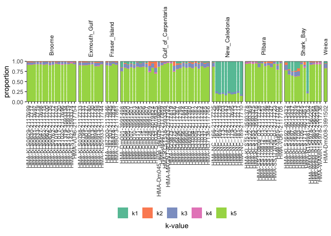

``` r
readStructure <- function(path) {
    k <- as.numeric(sub(".+-(.*)", "\\1", str_remove(basename(path), "\\..*") ))
    kpops <- paste0("k", 1:k)
    read_lines(path) |>
        str_remove("^\\s+") |>
        str_remove("\\s+$") |>
        str_remove(": ") |>
        str_replace_all("\\s+", "\t") |>
        as_tibble() |>
        separate(col = value, into = c("i1", "i2", "i3", "i4", kpops), sep = "\t") |>
        select(i1, starts_with("k")) |>
        pivot_longer(names_to = "k-value", values_to = "proportion", starts_with("k")) |>
        mutate(
            proportion = as.numeric(proportion),
            i1 = as.numeric(i1)
        )
}
```

## PCA

Here we load the PCA CSV file generated by the `Ipyrad.analysis`
toolkit.

``` r
lst_pca <- fs::dir_ls(here("results", "population-structure", "pca"), glob = "*.csv") |>
    (\(x) set_names(x, str_remove(basename(x), "-.*")))() |>
    imap(\(x, i) {
        tmp <- x |>
            read_csv(col_names = TRUE, col_types = cols())
        colnames(tmp) <- c("sample", paste0("PC", 1:(ncol(tmp) - 1)))
        pops |>
            filter(species == i) |>
            left_join(tmp)
    })
```

### \*Aipysurus laevis

``` r
pc_1_2 <- lst_pca |>
    pluck("ALA") |>
    ggplot(aes(x = PC1, y = PC2, colour = population)) +
    geom_point(size = 2) +
    scale_color_brewer(palette = "Paired") +
    labs(title = "PC1 vs PC2") +
    scale_y_continuous(
        limits = c(-4, 4),
        breaks = seq(-4, 4, by = 1),
        labels = as.character(seq(-4, 4, by = 1)),
        expand = c(0, 0)
    ) +
    scale_x_continuous(
        limits = c(-4, 12),
        breaks = seq(-4, 12, by = 2),
        labels = as.character(seq(-4, 12, by = 2)),
        expand = c(0, 0)
    ) +
    theme(
        legend.position = "bottom",
        legend.title = element_text(hjust = 0.5, face = "bold", size = 14),
        legend.title.position = "top",
        title = element_text(face = "bold")
    )

pc_1_3 <- lst_pca |>
    pluck("ALA") |>
    ggplot(aes(x = PC1, y = PC2, colour = population)) +
    geom_point(size = 2) +
    scale_color_brewer(palette = "Paired") +
    labs(title = "PC1 vs PC3") +
    scale_y_continuous(
        limits = c(-5, 5),
        breaks = seq(-5, 5, by = 1),
        labels = as.character(seq(-5, 5, by = 1)),
        expand = c(0, 0)
    ) +
    scale_x_continuous(
        limits = c(-4, 12),
        breaks = seq(-4, 12, by = 2),
        labels = as.character(seq(-4, 12, by = 2)),
        expand = c(0, 0)
    ) +
    theme(
        legend.position = "bottom",
        legend.title = element_text(hjust = 0.5, face = "bold", size = 14),
        legend.title.position = "top",
        title = element_text(face = "bold")
    )

pc_2_3 <- lst_pca |>
    pluck("ALA") |>
    ggplot(aes(x = PC2, y = PC3, colour = population)) +
    geom_point(size = 2) +
    scale_color_brewer(palette = "Paired") +
    labs(title = "PC2 vs PC3") +
    scale_y_continuous(
        limits = c(-6, 7),
        breaks = seq(-6, 7, by = 1),
        labels = as.character(seq(-6, 7, by = 1)),
        expand = c(0, 0)
    ) +
    scale_x_continuous(
        limits = c(-5, 5),
        breaks = seq(-5, 5, by = 2),
        labels = as.character(seq(-5, 5, by = 2)),
        expand = c(0, 0)
    ) +
    theme(
        legend.position = "bottom",
        legend.title = element_text(hjust = 0.5, face = "bold", size = 14),
        legend.title.position = "top",
        title = element_text(face = "bold")
    )


design <- "12\n34"

pc_1_2 + pc_1_3 + pc_2_3 + guide_area() +
    plot_layout(
        design = design, 
        guides = "collect",
        axes = "collect"
    ) &
    guides(colour = guide_legend(ncol = 3, override.aes = list(size = 4)))
```


### *Hydrophis major*

``` r
pc_1_2 <- lst_pca |>
    pluck("HMA") |>
    ggplot(aes(x = PC1, y = PC2, colour = population)) +
    geom_point(size = 2) +
    scale_color_brewer(palette = "Paired") +
    labs(title = "PC1 vs PC2") +
    scale_y_continuous(
        limits = c(-7, 7),
        breaks = seq(-7, 7, by = 1),
        labels = as.character(seq(-7, 7, by = 1)),
        expand = c(0, 0)
    ) +
    scale_x_continuous(
        limits = c(-5, 12),
        breaks = seq(-5, 12, by = 2),
        labels = as.character(seq(-5, 12, by = 2)),
        expand = c(0, 0)
    ) +
    theme(
        legend.position = "bottom",
        legend.title = element_text(hjust = 0.5, face = "bold", size = 14),
        legend.title.position = "top",
        title = element_text(face = "bold")
    )

pc_1_3 <- lst_pca |>
    pluck("HMA") |>
    ggplot(aes(x = PC1, y = PC3, colour = population)) +
    geom_point(size = 2) +
    scale_color_brewer(palette = "Paired") +
    labs(title = "PC1 vs PC3") +
    scale_y_continuous(
        limits = c(-4, 10),
        breaks = seq(-4, 10, by = 2),
        labels = as.character(seq(-4, 10, by = 2)),
        expand = c(0, 0)
    ) +
    scale_x_continuous(
        limits = c(-5, 12),
        breaks = seq(-5, 12, by = 2),
        labels = as.character(seq(-5, 12, by = 2)),
        expand = c(0, 0)
    ) +
    theme(
        legend.position = "bottom",
        legend.title = element_text(hjust = 0.5, face = "bold", size = 14),
        legend.title.position = "top",
        title = element_text(face = "bold")
    )

pc_2_3 <- lst_pca |>
    pluck("HMA") |>
    ggplot(aes(x = PC2, y = PC3, colour = population)) +
    geom_point(size = 2) +
    scale_color_brewer(palette = "Paired") +
    labs(title = "PC2 vs PC3") +
    scale_y_continuous(
        limits = c(-4, 10),
        breaks = seq(-4, 10, by = 2),
        labels = as.character(seq(-4, 10, by = 2)),
        expand = c(0, 0)
    ) +
    scale_x_continuous(
        limits = c(-7, 7),
        breaks = seq(-7, 7, by = 2),
        labels = as.character(seq(-7, 7, by = 2)),
        expand = c(0, 0)
    ) +
    theme(
        legend.position = "bottom",
        legend.title = element_text(hjust = 0.5, face = "bold", size = 14),
        legend.title.position = "top",
        title = element_text(face = "bold")
    )

pc_1_2 + pc_1_3 + pc_2_3 + guide_area() +
    plot_layout(
        design = design, 
        guides = "collect",
        axes = "collect"
    ) &
    guides(colour = guide_legend(ncol = 3, override.aes = list(size = 4)))
```


### *Hydrophis stokesii*

``` r
pc_1_2 <- lst_pca |>
    pluck("HST") |>
    ggplot(aes(x = PC1, y = PC2, colour = population)) +
    geom_point(size = 2) +
    scale_color_brewer(palette = "Paired") +
    labs(title = "PC1 vs PC2") +
    scale_y_continuous(
        limits = c(-7, 16),
        breaks = seq(-7, 16, by = 2),
        labels = as.character(seq(-7, 16, by = 2)),
        expand = c(0, 0)
    ) +
    scale_x_continuous(
        limits = c(-4, 10),
        breaks = seq(-4, 10, by = 2),
        labels = as.character(seq(-4, 10, by = 2)),
        expand = c(0, 0)
    ) +
    theme(
        legend.position = "bottom",
        legend.title = element_text(hjust = 0.5, face = "bold", size = 14),
        legend.title.position = "top",
        title = element_text(face = "bold")
    )

pc_1_3 <- lst_pca |>
    pluck("HST") |>
    ggplot(aes(x = PC1, y = PC3, colour = population)) +
    geom_point(size = 2) +
    scale_color_brewer(palette = "Paired") +
    labs(title = "PC1 vs PC3") +
    scale_y_continuous(
        limits = c(-8, 8),
        breaks = seq(-8, 8, by = 2),
        labels = as.character(seq(-8, 8, by = 2)),
        expand = c(0, 0)
    ) +
    scale_x_continuous(
        limits = c(-4, 10),
        breaks = seq(-4, 10, by = 2),
        labels = as.character(seq(-4, 10, by = 2)),
        expand = c(0, 0)
    ) +
    theme(
        legend.position = "bottom",
        legend.title = element_text(hjust = 0.5, face = "bold", size = 14),
        legend.title.position = "top",
        title = element_text(face = "bold")
    )

pc_2_3 <- lst_pca |>
    pluck("HST") |>
    ggplot(aes(x = PC2, y = PC3, colour = population)) +
    geom_point(size = 2) +
    scale_color_brewer(palette = "Paired") +
    labs(title = "PC2 vs PC3") +
    scale_y_continuous(
        limits = c(-8, 8),
        breaks = seq(-8, 8, by = 2),
        labels = as.character(seq(-8, 8, by = 2)),
        expand = c(0, 0)
    ) +
    scale_x_continuous(
        limits = c(-8, 16),
        breaks = seq(-8, 16, by = 2),
        labels = as.character(seq(-8, 16, by = 2)),
        expand = c(0, 0)
    ) +
    theme(
        legend.position = "bottom",
        legend.title = element_text(hjust = 0.5, face = "bold", size = 14),
        legend.title.position = "top",
        title = element_text(face = "bold")
    )

pc_1_2 + pc_1_3 + pc_2_3 + guide_area() +
    plot_layout(
        design = design, 
        guides = "collect",
        axes = "collect"
    ) &
    guides(colour = guide_legend(ncol = 3, override.aes = list(size = 4)))
```


## STRUCTURE

``` r
pops_structure <- pops |> mutate(i1 = row_number(), .by = species)

structure_df <- fs::dir_ls(
    here("results", "population-structure"), 
    glob = "*clumpp.outfile", 
    recurse = TRUE
) |>
    (\(x) set_names(x, str_remove(basename(x), "\\..*")))() |>
    map(readStructure) |>
    list_rbind(names_to = "species") |>
    separate_wider_delim(delim = "-", names = c("species", "K"), too_many = "merge", cols = species) |>
    left_join(pops_structure)
```

### Choosing the correct K (N-ancestral populations)

Choosing the best `K` value can be determined by plotting the estimated
log-probability for each `K` value, in addition to the delta-K value.
The values can be interpreted as follows:

-   **Estimated log-probability**: Higher values equal better model fit.
-   **Delta-K**: The rate of change between successive K-values. Larger
    values indicate reater change in the model fit

``` r
etable <- fs::dir_ls(here("results"), glob = "*etable.csv", recurse = TRUE) |>
    read_csv(col_names = TRUE, col_types = cols(), id = "species") |>
    mutate(species = str_remove(basename(species), "-etable.csv")) |>
    rename(K = `...1`)
```

``` r
prb <- etable |>
    ggplot(aes(x = K, y = estLnProbMean, colour = species)) +
    geom_point() +
    geom_line() +
    scale_y_continuous(
        name = "Estimated mean log-probability",
        breaks = seq(0, -105000, -10000),
        limits = c(-105e3, -4e4),
        labels = scales::label_number(style_negative = "minus")
    ) +
    scale_x_continuous(breaks = seq(2, 9, 1))

dk <- etable |>
    ggplot(aes(x = K, y = deltaK, colour = species)) +
    geom_point() +
    geom_line() +
    scale_x_continuous(breaks = seq(2, 9, 1)) +
    scale_y_continuous(
        name = "Delta-K",
        breaks = seq(0, 8, 1)
    )

prb/dk +
    plot_layout(axes = "collect", guides = "collect")
```


For the three species, with the current data, we can determine the
following:

-   **Aipysurus**: The two highest log-probability values are at `k = 5`
    and `K = 7`. The Delta-K for both of these values is quite high,
    indicating that both K-values improved the model fit substantially.
-   **Hydrophis major**: `K = 5` appears to be the best choice for *H.
    major*. The estimated log-probability is relatively stable for most
    values of `K`, before dipping once reaching higher values. Delta-K
    peaks at `K = 5`, with little improvement after.
-   **Hydrophis stokesii**: The estimated log-probabilities for
    *stokesii* show a similar pattern to *H. major*, being consistent
    across multiple `K` values. Delta-K spikes at `K=4`, indicating that
    this is likely the best value for the current dataset.

### *Aipysurus laevis*

``` r
structure_df |>
    filter(species == "ALA", K == "K-5") |>
    ggplot(aes(x = sample, y = proportion, fill = `k-value`)) +
    geom_col(position = "stack") +
    scale_fill_brewer(palette = "Set2") +
    scale_y_continuous(expand = c(0, 0)) +
    labs(x = NULL) + 
    facet_grid(
        cols = vars(population), scales = "free_x", space = "free_x"
        
    ) +
    guides(fill = guide_legend(title.position = "bottom")) +
    theme(
        axis.text.x = element_text(angle = 90, vjust = 0.5, hjust = 0.98),
        strip.text = element_text(angle = 90, vjust = 0.5, hjust = 0.1),
        strip.background = element_blank(),
        legend.position = "bottom",
        legend.title = element_text(hjust = 0.5),
        panel.spacing.x = unit(0.2, "line")
    )
```


### *Hydrophis major*

``` r
structure_df |>
    filter(species == "HMA", K == "K-5") |>
    ggplot(aes(x = sample, y = proportion, fill = `k-value`)) +
    geom_col(position = "stack") +
    scale_fill_brewer(palette = "Set2") +
    scale_y_continuous(expand = c(0, 0)) +
    labs(x = NULL) + 
    facet_grid(
        cols = vars(population), scales = "free_x", space = "free_x"
        
    ) +
    guides(fill = guide_legend(title.position = "bottom")) +
    theme(
        axis.text.x = element_text(angle = 90, vjust = 0.5, hjust = 0.98),
        strip.text = element_text(angle = 90, vjust = 0.5, hjust = 0.1),
        strip.background = element_blank(),
        legend.position = "bottom",
        legend.title = element_text(hjust = 0.5),
        panel.spacing.x = unit(0.2, "line")
    )
```



### *Hydrophis stokesii*

``` r
structure_df |>
    filter(species == "HST", K == "K-4") |>
    ggplot(aes(x = sample, y = proportion, fill = `k-value`)) +
    geom_col(position = "stack") +
    scale_fill_brewer(palette = "Set2") +
    scale_y_continuous(expand = c(0, 0)) +
    labs(x = NULL) +
    facet_grid(
        cols = vars(population), scales = "free_x", space = "free_x"
        
    ) +
    guides(fill = guide_legend(title.position = "bottom")) +
    theme(
        axis.text.x = element_text(angle = 90, vjust = 0.5, hjust = 0.98),
        strip.text = element_text(angle = 90, vjust = 0.5, hjust = 0.1),
        strip.background = element_blank(),
        legend.position = "bottom",
        legend.title = element_text(hjust = 0.5),
        panel.spacing.x = unit(0.2, "line")
    )
```


